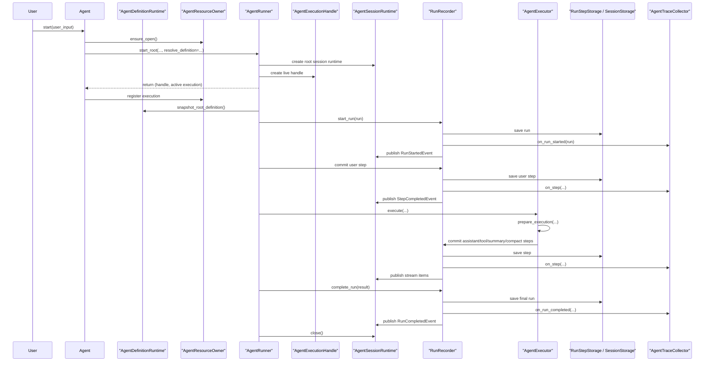
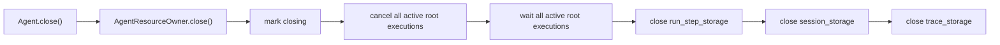
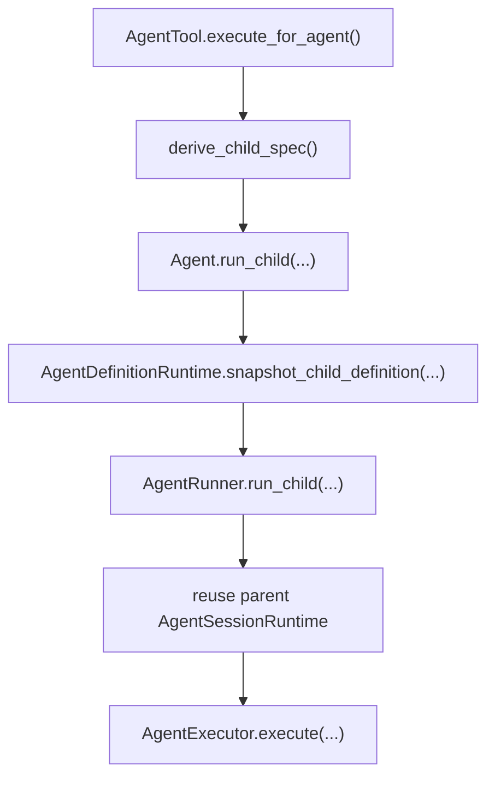

# `agiwo/agent` README

这份文档只讲 3 件事：

1. `agiwo/agent` 现在有哪些核心角色。
2. 一次执行是怎么从 `Agent.start()` 走到 `RunOutput` 的。
3. 看代码时应该先看哪里，出问题时应该排查哪里。

如果你看过旧版本，先忘掉这些概念：

- `Agent.steer()`
- `derive_child() -> Agent`
- `runtime_state.py`
- `EventEmitter`
- `EventPump`
- `StreamChannel`

它们都不是当前实现模型。

---

## 1. 一句话理解

现在的 `agiwo/agent` 可以用一句话概括：

> `Agent` 是模板，`AgentExecutionHandle` 是一次活执行，`AgentDefinitionRuntime` 负责定义派生，`AgentResourceOwner` 负责资源生命周期，`RunRecorder` 负责记账。

如果只记这一句，后面大多数代码都能对上。

---

## 2. 核心角色

| 角色 | 作用 | 主要代码 |
| --- | --- | --- |
| `Agent` | 对外 facade。公开 `start()` / `run()` / `run_stream()` / `derive_child_spec()`。 | [agent.py](/Users/hongv/workspace/agiwo/agiwo/agent/agent.py) |
| `AgentDefinitionRuntime` | definition owner。统一负责 hooks、tools、prompt runtime、root/child/scheduler child 派生。 | [definition_runtime.py](/Users/hongv/workspace/agiwo/agiwo/agent/inner/definition_runtime.py) |
| `AgentResourceOwner` | resource owner。统一负责 run-step storage、session storage、trace storage 和 active root executions。 | [resource_owner.py](/Users/hongv/workspace/agiwo/agiwo/agent/inner/resource_owner.py) |
| `AgentExecutionHandle` | 一次活执行的控制面。只暴露 `stream()/wait()/steer()/cancel()`。 | [execution.py](/Users/hongv/workspace/agiwo/agiwo/agent/execution.py) |
| `AgentSessionRuntime` | session 级共享 owner。持有 `session_id`、sequence owner、`trace_id`、abort signal、steering queue、stream subscribers。 | [session_runtime.py](/Users/hongv/workspace/agiwo/agiwo/agent/inner/session_runtime.py) |
| `ChildAgentSpec` | child 覆写数据，不携带 live runtime。 | [execution.py](/Users/hongv/workspace/agiwo/agiwo/agent/execution.py) |
| `ResolvedExecutionDefinition` | 一次执行真正使用的 definition 快照。 | [definition.py](/Users/hongv/workspace/agiwo/agiwo/agent/inner/definition.py) |
| `AgentRunner` | root/child run 编排 owner。 | [runner.py](/Users/hongv/workspace/agiwo/agiwo/agent/inner/runner.py) |
| `RunRecorder` | run/step lifecycle 唯一记账 owner。 | [run_recorder.py](/Users/hongv/workspace/agiwo/agiwo/agent/inner/run_recorder.py) |
| `AgentExecutor` | 执行循环 owner，只负责 LLM/tool/summary/compaction 编排。 | [executor.py](/Users/hongv/workspace/agiwo/agiwo/agent/inner/executor.py) |
| `prepare_execution(...)` | 执行前 bootstrap owner：加载历史、组装 messages、初始化 `RunState` 和 compactor。 | [execution_bootstrap.py](/Users/hongv/workspace/agiwo/agiwo/agent/inner/execution_bootstrap.py) |
| `ExecutionToolCoordinator` | tool call 批处理 owner：参数 hook、执行、step 落库、termination 传播。 | [execution_tools.py](/Users/hongv/workspace/agiwo/agiwo/agent/inner/execution_tools.py) |
| `ExecutionTerminationRuntime` | limit checks 与 termination summary owner。 | [termination_runtime.py](/Users/hongv/workspace/agiwo/agiwo/agent/inner/termination_runtime.py) |
| `apply_steering_messages(...)` | steering queue 注入 messages 的唯一 helper。 | [steering.py](/Users/hongv/workspace/agiwo/agiwo/agent/inner/steering.py) |

---

## 3. 高层结构图

```mermaid
flowchart TD
    A["Agent<br/>public facade"] --> DR["AgentDefinitionRuntime<br/>definition owner"]
    A --> RO["AgentResourceOwner<br/>resource owner"]
    A --> RUN["AgentRunner<br/>run orchestration"]

    A -->|start()| H["AgentExecutionHandle<br/>live execution"]
    A -->|derive_child_spec()| CS["ChildAgentSpec<br/>pure overrides"]

    DR --> RD["ResolvedExecutionDefinition<br/>execution snapshot"]
    CS --> RD

    H --> SR["AgentSessionRuntime<br/>session-scoped shared runtime"]
    RUN --> SR
    RUN --> RR["RunRecorder<br/>run/step lifecycle"]
    RUN --> EX["AgentExecutor<br/>execution loop"]

    EX --> BOOT["prepare_execution()<br/>bootstrap"]
    RR --> STORE["RunStepStorage / SessionStorage"]
    RR --> TRACE["AgentTraceCollector"]
    RR --> STREAM["AgentStreamItem subscribers"]
```

理解这个图时，分两条线看：

- 执行控制线：`Agent -> Handle -> Runner -> Executor`
- 记录观测线：`Runner -> RunRecorder -> storage/trace/stream`

---

## 4. 先搞懂 4 个名词

### 4.1 `session`

`session` 是一条连续上下文。

它决定：

- sequence 在哪个范围里递增
- root run 和 child run 是否共享历史
- steering message 应该进哪个队列
- trace 属于哪一条根链路

当前 owner 是 [session_runtime.py](/Users/hongv/workspace/agiwo/agiwo/agent/inner/session_runtime.py) 里的 `AgentSessionRuntime`。

### 4.2 `run`

`run` 是一次执行。

比如：

- 用户发一句话，触发一次 root run
- `AgentTool` 调一次 child run
- scheduler 唤醒一次 sleeping agent，也会产生一次 run

领域模型在 [runtime.py](/Users/hongv/workspace/agiwo/agiwo/agent/runtime.py) 的 `Run`。

### 4.3 `step`

`step` 是 run 里已经提交的一步动作。

常见 step：

- user step
- assistant step
- tool step
- summary step
- compaction 相关 step

领域模型在 [runtime.py](/Users/hongv/workspace/agiwo/agiwo/agent/runtime.py) 的 `StepRecord`。

### 4.4 `stream item`

stream item 是“跑的时候往外发给订阅者的 typed item”，不是通用事件总线。

当前公开的几种类型都在 [runtime.py](/Users/hongv/workspace/agiwo/agiwo/agent/runtime.py)：

- `RunStartedEvent`
- `StepDeltaEvent`
- `StepCompletedEvent`
- `RunCompletedEvent`
- `RunFailedEvent`

统一别名是 `AgentStreamItem`。

---

## 5. 一次 root run 怎么开始

最小例子：

```python
from agiwo.agent import Agent, AgentConfig

agent = Agent(
    AgentConfig(name="demo", description="demo agent"),
    model=model,
)

handle = agent.start("Explain session vs run")

async for item in handle.stream():
    print(item.type)

result = await handle.wait()
print(result.response)
```

这里有两个关键点：

- `agent.start(...)` 立即返回 `AgentExecutionHandle`
- 真正执行是在后台 task 里继续跑的

也就是说：

- `Agent` 不是“正在跑”的对象
- `handle` 才是“这一轮执行”的对象

---

## 6. root run 的完整时序



这条链路里最重要的不变量是：

1. definition 只从 `AgentDefinitionRuntime` 派生一次
2. 资源只从 `AgentResourceOwner` 来
3. run/step lifecycle 只走 `RunRecorder`
4. root session 只由 `AgentSessionRuntime` 持有

---

## 7. `Agent` 自己到底还负责什么

当前 [agent.py](/Users/hongv/workspace/agiwo/agiwo/agent/agent.py) 很刻意地只保留了 facade 能力：

- 保存纯配置和 `model`
- 暴露只读属性：`id/name/description/options/tools/hooks`
- 暴露运行入口：`start()/run()/run_stream()`
- 暴露 child 定义入口：`derive_child_spec()`
- 暴露 child 执行入口：`run_child()`
- 暴露 scheduler child 模板克隆入口：`create_scheduler_child_agent()`
- 关闭资源：`close()`

它**不再**负责：

- 自己拼 prompt runtime
- 自己管理 runtime tools 合并
- 自己管理 storage/trace 生命周期
- 自己分配 active execution
- 自己实现 stream cleanup 协议

如果你在 `Agent` 里又看到这些逻辑开始长出来，说明边界又在退化。

---

## 8. `AgentDefinitionRuntime` 为什么重要

它是这轮收口里最关键的一个 owner。

它统一负责：

- effective hooks 构造
- provided tools + sdk tools + runtime tools 合并
- prompt runtime 构造与刷新
- root definition snapshot
- child definition snapshot
- scheduler child 模板克隆输入

### 8.1 为什么不能让 `Agent` 自己做这些

如果 `Agent` 既是 facade，又负责 child 派生、prompt runtime 刷新、hook/tool 合并，那么：

- `Agent` 会越来越像 God Object
- nested child 和 scheduler child 很容易各自长出一套派生规则
- 后面改 prompt/tool/hook 规则时，会在多个地方同步修改

把这些逻辑收进 [definition_runtime.py](/Users/hongv/workspace/agiwo/agiwo/agent/inner/definition_runtime.py) 后，root/child/scheduler child 的派生规则就只有一个 owner 了。

### 8.2 child 派生规则现在在哪里

统一都在 `AgentDefinitionRuntime`：

- child 是否过滤某些 tools
- child 是否开启 `enable_termination_summary`
- child 的 raw `system_prompt` 是否叠加 `<task-instruction>`
- child hooks 是否做 snapshot

所以：

- nested child run 用 `snapshot_child_definition(...)`
- scheduler child 模板用 `build_scheduler_child_clone(...)`

二者共享同一套派生规则，只是产物不同。

---

## 9. `AgentResourceOwner` 为什么存在

`AgentResourceOwner` 解决的是另一个问题：资源生命周期。

它当前统一持有：

- `run_step_storage`
- `session_storage`
- `trace_storage`
- active root executions

### 9.1 为什么不能让 `Agent.close()` 直接关 storage

如果 `Agent` 自己不跟踪活执行，却又能直接 `close()` storage，那么会出现：

- handle 还在跑
- storage/trace 先被关掉
- 运行中的 task 在中途失败

所以现在的关闭顺序固定是：



也就是说，资源关闭一定发生在活执行收尾之后。

---

## 10. `AgentExecutionHandle` 应该怎么理解

`AgentExecutionHandle` 就是一次执行的“遥控器”。

它只做四件事：

```python
handle = agent.start("hello")

async for item in handle.stream():
    ...

result = await handle.wait()
await handle.steer("please be more concise")
handle.cancel("user closed the page")
```

它**不应该**变成访问内部 runtime 的后门。

所以现在它不暴露：

- `context`
- `session_runtime`
- `abort_signal`
- `done`

如果调用方需要这些，说明边界已经穿透到 `agent.inner` 了。

---

## 11. 为什么要单独有 `consume_execution_stream(...)`

一个常见但很烦的问题是：

- 订阅 `handle.stream()` 后，什么时候 `await handle.wait()`？
- 如果调用方提前结束订阅，要不要 `cancel()`？
- `CancelledError` 要不要往上抛？

现在这套协议统一在 [streaming.py](/Users/hongv/workspace/agiwo/agiwo/agent/streaming.py)：

```python
async for item in consume_execution_stream(
    handle,
    cancel_reason="consumer closed",
):
    ...
```

它统一负责：

- 正常读完 stream 后再 `await handle.wait()`
- 提前结束时 `cancel()`
- 吞掉内部取消时的 `CancelledError`

当前这些地方都复用它：

- `Agent.run_stream()`
- console chat SSE
- scheduler event stream

这样 stream lifecycle 的语义就不会在三个地方各自长歪。

---

## 12. child run 是怎么进来的

`AgentTool` 会把另一个 `Agent` 模板包装成工具。

核心流程是：



这里要注意两点：

1. child run 共享父 `AgentSessionRuntime`
   所以 sequence、trace_id、steering queue、session storage 都是同一个 owner。

2. `ChildAgentSpec` 不是 live agent
   它只是“这次 child 执行怎么覆写”的数据包。

---

## 13. scheduler child 和 nested child 的关系

这两种 child 很像，但不一样：

### nested child

- 发生在一次 root run 里面
- 共享父 `AgentSessionRuntime`
- 不创建新的 `Agent` 模板实例

### scheduler child

- 是 scheduler state machine 里的独立 child template
- 需要新的 `Agent` 实例
- 但派生规则和 nested child 共用 `AgentDefinitionRuntime`

这就是为什么 [agent.py](/Users/hongv/workspace/agiwo/agiwo/agent/agent.py) 里保留了 `create_scheduler_child_agent()`：

- 它不是自己重新拼规则
- 它只是拿 `build_scheduler_child_clone(...)` 的结果，再构造一个新的 `Agent`

---

## 14. `AgentExecutor` 现在负责什么

[`executor.py`](/Users/hongv/workspace/agiwo/agiwo/agent/inner/executor.py) 现在尽量只保留“执行循环”。

### 执行前准备

运行前准备已经拆到了 [execution_bootstrap.py](/Users/hongv/workspace/agiwo/agiwo/agent/inner/execution_bootstrap.py)：

- 读取 latest compact metadata
- 读取 existing steps
- 组装 initial messages
- 创建 `RunState`
- 创建 `CompactionRuntime`

### 执行循环本体

`AgentExecutor` 自己主要做：

- loop
- LLM streaming
- 调 `ExecutionToolCoordinator`
- 调 `ExecutionTerminationRuntime`
- 调 `CompactionRuntime`

阅读上可以把它当成：

```python
prepared = await prepare_execution(...)
try:
    await run_loop(...)
finally:
    await termination_runtime.maybe_generate_summary(...)
```

所以现在再看 `executor.py`，脑子里不要把它当“装配器”，而要把它当“执行循环 owner”。

---

## 15. 看代码的推荐顺序

如果你是第一次进这个目录，建议按这个顺序读：

1. [agent.py](/Users/hongv/workspace/agiwo/agiwo/agent/agent.py)
2. [execution.py](/Users/hongv/workspace/agiwo/agiwo/agent/execution.py)
3. [inner/definition_runtime.py](/Users/hongv/workspace/agiwo/agiwo/agent/inner/definition_runtime.py)
4. [inner/resource_owner.py](/Users/hongv/workspace/agiwo/agiwo/agent/inner/resource_owner.py)
5. [inner/runner.py](/Users/hongv/workspace/agiwo/agiwo/agent/inner/runner.py)
6. [inner/run_recorder.py](/Users/hongv/workspace/agiwo/agiwo/agent/inner/run_recorder.py)
7. [inner/execution_bootstrap.py](/Users/hongv/workspace/agiwo/agiwo/agent/inner/execution_bootstrap.py)
8. [inner/executor.py](/Users/hongv/workspace/agiwo/agiwo/agent/inner/executor.py)
9. [runtime_tools/agent_tool.py](/Users/hongv/workspace/agiwo/agiwo/agent/runtime_tools/agent_tool.py)
10. [scheduler_port.py](/Users/hongv/workspace/agiwo/agiwo/agent/scheduler_port.py)

这样读，心智成本最低。

---

## 16. 排查问题时先看哪里

### 16.1 “为什么这个 child 的 prompt/tool/hook 不对？”

先看：

- [definition_runtime.py](/Users/hongv/workspace/agiwo/agiwo/agent/inner/definition_runtime.py)

重点看：

- `snapshot_child_definition(...)`
- `build_scheduler_child_clone(...)`
- `_build_child_inputs(...)`

### 16.2 “为什么 close 以后还在跑 / 为什么 storage 提前关了？”

先看：

- [resource_owner.py](/Users/hongv/workspace/agiwo/agiwo/agent/inner/resource_owner.py)

### 16.3 “为什么 stream 提前断了 / 为什么取消语义不一致？”

先看：

- [streaming.py](/Users/hongv/workspace/agiwo/agiwo/agent/streaming.py)
- [execution.py](/Users/hongv/workspace/agiwo/agiwo/agent/execution.py)

### 16.4 “为什么 step 明明生成了，但 storage/trace/stream 不一致？”

先看：

- [run_recorder.py](/Users/hongv/workspace/agiwo/agiwo/agent/inner/run_recorder.py)

### 16.5 “为什么执行循环里又变复杂了？”

先看：

- [execution_bootstrap.py](/Users/hongv/workspace/agiwo/agiwo/agent/inner/execution_bootstrap.py)
- [executor.py](/Users/hongv/workspace/agiwo/agiwo/agent/inner/executor.py)

判断标准很简单：

- bootstrap 应该只做准备
- executor 应该只做执行

如果两边又开始互相长进去，说明边界又在退化。

---

## 17. 现在最重要的维护原则

以后改 `agiwo/agent`，优先守住这几条：

1. 不要再让 `Agent` 变回 God Object。
2. definition 派生规则只能有一个 owner。
3. resource 生命周期只能有一个 owner。
4. stream cleanup 协议只能有一个 owner。
5. `RunRecorder` 是唯一的 run/step lifecycle owner。
6. `AgentExecutor` 只负责执行循环，不再回去兼管 bootstrap/装配。

如果你准备加一个新逻辑，先问自己：

> 这件事是 definition 的问题、resource 的问题、execution control 的问题，还是 lifecycle record 的问题？

答清楚这个，代码通常就会落到对的地方。
