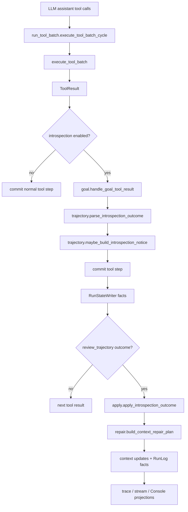
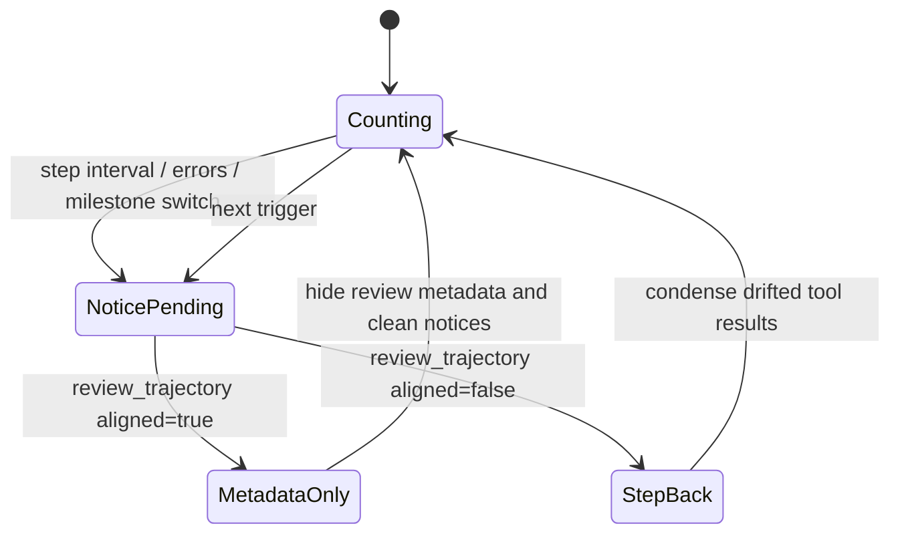
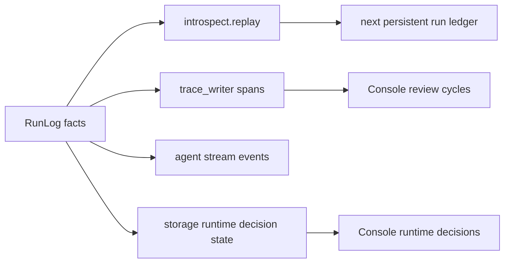

# Agent Introspect

`agiwo.agent.introspect` is the goal, trajectory-introspection, and context-repair subsystem used by the agent runtime. It keeps long-running agents aligned with declared milestones, forces periodic trajectory review, and applies KV-cache-safe context repair when the agent reports that recent work drifted from the goal.

The subsystem does not own the run loop. `agiwo.agent.run_tool_batch` remains the execution owner and calls focused functions from this package while tool results are committed.

## Responsibilities

| File | Responsibility |
| --- | --- |
| `models.py` | Pure dataclasses for milestones, goal state, introspection state, notices, outcomes, and repair plans. |
| `goal.py` | Parse and validate `declare_milestones` output, then update `GoalState`. |
| `trajectory.py` | Decide when to inject `<system-review>`, build the notice, and parse `review_trajectory` results. |
| `repair.py` | Build a pure `ContextRepairPlan` from current prompt-visible messages and an `IntrospectionOutcome`. |
| `apply.py` | Apply an outcome to live context and write first-class `RunLog` facts through `RunStateWriter`. |
| `replay.py` | Rebuild `GoalState` and `IntrospectionState` from committed `RunLog` facts for persistent sessions. |

## Runtime Position



Introspection is active only when all of these are true:

```python
context.config.enable_goal_directed_review
and "review_trajectory" in runtime.tools_map
and "declare_milestones" in runtime.tools_map
```

The scheduler injects `declare_milestones` and `review_trajectory` as runtime tools. The package itself does not depend on the scheduler.

## Inputs And Outputs

### Main Inputs

| Input | Producer | Consumer | Meaning |
| --- | --- | --- | --- |
| `ToolResult(tool_name="declare_milestones")` | Scheduler runtime tool | `goal.handle_goal_tool_result` | Declares or updates the goal contract. |
| Normal `ToolResult` | Any tool | `trajectory.maybe_build_introspection_notice` | Counts progress since the last boundary and may trigger review. |
| `ToolResult(tool_name="review_trajectory")` | Scheduler runtime tool | `trajectory.parse_introspection_outcome` | Agent's structured answer to `<system-review>`. |
| `context.ledger.messages` | Run runtime | `repair.build_context_repair_plan` and `apply.apply_introspection_outcome` | Prompt-visible messages that may need notice cleanup or condensed content. |
| Committed `RunLog` entries | Storage | `replay.build_introspect_state_from_entries` | Source of truth for restoring persistent sessions. |

### Main Outputs

| Output | Written By | Consumer |
| --- | --- | --- |
| `GoalState` / `IntrospectionState` mutations | `goal.py`, `trajectory.py`, `apply.py`, `replay.py` | Current run context. |
| `<system-review>` notice appended to one tool result | `trajectory.py` through `run_tool_batch.py` | Next LLM call. |
| `StepView.condensed_content` updates | `apply.py` through `RunStateWriter` | Prompt rebuild, replay, Console. |
| `ContextStepsHidden` facts | `apply.py` through `RunStateWriter` | Stream reconciliation and step queries. |
| `GoalMilestonesUpdated` | `run_tool_batch.py` through `RunStateWriter` | Replay, trace, Console milestone board. |
| `IntrospectionTriggered` | `run_tool_batch.py` through `RunStateWriter` | Replay, trace, Console review cycles. |
| `IntrospectionCheckpointRecorded` | `apply.py` through `RunStateWriter` | Replay, trace, Console review cycles. |
| `IntrospectionOutcomeRecorded` | `apply.py` through `RunStateWriter` | Replay, trace, Console review cycles. |
| `ContextRepairApplied` | `apply.py` through `RunStateWriter` | Runtime decision views, trace, Console. |

## State Model



`last_boundary_seq` is the sequence boundary after the last accepted review outcome. `review_count_since_boundary` counts committed non-`review_trajectory` tool results after that boundary. A successful `review_trajectory` result resets the counter and moves `last_boundary_seq` to the review outcome boundary.

## Trigger Rules

| Trigger | Code Path | Condition |
| --- | --- | --- |
| `step_interval` | `maybe_build_introspection_notice` | `review_count_since_boundary >= AgentConfig.review_step_interval`. |
| `consecutive_errors` | `maybe_build_introspection_notice` | `review_on_error` is enabled and consecutive failed tool results reach the default threshold of `2`. |
| `milestone_switch` | `update_goal_milestones` plus `maybe_build_introspection_notice` | Active milestone changed or a milestone was completed/activated, then a later non-`declare_milestones` tool result arrives. |

Only one prompt-visible `<system-review>` notice is allowed at a time. `review_trajectory` itself is excluded from the progress counter.

## Outcome Modes

| Mode | When | Runtime Effect |
| --- | --- | --- |
| `metadata_only` | `review_trajectory(aligned=true)` or malformed/unknown `aligned` value | Hide temporary review call/result metadata, remove stale `<system-review>` notices, record outcome and optional checkpoint. |
| `step_back` | `review_trajectory(aligned=false, experience=...)` | Replace tool result content between the previous boundary and this outcome with `[EXPERIENCE] ...`, hide review metadata, record context repair, and call `after_step_back` hooks. |

Context repair is intentionally KV-cache-safe:

- it does not delete or reorder business messages
- it only replaces tool-result `content`
- it may hide the temporary `review_trajectory` assistant/tool metadata pair
- it records the canonical facts before trace, stream, and Console projections consume them

## Pseudocode

```python
for result in execute_tool_batch(tool_calls):
    seq = allocate_sequence()
    tool_step = StepView.tool(..., content=result.content)

    if introspection_enabled:
        goal_update = handle_goal_tool_result(result, ledger.goal, current_seq=seq)
        if goal_update:
            writer.record_goal_milestones_updated(...)

        pending_outcome = (
            parse_introspection_outcome(result, ledger.goal, current_seq=seq, ...)
            or pending_outcome
        )

        notice = maybe_build_introspection_notice(
            result,
            ledger.goal,
            ledger.introspection,
            step_interval=config.review_step_interval,
            review_on_error=config.review_on_error,
            has_visible_notice=has_prompt_visible_system_review(ledger.messages),
        )
        if notice:
            advice = hooks.before_review(...)
            tool_step.content = append_system_review_notice(result.content, ...)

    committed_step = commit_step(tool_step)
    register_committed_tool_step(step_lookup, result.tool_call_id, committed_step)

    if notice:
        writer.record_introspection_triggered(...)

if pending_outcome:
    full_lookup = build_tool_step_lookup(context, step_lookup)
    apply_introspection_outcome(context, pending_outcome, writer, full_lookup)
```

## Replay And Observability



`RunLog` is the source of truth. Replay and Console must not infer authoritative milestone or repair state from `declare_milestones` text, `review_trajectory` text, or `<system-review>` content. Those strings are prompt-visible transport; the persisted facts are the durable state.

## Boundaries

- `run_tool_batch.py` owns the single tool-batch execution flow.
- `RunStateWriter` is the only write path for persisted introspection facts.
- `introspect/` contains pure policy and application helpers; it does not own agent lifecycle or scheduler lifecycle.
- Hooks can advise (`before_review`) or observe (`after_step_back`) but do not implement the core introspection state machine.
- Historical `agiwo.agent.review` compatibility is intentionally not kept. Old test data should be deleted instead of migrated.
