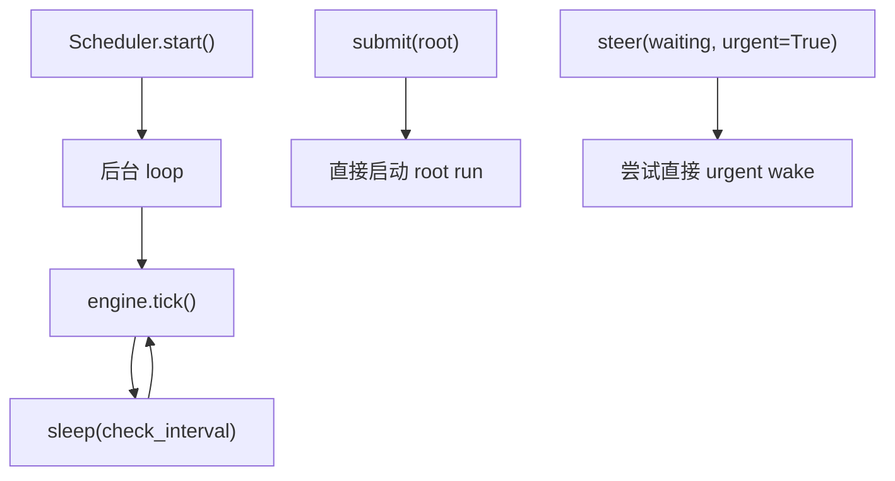
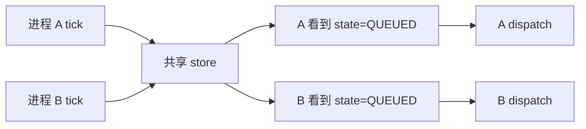
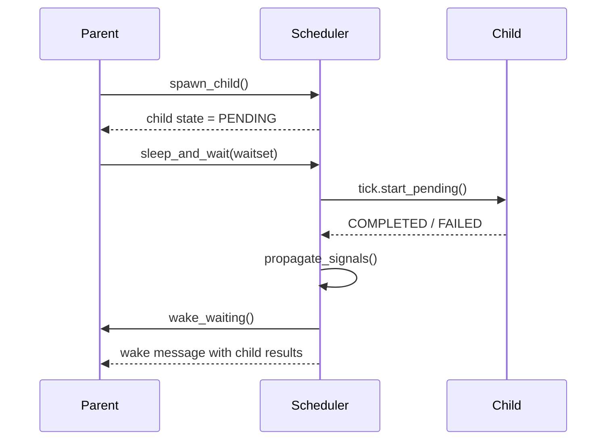

# Scheduler Design Q&A

这份文档专门回答从顶层视角审视 `agiwo/scheduler` 时最容易卡住的几个问题。

下面的结论都以当前源码为准，不代表未来一定要维持不变。

## 先给结论

`scheduler` 现在的整体结构已经比以前清晰很多，但下面几件事必须明确：

- 它当前是“单进程 scheduler owner + 持久化 state/event store”的模型
- tick 驱动目前以固定间隔轮询为主，不是纯事件驱动
- `FAILED` 更偏 scheduler/orchestration failure，不等于所有 agent-level error
- `enqueue_input()` 是单槽续跑，不是多消息队列
- `WakeCondition` 不是通用布尔表达式树，只支持少数固定形态

如果把这几个前提说清楚，代码就容易读很多。

---

## 1. Tick loop 的驱动模型是什么

### 现状

当前是“固定间隔轮询为主，局部直接触发为辅”。

最顶层驱动在 [`scheduler.py`](./scheduler.py)：

```python
async def _loop(self) -> None:
    while self._running:
        await self._engine.tick()
        await asyncio.sleep(self._check_interval)
```

`check_interval` 来自 `SchedulerConfig.check_interval`，默认是 `1.0` 秒。

也就是说，后台会按固定间隔执行一轮 tick：

```python
await self._tick_ops.propagate_signals()
await self._tick_ops.enforce_timeouts()
await self._tick_ops.process_pending_events()
await self._tick_ops.start_pending()
await self._tick_ops.start_queued_roots()
await self._tick_ops.wake_waiting()
```

### 不是完全事件驱动

它并不是“任何状态变化都立刻触发调度”。大部分调度都要等下一次 tick。

但有少数直接路径：

- `submit()`：root 提交后直接起一个 task，不等 tick
- `steer(..., urgent=True)` 且目标是 `WAITING`：会尝试直接 `try_urgent_wake()`

所以更准确的描述是：

> `scheduler` 当前是“轮询主驱动 + 少量直接 fast path”。

### 图示



### 建议

如果以后要进一步降低“为什么它没立刻动”的困惑，README/接口文档里最好明确区分：

- `submit()` 是直接启动
- `enqueue_input()` 是先入队，等 tick 拉起
- `spawn_child()` 是先写 `PENDING`，等 tick 拉起

---

## 2. 并发控制策略是什么

### 单进程内如何避免同一个 state 被重复拉起

这件事靠 [`coordinator.py`](./coordinator.py) 的进程内去重：

```python
def reserve_state_dispatch(self, state_id: str) -> bool:
    if state_id in self._dispatched_state_ids:
        return False
    self._dispatched_state_ids.add(state_id)
    return True
```

`tick_ops.py` 里所有真正会启动执行的地方，最终都会走 `dispatch_state_task()` 或 `reserve_state_dispatch()`。

这能避免下面这种情况：

- tick interval 很短
- 上一轮对同一个 `state_id` 的 run 还没结束
- 下一轮 tick 又看到了这个 state

在同一个进程里，第二次 dispatch 会被挡住。

### `enqueue_input()` 和 tick 的竞争关系

当前 `enqueue_input()` 不是多消息排队，而是“单个 pending_input 槽位”：

```python
if not state.can_accept_enqueue_input():
    raise RuntimeError("expected IDLE or FAILED")

await self._state_ops.mark_queued(
    state_id,
    pending_input=user_input,
)
```

只有 `IDLE` 或 `FAILED` 的 persistent root 才能接收 `enqueue_input()`。

这意味着：

- 如果 tick 还没把 `QUEUED` 拉起来，新输入已经写进 `pending_input`
- 如果 tick 已经把它转成 `RUNNING`，新的 `enqueue_input()` 会直接被拒绝

所以答案是：

- 不会自动形成多条消息队列
- 也不会在 scheduler 内部累积多条 pending input
- 调用方要么等它回到 `IDLE`，要么对 `RUNNING` 状态用 `steer()`

### 多进程 / 多实例部署呢

根据当前源码推断，**不支持多个 scheduler 进程共享同一份 store 并同时调度**。

原因很直接：

- 去重状态在 `SchedulerCoordinator`，它是纯内存
- `AgentStateStorage` 没有 lease / version / compare-and-swap
- `tick_ops.py` 的筛选是 `list_states(...)` 后在本进程决定 dispatch

所以如果两个进程共享一个 SQLite 或别的持久化后端：

- 它们都可能同时看到同一个 `QUEUED` / `WAITING`
- 然后都各自 dispatch

### 图示



### 结论

当前模型应该被明确写成：

> 一个持久化 store 只能对应一个 active scheduler owner 进程。

如果未来要支持多实例，需要补的是“分布式 dispatch 所有权”，不是继续改 tick phase。

---

## 3. 错误恢复和重试语义是什么

### `FAILED` 是终态吗

要分两种情况：

#### 1. 对非 persistent state

基本可以视为终态。

#### 2. 对 persistent root

当前实现里，`FAILED` 是“可恢复失败”，因为它还能继续 `enqueue_input()`：

```python
def can_accept_enqueue_input(self) -> bool:
    return self.is_root and self.is_persistent and self.status in (
        AgentStateStatus.IDLE,
        AgentStateStatus.FAILED,
    )
```

也就是说：

- persistent root 失败后，可以继续喂下一条输入
- 这更像“本轮失败，但这个长期会话实例还活着”

### 有没有自动 retry

没有。

当前没有：

- retry phase
- retry policy
- backoff
- retry_count

恢复入口只有两个：

- 新建一次新的 root：`submit()`
- 对 persistent root 继续下一轮：`enqueue_input()`

### parent 怎么感知 child 失败

当前有两条机制，但它们承担的职责不同。

#### 机制 A：waitset 完成传播

`tick_ops.propagate_signals()` 会把 terminal child 的 `id` 追加进 parent 的 `wake_condition.completed_ids`。

这意味着：

- 对 waitset 来说，child `COMPLETED` 和 `FAILED` 都算“已经结束”
- parent 可以因此满足 `WAITSET(ALL|ANY)` 条件并被唤醒

#### 机制 B：pending event

child 在一些结果路径下会给 parent 写 `PendingEvent`：

- `CHILD_COMPLETED`
- `CHILD_FAILED`
- `CHILD_SLEEP_RESULT`

然后 parent 如果走的是 pending-event 路径，会在 wake 时收到一段“通知汇总消息”。

### 一个很重要的语义细节

当前的 scheduler `FAILED`，更偏“scheduler/orchestration failure”，并不等于所有 agent-level error。

看 [`runner.py`](./runner.py) 的结果翻译逻辑：

```python
if output.termination_reason == TerminationReason.SLEEPING:
    ...

if is_persistent:
    await self._state_ops.mark_idle(...)
    return

await self._state_ops.mark_completed(...)
```

这意味着：

- agent run 如果只是以 `TIMEOUT / MAX_STEPS / ERROR_WITH_CONTEXT` 这类 termination reason 结束
- scheduler 仍然可能把它翻译成 `IDLE` 或 `COMPLETED`

所以：

> `FAILED` 不是“agent 不成功”的总开关，而是 scheduler 自己认定这条编排链路失败了。

这是当前实现里最需要说清楚的语义之一。

### 建议

如果以后要继续收口语义，最值得补的是：

- 明确区分 `scheduler_failed` 和 `run_completed_but_unsuccessful`
- 或者显式定义 `FAILED` 到底是不是“所有失败的统一态”

---

## 4. Child agent 的生命周期是什么

### child 是怎么创建的

parent 不是直接 new child，而是通过 scheduler runtime tool：

```python
spawn_agent -> SchedulerControl.spawn_child() -> SchedulerControlOps.spawn_child()
```

这一步只会先创建一个 `PENDING` child state：

```python
state = AgentState(
    id=child_id,
    status=AgentStateStatus.PENDING,
    task=request.task,
    parent_id=request.parent_agent_id,
    depth=parent_state.depth + 1,
)
```

真正启动 child，要等下一次 tick 的 `start_pending()`。

### parent / child 怎么通信

不是共享内存，也不是直接 return。

当前主要靠两类东西：

- child 自己的 `AgentState`
- 发给 parent 的 `PendingEvent`

### 最常见的协作方式

最常见模式是：

1. parent `spawn_agent`
2. parent `sleep_and_wait(wake_type="waitset")`
3. tick 启动 child
4. child 完成或失败
5. tick 把 child id 传播到 parent 的 `completed_ids`
6. parent 满足 wake 条件后被唤醒
7. `WakeMessageBuilder` 把 child 结果汇总成一段消息喂回 parent

### 图示



### 深度有限制吗

有。

`TaskGuard.check_spawn()` 会检查：

- `max_depth`，默认 5
- `max_children_per_agent`，默认 10

另外 child 在派生时会显式去掉 `spawn_agent`，所以当前运行时契约仍然是不鼓励递归无限派生。

---

## 5. `steer()` 的语义到底是什么

### 它不是改 system prompt

当前 `steer()` 不是改 agent 配置，也不是改 system prompt 模板。

它本质上是“给当前编排链路补一条额外的引导信息”。

### `RUNNING` 时

直接把文本塞进 live execution 的 steering queue：

```python
if state.status == AgentStateStatus.RUNNING:
    handle = self._coordinator.get_execution_handle(state_id)
    await handle.steer(message)
```

在 agent 执行循环里，这些 steering message 会被并入当前消息上下文：

```python
apply_steering_messages(state.messages, state.context.steering_queue)
```

当前实现会把它附加成：

- 追加到最后一条 user/tool message 后面的 `<system-steering>...</system-steering>`
- 或者必要时补成一条新的 user message

所以它更像“动态纠偏”。

### `WAITING / IDLE / FAILED / QUEUED` 时

不会直接改 live run，而是先写一条 `USER_HINT` pending event：

```python
event = PendingEvent(
    event_type=SchedulerEventType.USER_HINT,
    payload={"hint": message},
)
await self._store.save_event(event)
```

如果参数 `urgent=True` 且当前状态是 `WAITING`，会尝试立刻 wake。

### 它和 `enqueue_input()` 的区别

#### `enqueue_input()`

- 只给 persistent root 用
- 含义是“开始下一轮正式输入”
- 会把状态从 `IDLE/FAILED` 切到 `QUEUED`

#### `steer()`

- 用于纠偏、追加 hint、打断式引导
- 更像“对当前编排链路追加指令”
- 不会把它变成新的正式 `task`

### 结论

最稳妥的理解方式是：

- `enqueue_input()` 是“下一条正式消息”
- `steer()` 是“补充方向”

### 一个当前仍然存在的小张力

`steer()` 对 `WAITING` 很合理，对 `RUNNING` 也合理；  
但对 `IDLE/FAILED`，它只是落成 pending event，并不是最自然的“继续会话”入口。

所以对长期 root 会话来说：

- 正式继续对话，用 `enqueue_input()`
- 不要把 `steer()` 当成它的替代品

---

## 6. `stream()` 为什么同时支持两种用法

当前 `stream()` 有两种合法调用形态：

```python
# 新建一次 root run
async for item in scheduler.stream("写公告", agent=agent):
    ...

# 给已有 persistent root 续一条输入
async for item in scheduler.stream("继续处理", state_id=state_id):
    ...
```

### 这是故意的 facade 收口

内部动作仍然是两种：

- 新建：`submit()`
- 续跑：`enqueue_input()`

但外部没有必要暴露两套并列流式 API，所以统一压成一个 `stream(...)`。

内部实现就是显式分支：

```python
if state_id is None:
    await self.submit(...)
else:
    await self.enqueue_input(...)
```

### 这是不是有张力

有。

代价就是：

- 方法签名里有 `agent: Agent | None` 和 `state_id: str | None`
- 调用方要遵守“两个合法形态”
- 类型系统无法完全靠签名表达约束

### 但这比“双流式 API”更好

这属于“把复杂度内化到 facade 里”的取舍。

我对当前实现的判断是：

- 这是合理张力
- 比重新暴露两套并列 public stream API 更好

最关键的是文档必须把 contract 说死：

#### 合法形态 A

- `agent` 必填
- `state_id` 省略
- 含义：新建 root 并 stream

#### 合法形态 B

- `state_id` 必填
- `agent` 可选
- 含义：给已有 persistent root 续输入并 stream

如果未来还想更强类型化，可以在不增加新协议的前提下补两个薄 wrapper：

- `stream_new(...)`
- `stream_existing(...)`

但当前不一定急着做。

---

## 7. `WakeCondition` 的扩展性怎么样

### 当前不是通用组合表达式

现在的 `WakeCondition` 只有一个 `type` 字段，不是 AST，也不是布尔组合树。

因此当前**不支持任意组合**，例如：

- `WAITSET OR TIMER`
- `PENDING_EVENTS AND WAITSET`
- `(child_a done OR child_b done) AND timeout`

这类通用表达式都没有。

### 现在能表达什么

#### 1. `WAITSET`

可以表达：

- 等全部 child 完成
- 等任意 child 完成

还可以配 `timeout_at`，所以实际上能表达：

> 等 child 条件满足，或者超时

#### 2. `TIMER`

表示固定延时后唤醒。

#### 3. `PERIODIC`

表示每隔一段时间唤醒一次继续检查。  
如果设置了 `timeout`，则会在超时时走 timeout wake 路径。

#### 4. `PENDING_EVENTS`

这是内部 wake 语义，不是当前 tool API 直接暴露给 agent 的主要形态。

### 组合语义现在是什么

当前只有“类型内组合”，没有“类型间组合”：

- `WAITSET` 内部：`ALL` 或 `ANY`
- `WAITSET + timeout_at`：本质上是 “waitset satisfied OR timeout”
- `PERIODIC + timeout_at`：本质上是 “periodic tick until timeout”

但它没有统一的显式 AND/OR 组合模型。

### `PERIODIC` 遇到进程重启怎么办

要分两层看：

#### 1. wake 时间本身

会持久化。`wakeup_at / timeout_at` 在 store 里是有保存的。

#### 2. 能不能真的恢复执行

这取决于对应 agent 是否还在 `SchedulerCoordinator` 里注册着。

当前 `wake_agent()` 会从 coordinator 里取 live agent：

- 取得到，能继续 wake
- 取不到，就会失败并把 state 标成失败

所以当前实现更准确的描述是：

> `WakeCondition` 是可持久化的，但 runtime agent registry 是进程内的，自动恢复并不完整。

换句话说：

- state/event 是 durable 的
- live runtime owner 不是 durable 的

这也是为什么当前 scheduler 更适合“单进程 owner + 可持久化状态”，而不是“任意进程重启后自动接管一切”。

---

## 最后给一个总判断

你前面提的 7 个问题里，真正需要明确写进设计文档的，不是每一个细节，而是下面 5 个系统级前提：

1. `scheduler` 当前是固定间隔 tick 主驱动，不是纯事件驱动
2. `SchedulerCoordinator` 只保证单进程内去重，不保证跨实例排他
3. `enqueue_input()` 是单槽续跑，不是消息队列
4. scheduler `FAILED` 不是所有 agent-level failure 的总称
5. `WakeCondition` 不是通用组合表达式

只要这 5 个前提写清楚，`agiwo/scheduler` 的定位、能力边界和剩余复杂度就会一下子清楚很多。
