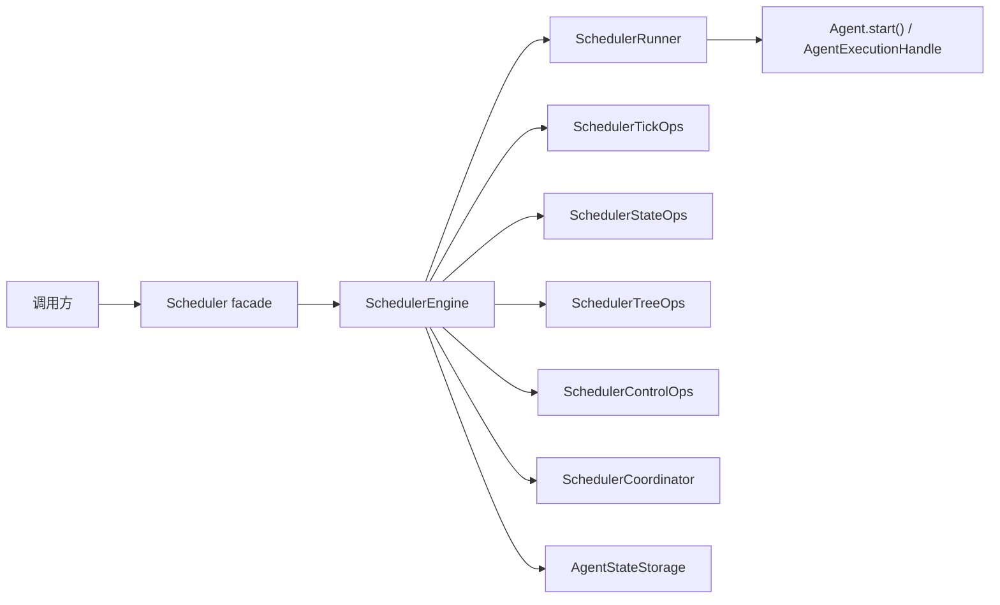
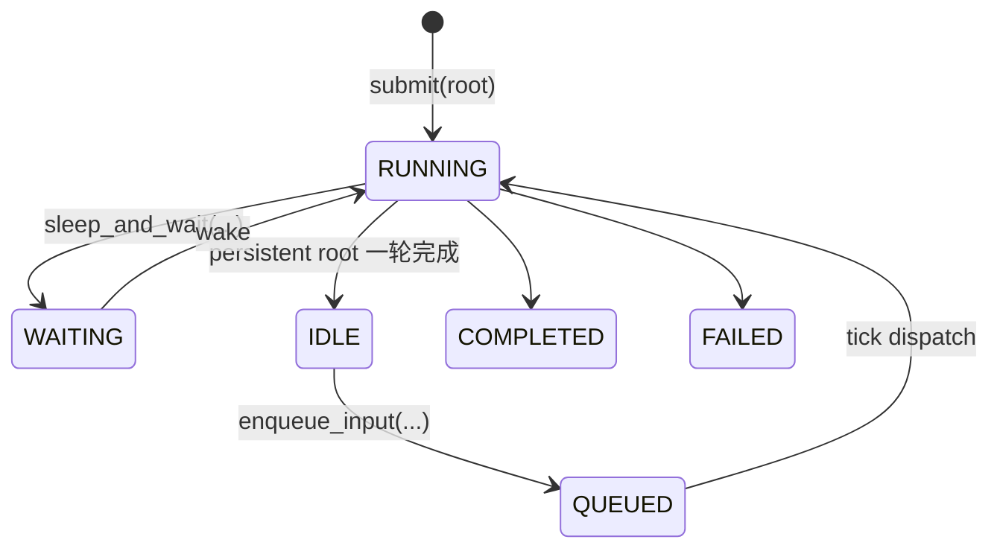
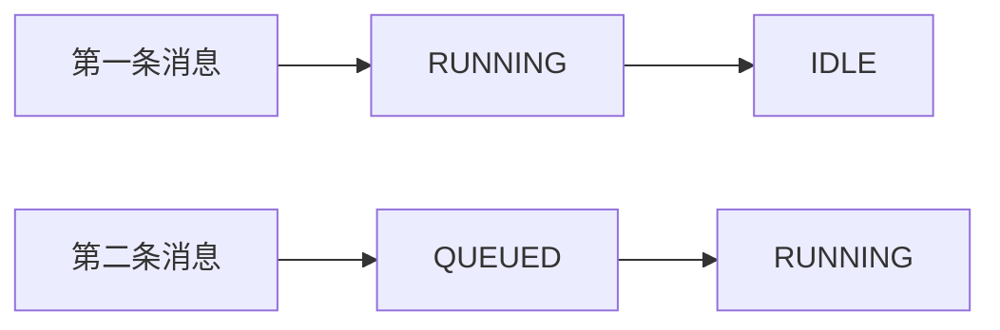
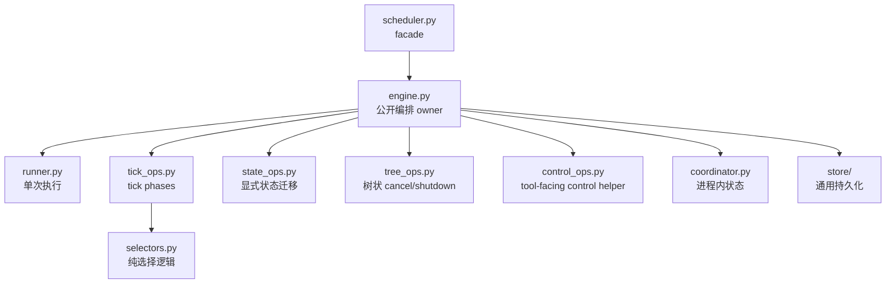

# Scheduler

`agiwo.scheduler` 是 `Agent` 之上的编排层。

如果把 `Agent` 理解成“会思考、会调工具、会产出结果的一次执行单元”，那 `Scheduler` 更像它的“运行时调度器”：

- 负责什么时候开始跑
- 负责什么时候暂停等待
- 负责什么时候被再次唤醒
- 负责怎样跨多次 run 持续存在
- 负责怎样管理 child agent

它不负责这些事：

- 不负责 agent 内部推理细节
- 不负责 LLM provider 适配
- 不负责 console 专属会话语义

## 一句话理解

没有 `Scheduler` 时，`Agent` 更像一次性调用：

```python
result = await agent.run("帮我做一件事")
```

有了 `Scheduler` 之后，`Agent` 可以变成“可持续存在、可等待、可继续、可派子任务”的运行单元：

```python
state_id = await scheduler.submit(agent, "开始处理", persistent=True)
result = await scheduler.wait_for(state_id)

await scheduler.enqueue_input(state_id, "继续处理下一条消息")
```

## 它在系统里的位置



可以把它拆成两层来看：

- `Agent` 负责“这一轮怎么跑”
- `Scheduler` 负责“这一轮什么时候开始、什么时候停、下一轮什么时候继续”

## 核心对外 API

对外最常用的是这几个方法：

```python
class Scheduler:
    async def run(...) -> RunOutput: ...
    async def submit(...) -> str: ...
    async def enqueue_input(...) -> None: ...
    async def stream(...) -> AsyncIterator[AgentStreamItem]: ...
    async def wait_for(...) -> RunOutput: ...
    async def get_state(...) -> AgentState | None: ...
    async def steer(...) -> bool: ...
    async def cancel(...) -> bool: ...
    async def shutdown(...) -> bool: ...
```

### 什么时候用哪个 API

#### 1. `run()`

最简单。适合“一次性跑完就结束”的场景。

```python
result = await scheduler.run(agent, "整理今天的待办")
print(result.response)
```

#### 2. `submit()` + `wait_for()`

适合“先提交，再由 scheduler 在后台跑”的场景。

```python
state_id = await scheduler.submit(agent, "开始处理", persistent=False)
result = await scheduler.wait_for(state_id, timeout=30)
```

#### 3. `submit(..., persistent=True)` + `enqueue_input()`

适合“长期在线的 root agent”，比如会话 agent。

```python
state_id = await scheduler.submit(
    agent,
    "第一条消息",
    persistent=True,
)

first_round = await scheduler.wait_for(state_id)

await scheduler.enqueue_input(state_id, "第二条消息")
second_round = await scheduler.wait_for(state_id)
```

#### 4. `stream()`

适合需要边跑边消费事件的场景。`Scheduler` 直接复用 `AgentStreamItem`，不会再额外发一套 scheduler 自己的文本流协议。

```python
async for item in scheduler.stream(
    "写一个发布公告",
    agent=agent,
    persistent=False,
):
    print(item.type)
```

也可以用于给一个已有 persistent root 继续喂输入：

```python
async for item in scheduler.stream(
    "继续处理下一条消息",
    state_id=state_id,
):
    print(item.type)
```

## 最重要的状态机

这套状态机是现在理解 `scheduler` 的关键。

### 状态说明

| Status | 含义 |
| --- | --- |
| `PENDING` | child 已创建，但还没真正开始跑 |
| `RUNNING` | 当前正在执行一轮 agent cycle |
| `WAITING` | 真正在等 wake 条件，比如 timer、waitset、pending events |
| `IDLE` | persistent root 当前这一轮结束了，正在待命，等下一条输入 |
| `QUEUED` | persistent root 已收到下一条输入，但还没开始下一轮 |
| `COMPLETED` | 非 persistent run 已完成 |
| `FAILED` | 本轮失败或被标记失败 |

### 为什么 `IDLE / QUEUED / WAITING` 很重要

以前最难懂的点，是把这些语义都混进一个泛化的 `SLEEPING` 里。现在它们被显式拆开了。

这三个状态分别代表：

- `WAITING`：真等待外部条件
- `IDLE`：persistent root 这一轮做完了，等下一条输入
- `QUEUED`：下一条输入已经到了，只是还没被 tick 拉起来运行

### root agent 的主路径



### 用大白话理解 persistent root

把 persistent root 想成一个长期在线的客服：

1. 收到一条消息，开始处理
2. 这一轮处理完，进入 `IDLE`
3. 新消息来了，进入 `QUEUED`
4. scheduler 下一次 tick 把它拉起来，重新进入 `RUNNING`



## 真实 wake 语义

现在 `WakeCondition` 只表示“真实等待条件”，不会再混入“提交了下一条消息”这种伪唤醒语义。

当前支持的 wake 类型：

- `WAITSET`
- `TIMER`
- `PERIODIC`
- `PENDING_EVENTS`

也就是说：

- root 会话继续处理下一条输入，不再通过 `WakeType.TASK_SUBMITTED` 这种隐式手法表达
- `WakeCondition` 现在只描述真正的等待条件

## 内部模块怎么分工

下面这张图是理解代码结构的最快方式：



### 1. `scheduler.py`

对外 facade。

它只做三件事：

- 构造依赖
- 暴露统一 public API
- 驱动后台 tick loop

它不应该重新长回一个 God Object。

### 2. `engine.py`

编排 owner。

它负责：

- `submit / enqueue_input / stream / wait_for`
- `steer / cancel / shutdown`
- 组合 tick phases
- 作为 scheduler tools 依赖的 `SchedulerControl` 实现

如果要问“scheduler 的真正语义 owner 在哪”，答案就是这里。

### 3. `runner.py`

只负责单次执行。

它做的是：

- 调 `Agent.start()`
- 消费 `AgentExecutionHandle.stream()`
- 把一次 run 的结果翻译回 scheduler state

它不负责决定“哪些 state 应该被拉起来运行”，那是 engine/tick 的事。

### 4. `tick_ops.py`

后台调度循环的几个固定 phase：

```python
await tick_ops.propagate_signals()
await tick_ops.enforce_timeouts()
await tick_ops.process_pending_events()
await tick_ops.start_pending()
await tick_ops.start_queued_roots()
await tick_ops.wake_waiting()
```

好处是：调度循环不再散成很多临时 helper，而是明确分阶段。

### 5. `selectors.py`

纯规则选择器。

例如：

- 哪些 waiting state 已经满足 wake 条件
- 哪些 waiting state 已经 timeout
- 哪些 pending events 已达到 debounce 条件

这里不做副作用，只做“选谁”。

### 6. `coordinator.py`

只保存进程内状态，不碰 store。

它管理：

- 已注册 agent
- live execution handle
- abort signal
- active task
- dispatch 去重
- wait event
- stream channel

### 7. `store/`

现在就是通用 repo，而不是半个 orchestration engine。

它只负责状态和事件的持久化能力：

```python
await store.save_state(state)
state = await store.get_state(state_id)
await store.patch_state(state_id, status=..., wake_condition=...)
states = await store.list_states(statuses=(...))

await store.save_event(event)
events = await store.list_events(target_agent_id=...)
await store.delete_events([...])
```

wakeable、timeout、debounce、signal propagation 这些规则，统一回到 scheduler 侧组合完成。

## 为什么现在更易维护

现在这套实现相比旧版，维护成本已经明显下降，原因主要是 4 点。

### 1. 状态语义更直接

以前看到一个 `SLEEPING`，你还得继续猜它到底是在：

- 真等待
- 会话待命
- 还是消息已排队

现在状态本身就直接表达语义。

### 2. 运行观测只有一条主链路

`SchedulerRunner` 统一通过 `AgentExecutionHandle.stream()` 观察 live run。

这意味着：

- 不需要再同时维护两套 live observation path
- 不需要再额外定义一套 scheduler 自己的 live-output 协议

### 3. store 边界更干净

store 只做 repo，不再承载越来越多的编排语义。

这让：

- memory/sqlite 两套实现更稳定
- 新规则更容易落在 `selectors + tick_ops + state_ops`

### 4. owner 更清楚

现在大部分语义都能回答“到底应该去哪改”：

- 改状态迁移：`state_ops.py`
- 改调度 phase：`tick_ops.py`
- 改纯规则选择：`selectors.py`
- 改一次执行怎么翻译结果：`runner.py`
- 改对外生命周期入口：`engine.py`

## 一个建议的阅读顺序

如果你第一次读这个模块，推荐按这个顺序：

1. 先看 [`scheduler.py`](./scheduler.py)
2. 再看 [`models.py`](./models.py)
3. 再看 [`engine.py`](./engine.py)
4. 接着看 [`runner.py`](./runner.py)
5. 最后看 [`tick_ops.py`](./tick_ops.py)、[`state_ops.py`](./state_ops.py)、[`selectors.py`](./selectors.py)

这样更容易先建立整体心智模型，再下钻细节。

## 当前的总体判断

从顶层视角看，`agiwo/scheduler` 现在已经比之前清晰很多，边界也明显更稳了。

它还不是“没有复杂度”，但剩下的大部分复杂度已经是编排层本来就该有的复杂度，而不是重复模型、重复观测链路、或 store 越权导致的人为复杂度。

当前最需要守住的约束只有两个：

- 不要再把新的编排语义塞回 `store`
- 不要再把新的生命周期分支重新堆回 `scheduler.py`

只要这两个边界守住，这个模块会继续保持可维护。

## 进一步问题

如果你想继续看更偏“设计问答”的解释，例如：

- tick loop 到底是轮询还是事件驱动
- 单进程去重和多实例部署边界
- `FAILED`、`steer()`、`enqueue_input()` 的具体语义
- child 生命周期和 `WakeCondition` 的组合能力

可以继续看 [`DESIGN_QA.md`](./DESIGN_QA.md)。
