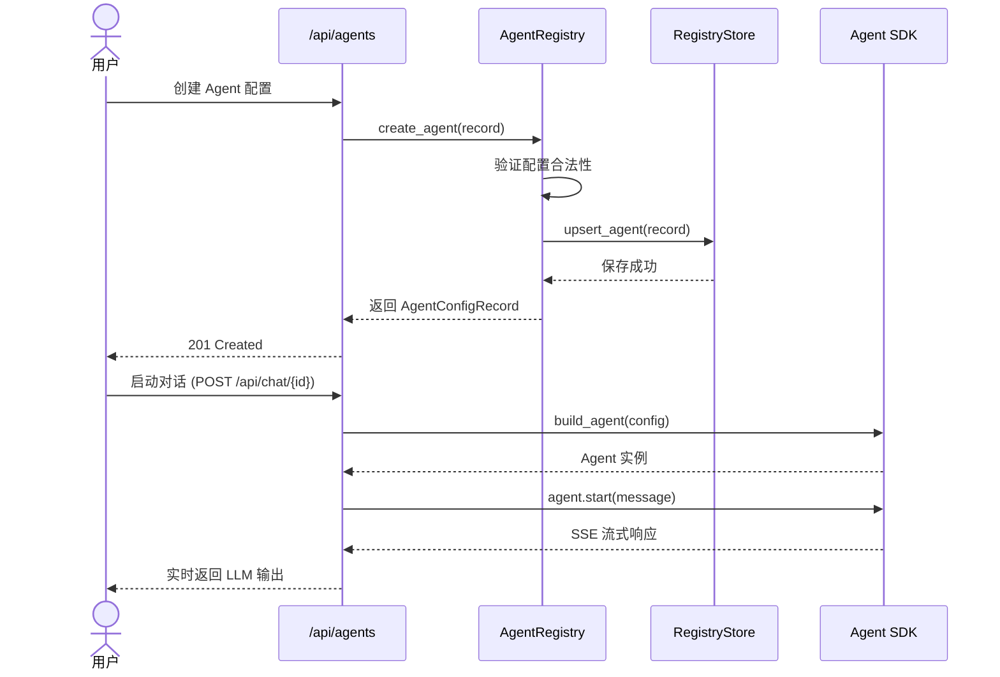
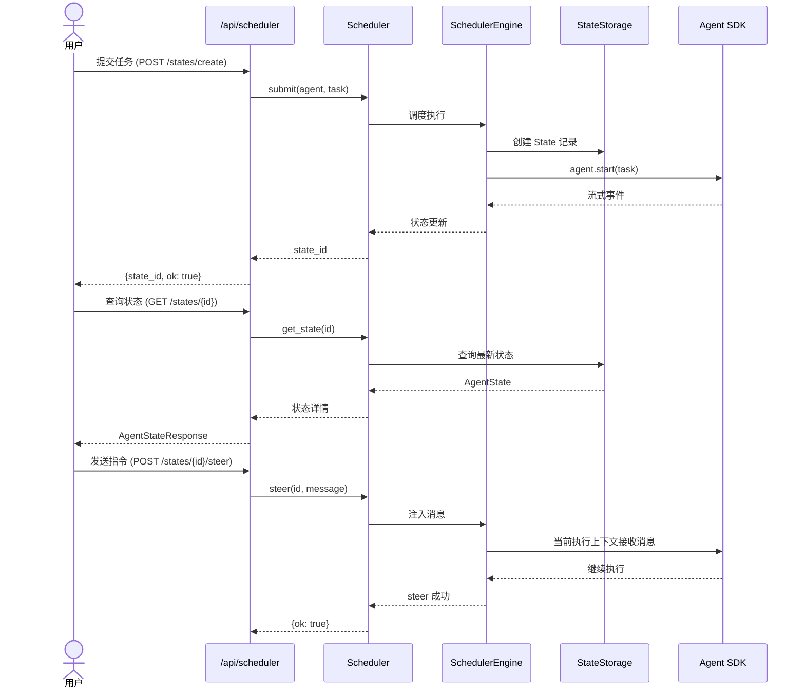
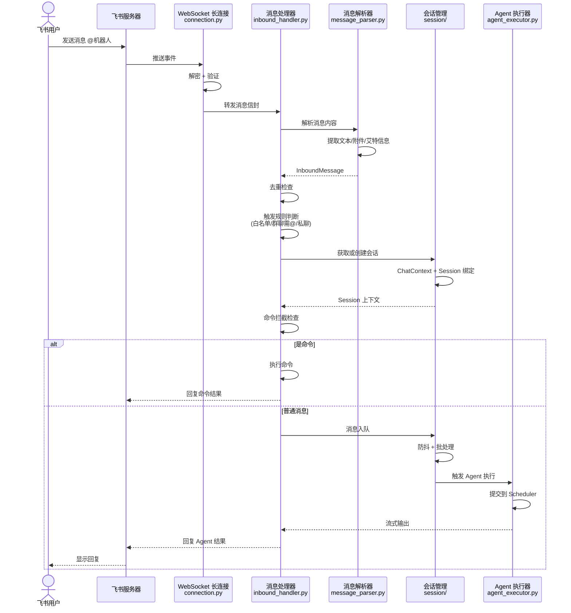
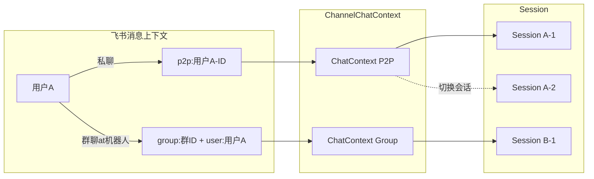
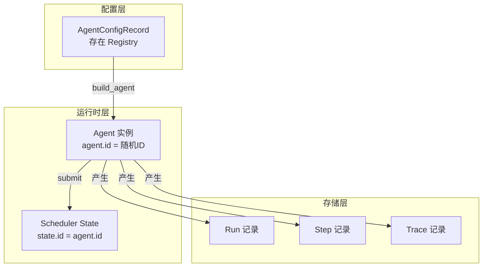
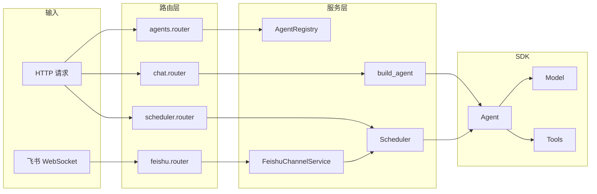

# Console Server

Agiwo Console 的控制平面后端，基于 FastAPI 构建，为 Agent SDK 提供可视化管理界面和第三方渠道接入能力。

## 一句话概括

Console Server 是 **Agent 的控制中枢** —— 它把底层的 Agent SDK 包装成 REST API，让前端可以管理 Agent 配置、查看执行记录，同时通过渠道系统把 Agent 接入飞书等 IM 平台。

---

## 整体架构


---

## 核心主流程

### 1. Agent 配置管理流程



### 2. Scheduler 调度流程



### 3. 飞书渠道消息处理流程



---

## 目录结构详解

```
console/server/
├── app.py                    # FastAPI 入口 + lifespan 管理
├── config.py                 # 配置定义 (ConsoleConfig)
├── dependencies.py           # 依赖注入容器
├── schemas.py                # API 请求/响应 Pydantic 模型
├── response_serialization.py # 响应序列化工具
├── tools.py                  # 工具目录 + 工具组装
├── routers/                  # API 路由层
│   ├── sessions.py           # Session/Run/Step 查询
│   ├── agents.py             # Agent CRUD
│   ├── chat.py               # 直接对话 SSE
│   ├── scheduler.py          # Scheduler 状态/控制
│   ├── traces.py             # Trace 查询 + SSE
│   └── feishu.py             # 飞书渠道状态
├── services/                 # 业务服务层
│   ├── agent_lifecycle.py    # Agent 构建/恢复/复用
│   ├── agent_registry/       # Agent 配置持久化
│   ├── storage_wiring.py     # 存储配置构建
│   ├── chat_sse.py           # Chat SSE 工具
│   └── metrics.py            # 指标聚合
├── channels/                 # 渠道接入层
│   ├── base.py               # 渠道抽象基类
│   ├── agent_executor.py     # Agent 执行器
│   ├── runtime_agent_pool.py # Agent 运行时池
│   ├── session/              # 会话管理子包
│   └── feishu/               # 飞书渠道实现
└── domain/                   # 领域模型
    ├── agent_configs.py
    ├── run_metrics.py
    ├── sessions.py
    └── tool_references.py
```

---

## 三大子系统

### 1. API 层 (`routers/`)

REST API + SSE 端点，供前端调用。

| 路由 | 职责 |
|------|------|
| `/api/agents` | Agent 配置的 CRUD |
| `/api/chat/{id}` | 直接对话 SSE |
| `/api/scheduler/*` | Scheduler 状态查询、控制、调度对话 |
| `/api/sessions/*` | Session/Run/Step 查询 |
| `/api/traces/*` | Trace 查询 + 实时 SSE |
| `/api/channels/feishu/*` | 飞书渠道状态 |

### 2. 服务层 (`services/`)

核心业务逻辑，封装 SDK 调用。

| 模块 | 职责 |
|------|------|
| `agent_lifecycle.py` | Agent 构建、重新水化、持久 Agent 恢复 |
| `agent_registry/` | Agent 配置的持久化 CRUD |
| `storage_wiring.py` | 存储配置的构建器 |
| `chat_sse.py` | Chat 对话的 SSE 流式响应封装 |
| `metrics.py` | Run/Session/State 的指标聚合 |

### 3. 渠道层 (`channels/`)

第三方 IM 接入，当前只有飞书，设计为可扩展。

| 模块 | 职责 |
|------|------|
| `base.py` | 渠道抽象基类，定义通用流程 |
| `agent_executor.py` | 封装 Agent 执行，对接 Scheduler |
| `runtime_agent_pool.py` | Agent 实例缓存 + 配置指纹刷新 |
| `session/` | 会话生命周期管理 |
| `feishu/` | 飞书渠道具体实现 |

---

## 关键概念图解

### Session 绑定模型



### Agent 运行时关系



---

## 数据流总览



---

## 子包文档

- [`channels/`](./channels/README.md) — 渠道接入层详解
- [`channels/feishu/`](./channels/feishu/README.md) — 飞书渠道实现
- [`services/`](./services/README.md) — 业务服务层详解

---

## 启动流程

```python
# app.py 的 lifespan

1. 加载 ConsoleConfig
2. 创建 run_step_storage (SQLite/Mongo/Memory)
3. 创建 trace_storage (BaseTraceStorage)
4. 初始化 AgentRegistry
5. 创建 Scheduler (使用 state_storage)
6. 如启用飞书:
   - 获取/创建默认 Agent 配置
   - 创建 FeishuChannelService
   - 启动 WebSocket 长连接
7. 组装 ConsoleRuntime 绑定到 app.state
8. 启动完成，开始服务请求
```

---

## 开发指南

### 添加新的 API 端点

1. 在 `schemas.py` 定义请求/响应模型
2. 在 `routers/` 创建或修改路由文件
3. 使用 `ConsoleRuntimeDep` 获取依赖
4. 在 `app.py` 的 `create_app()` 中注册路由

### 添加新的渠道

1. 继承 `BaseChannelService`
2. 实现抽象方法 (`_build_user_message`, `_deliver_reply`, 等)
3. 实现渠道特定的消息解析、存储
4. 在 `app.py` lifespan 中初始化和启动

### 存储后端切换

通过环境变量控制：
- `AGIWO_CONSOLE_RUN_STEP_STORAGE_TYPE=sqlite|mongodb|memory`
- `AGIWO_CONSOLE_TRACE_STORAGE_TYPE=sqlite|mongodb|memory`
- `AGIWO_CONSOLE_METADATA_STORAGE_TYPE=sqlite|mongodb|memory`
