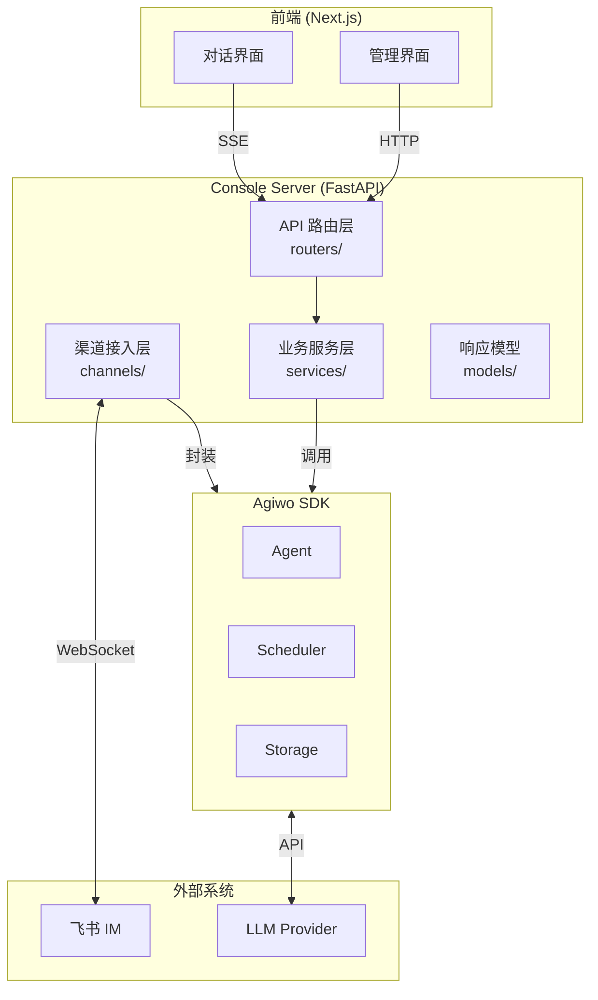

# Console Server

Agiwo Console 的控制平面后端，基于 FastAPI 构建，为 Agent SDK 提供可视化管理界面和第三方渠道接入能力。

## 一句话概括

Console Server 是 **Agent 的控制中枢** —— 它把底层的 Agent SDK 包装成 REST API，让前端可以管理 Agent 配置、查看执行记录，同时通过渠道系统把 Agent 接入飞书等 IM 平台。

---

## 整体架构



---

## 核心主流程

### 1. Agent 配置管理流程

*(略，与原文件保持不变)*

### 2. Scheduler 调度流程

*(略，与原文件保持不变)*

### 3. 飞书渠道消息处理流程

*(略，与原文件保持不变)*

---

## 目录结构详解

```text
console/server/
├── app.py                    # FastAPI 入口 + lifespan 管理
├── config.py                 # 配置定义 (ConsoleConfig)
├── dependencies.py           # 依赖注入容器
├── tools.py                  # 工具目录 + 工具组装
├── models/                   # API 请求/响应 Pydantic 模型
│   ├── agent_config.py       # Agent 配置模型
│   ├── agent_options.py      # Agent 选项模型
│   ├── chat.py               # 对话相关模型
│   ├── metrics.py            # 指标聚合模型
│   ├── scheduler_control.py  # 调度控制模型
│   ├── scheduler_state.py    # 调度状态模型
│   ├── step_run.py           # Step/Run 响应模型
│   ├── stream.py             # 流式响应模型
│   ├── tool_reference.py     # 工具引用模型
│   └── trace.py              # Trace 响应模型
├── routers/                  # API 路由层
│   ├── agents.py             # Agent CRUD + GET /tools/available
│   ├── chat.py               # 直接对话 SSE + session/fork
│   ├── scheduler.py          # Scheduler 状态/控制/提交
│   ├── sessions.py           # Sessions/Runs/Steps 查询
│   ├── traces.py             # Trace 查询
│   └── feishu.py             # 飞书渠道状态
├── services/                 # 业务服务层
│   ├── agent_lifecycle.py    # Agent 构建/恢复/复用
│   ├── agent_registry/       # Agent 配置持久化
│   ├── storage_wiring.py     # 存储配置构建
│   ├── chat_sse.py           # Chat SSE 工具
│   └── metrics.py            # 指标聚合
└── channels/                 # 渠道接入层
    ├── agent_executor.py     # Agent 执行器
    ├── runtime_agent_pool.py # Agent 运行时池
    ├── exceptions.py         # 渠道异常定义
    ├── session/              # 会话管理子包
    │   ├── context_service.py
    │   ├── manager.py
    │   └── models.py
    └── feishu/               # 飞书渠道实现
        ├── commands/         # 命令系统
        ├── store/            # 存储后端
        ├── connection.py
        ├── inbound_handler.py
        ├── message_parser.py
        ├── content_extractor.py
        ├── message_builder.py
        ├── delivery_service.py
        ├── api_client.py
        ├── factory.py
        ├── group_history_store.py
        └── service.py
```

---

## 三大子系统

### 1. API 层 (`routers/`)

REST API + SSE 端点，供前端调用。

| 路由 | 职责 |
|------|------|
| `/api/agents` | Agent 配置的 CRUD |
| `/api/agents/tools/available` | 获取可用工具列表 |
| `/api/chat/{id}` | 直接对话 SSE |
| `/api/chat/{id}/cancel` | 取消正在进行中的对话 |
| `/api/chat/{id}/sessions/*` | 对话级 session 操作（列表/创建/切换/fork） |
| `/api/scheduler/*` | Scheduler 状态查询、控制、提交 |
| `/api/sessions/*` | Session/Run/Step 查询 |
| `/api/traces` | Trace 查询 |
| `/api/channels/feishu/*` | 飞书渠道状态 |

### 2. 服务层 (`services/`)

核心业务逻辑，封装 SDK 调用。

| 模块 | 职责 |
|------|------|
| `agent_lifecycle.py` | Agent 构建、重新水化、持久 Agent 恢复 |
| `agent_registry/` | Agent 配置的持久化 CRUD |
| `storage_wiring.py` | 存储配置的构建器 |
| `chat_sse.py` | Chat 对话的 SSE 流式响应封装 |
| `metrics.py` | Run/Session/State 的指标聚合 |

### 3. 渠道层 (`channels/`)

第三方 IM 接入，当前只有飞书，设计为可扩展。

| 模块 | 职责 |
|------|------|
| `agent_executor.py` | 封装 Agent 执行，对接 Scheduler |
| `runtime_agent_pool.py` | Agent 实例缓存 + 配置指纹刷新 |
| `session/` | 会话生命周期管理 |
| `feishu/` | 飞书渠道具体实现 |
| `feishu/commands/` | 飞书命令系统 |
| `feishu/store/` | 飞书存储后端 |

---

## 关键概念图解

### Session 绑定模型

*(略，与原文件保持一致)*

### Agent 运行时关系

*(略，与原文件保持一致)*

---

## 数据流总览

*(略，与原文件保持一致)*

---

## 子包文档

- [`channels/README.md`](./channels/README.md) — 渠道接入层详解
- [`channels/feishu/README.md`](./channels/feishu/README.md) — 飞书渠道实现
- [`services/README.md`](./services/README.md) — 业务服务层详解

---

## 启动流程

*(略，与原文件保持一致)*

---

## 开发指南

### 添加新的 API 端点

1. 在 `models/` 定义请求/响应模型
2. 在 `routers/` 创建或修改路由文件
3. 使用 `ConsoleRuntimeDep` 获取依赖
4. 在 `app.py` 的 `create_app()` 中注册路由

### 添加新的渠道

1. 创建渠道目录 `channels/your_channel/`
2. 实现渠道服务类，参考 `feishu/service.py`
3. 在 `app.py` 的 lifespan 中初始化和启动

### 存储后端切换

通过环境变量控制：
- `AGIWO_CONSOLE_RUN_STEP_STORAGE_TYPE=sqlite|mongodb|memory`
- `AGIWO_CONSOLE_TRACE_STORAGE_TYPE=sqlite|mongodb|memory`
- `AGIWO_CONSOLE_METADATA_STORAGE_TYPE=sqlite|mongodb|memory`
