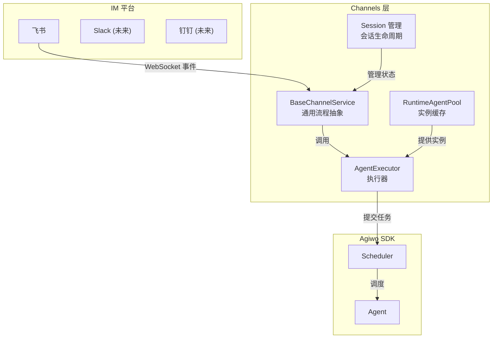
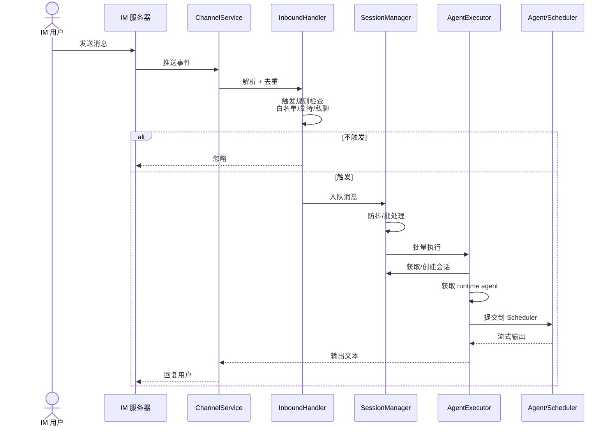
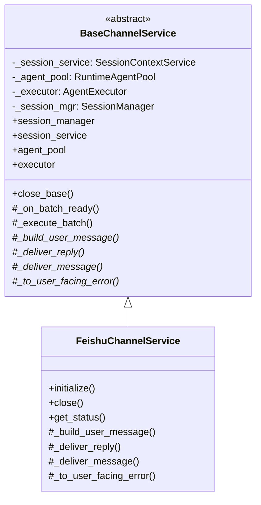
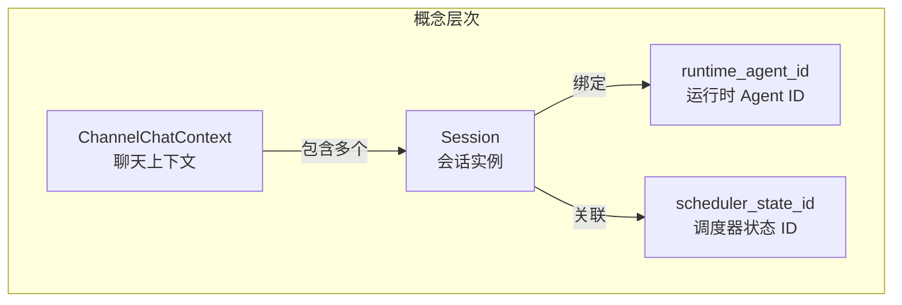
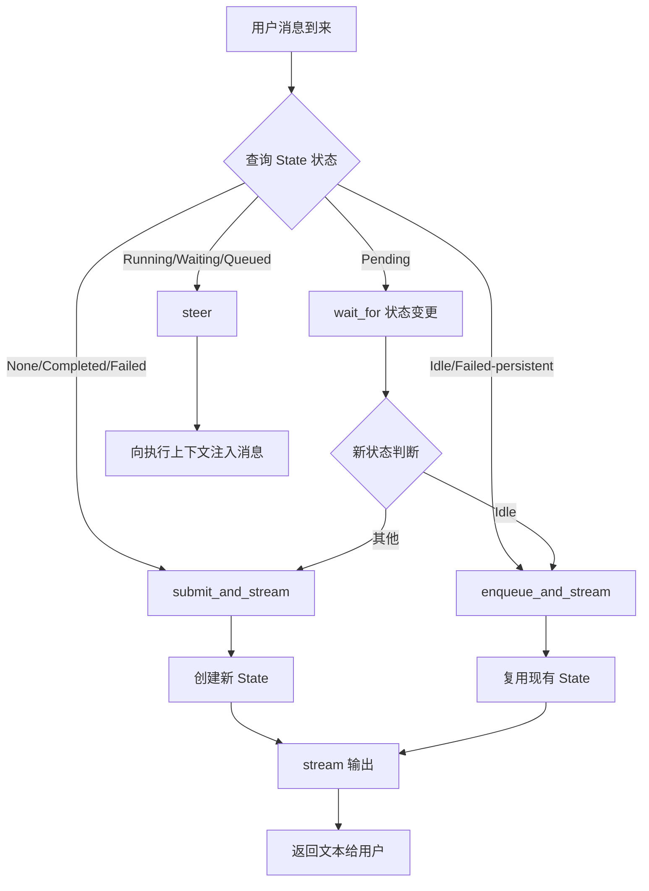
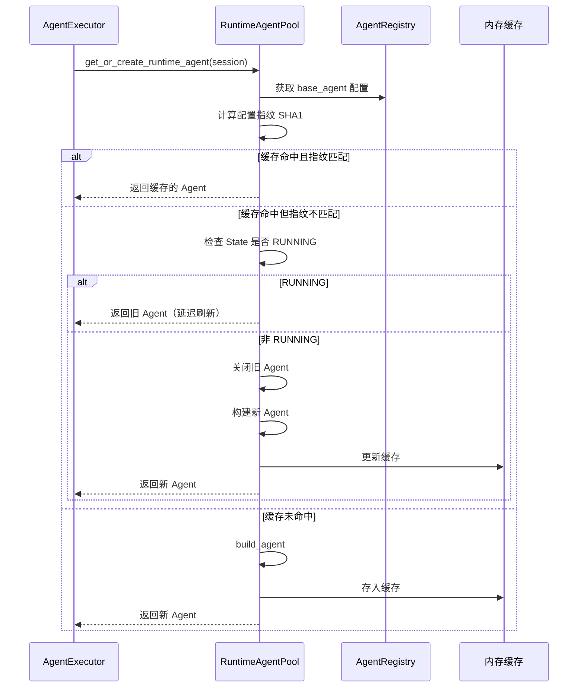
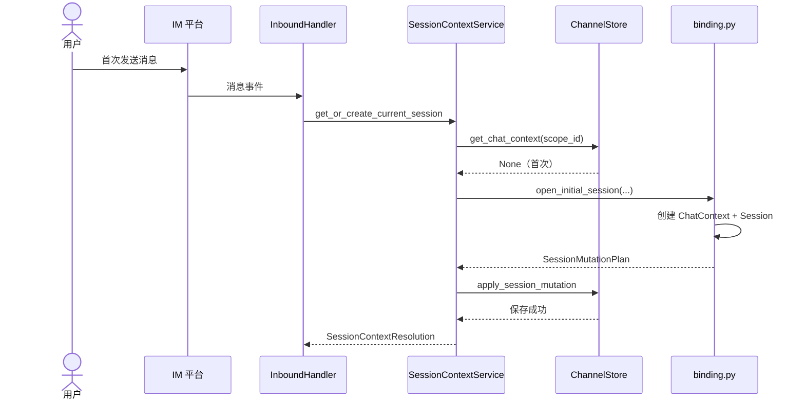
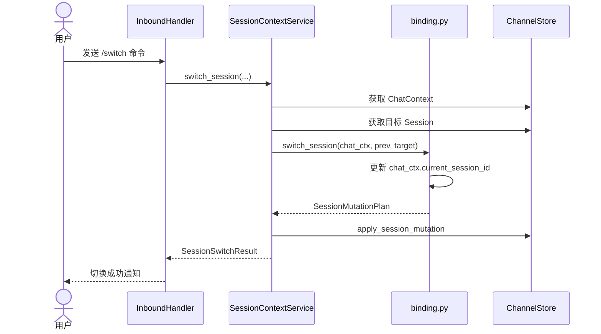
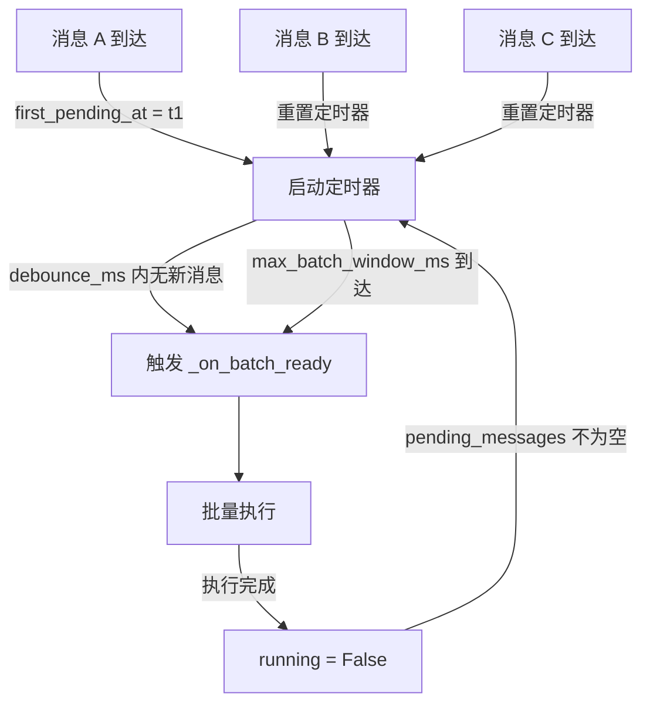

# Channels 渠道接入层

Channels 包负责把 Agent 能力接入到第三方 IM 平台（如飞书）。它提供了一套通用的渠道抽象，让不同 IM 平台的接入逻辑可以复用相同的基础设施。

---

## 一句话概括

Channels 是 **Agent 的"翻译官"** —— 它把飞书、钉钉等 IM 平台的消息格式转换成 Agent 能理解的输入，再把 Agent 的输出发送回 IM 平台。

---

## 架构定位



---

## 核心流程

### 消息处理总流程



---

## 模块详解

### 1. BaseChannelService — 渠道抽象基类

**文件**: `base.py`

定义了所有渠道必须实现的通用流程。



**抽象方法说明**:

| 方法 | 职责 | 飞书实现示例 |
|------|------|-------------|
| `_build_user_message` | 把渠道消息转成 `UserMessage` | `FeishuUserMessageBuilder` |
| `_deliver_reply` | 发送首条回复 | 回复消息或添加表情 |
| `_deliver_message` | 发送后续消息 | 创建新消息 |
| `_to_user_facing_error` | 错误本地化 | "上一条任务仍在处理中" |

### 2. Session 会话管理子包

**目录**: `session/`

管理 IM 会话的生命周期，处理多会话切换。



**核心模型**:

| 模型 | 含义 | 示例 |
|------|------|------|
| `ChannelChatContext` | 聊天上下文（群/私聊） | `feishu:main:p2p:ou_xxx` |
| `Session` | 一次连续对话 | UUID |
| `BatchContext` | 批量消息上下文 | 包含触发用户、消息 ID 等 |
| `InboundMessage` | 入站消息 | 解析后的飞书消息 |

**核心服务**:

| 模块 | 职责 |
|------|------|
| `SessionContextService` | 会话协调（获取/创建/切换） |
| `SessionManager` | 消息批处理 + 防抖 |
| `binding.py` | 会话操作的原子领域逻辑 |

### 3. AgentExecutor — Agent 执行器

**文件**: `agent_executor.py`

封装 Agent 执行的细节，对接 Scheduler。

**状态路由逻辑**:

```
当前状态 → 动作
─────────────────────────────
None/COMPLETED/FAILED    → submit (新建持久 Agent)
IDLE/FAILED(persistent)  → enqueue (复用现有 Agent)
RUNNING/WAITING/QUEUED   → steer (注入消息)
PENDING                  → wait → submit/enqueue
```



### 4. RuntimeAgentPool — Agent 运行时池

**文件**: `runtime_agent_pool.py`

缓存 Agent 实例，避免重复构建，支持配置热更新。



**配置指纹计算**:
```python
# 包含字段：name, description, model_provider, model_name,
#          system_prompt, tools, options, model_params
# 算法：SHA1(sorted JSON)
```

---

## Session 管理详解

### 会话绑定流程



### 会话切换流程



---

## 消息批处理机制

SessionManager 实现了防抖 + 最大等待窗口的消息批处理：



**参数配置** (config.py):
- `feishu_debounce_ms`: 防抖等待时间 (默认 3000ms)
- `feishu_max_batch_window_ms`: 最大批处理窗口 (默认 15000ms)

---

## 接口定义

### ChannelChatSessionStore (Protocol)

```python
class ChannelChatSessionStore(Protocol):
    async def get_chat_context(self, scope_id: str) -> ChannelChatContext | None: ...
    async def upsert_chat_context(self, chat_context: ChannelChatContext) -> None: ...
    async def get_session(self, session_id: str) -> Session | None: ...
    async def upsert_session(self, session: Session) -> None: ...
    async def apply_session_mutation(self, mutation: SessionMutationPlan) -> None: ...
    async def list_sessions_by_user(self, user_open_id: str) -> list[SessionWithContext]: ...
```

### 存储实现

| 实现 | 文件 | 适用场景 |
|------|------|----------|
| `InMemoryFeishuChannelStore` | `feishu/store/memory.py` | 开发/测试 |
| `SqliteFeishuChannelStore` | `feishu/store/sqlite.py` | 生产环境 |

---

## 扩展指南

### 接入新的 IM 平台 (如 Slack)

1. **创建渠道目录** `channels/slack/`
2. **实现消息解析**
   ```python
   # slack/message_parser.py
   class SlackInboundEnvelope: ...
   class SlackMessageParser: ...
   ```
3. **实现内容提取**
   ```python
   # slack/content_extractor.py
   class SlackContentExtractor: ...
   ```
4. **实现发送服务**
   ```python
   # slack/delivery_service.py
   class SlackDeliveryService: ...
   ```
5. **实现渠道服务**
   ```python
   # slack/service.py
   class SlackChannelService(BaseChannelService): ...
   ```
6. **在 app.py 中初始化和启动**

### 关键实现点

- **连接方式**: WebSocket 实时推送 或 Webhook
- **去重机制**: event_id 幂等检查
- **触发规则**: 群聊需@ / 私聊直接触发 / 白名单过滤
- **会话标识**: 私聊用用户ID，群聊用群ID+用户ID
- **消息格式**: 文本、富文本、图片、文件的处理

---

## 与飞书渠道的交互

详细实现见 [`feishu/README.md`](./feishu/README.md)。
