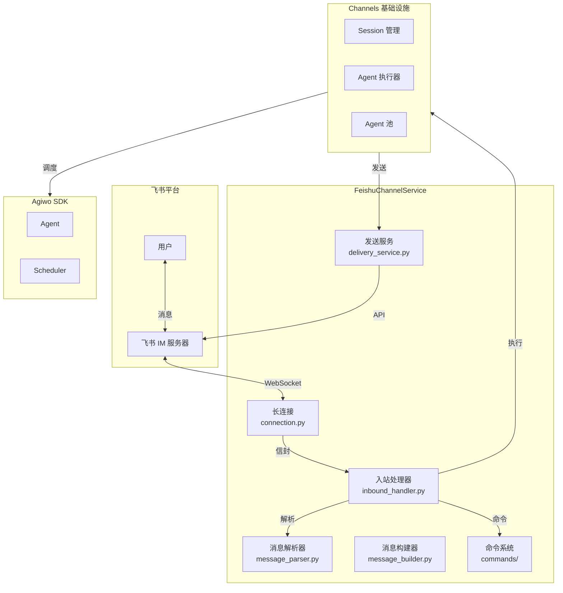
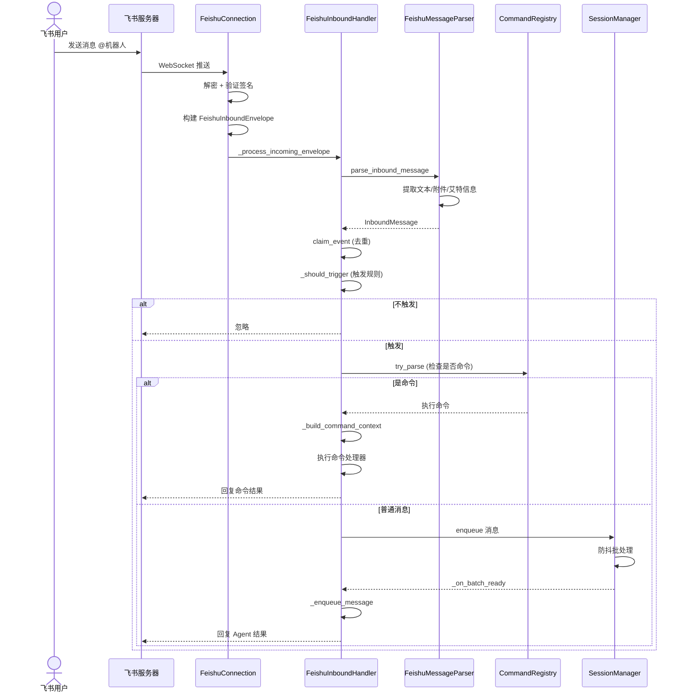
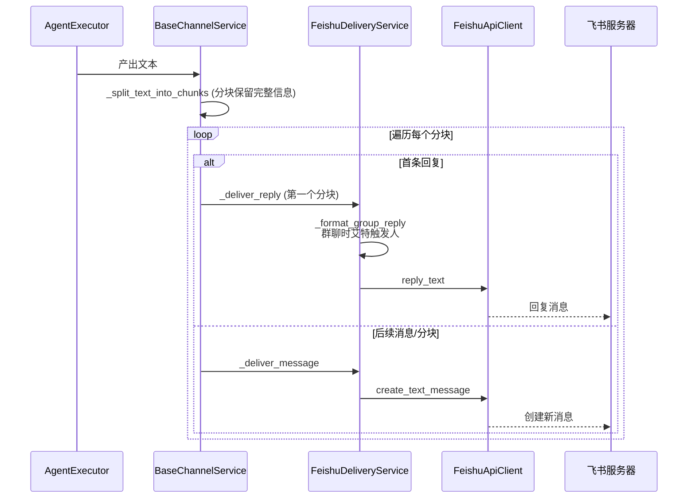
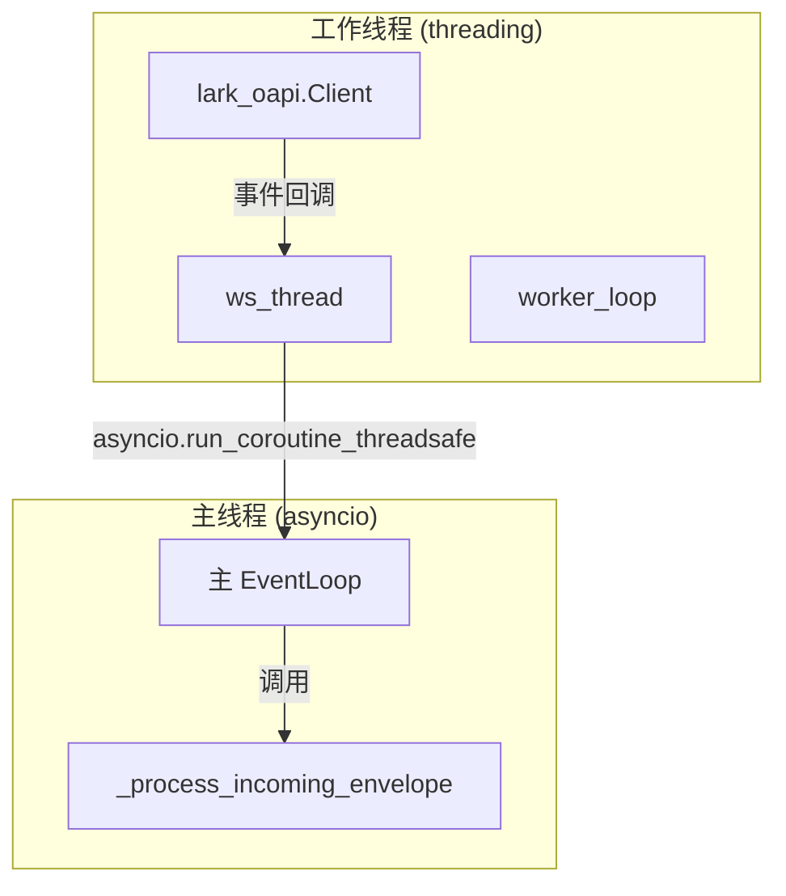
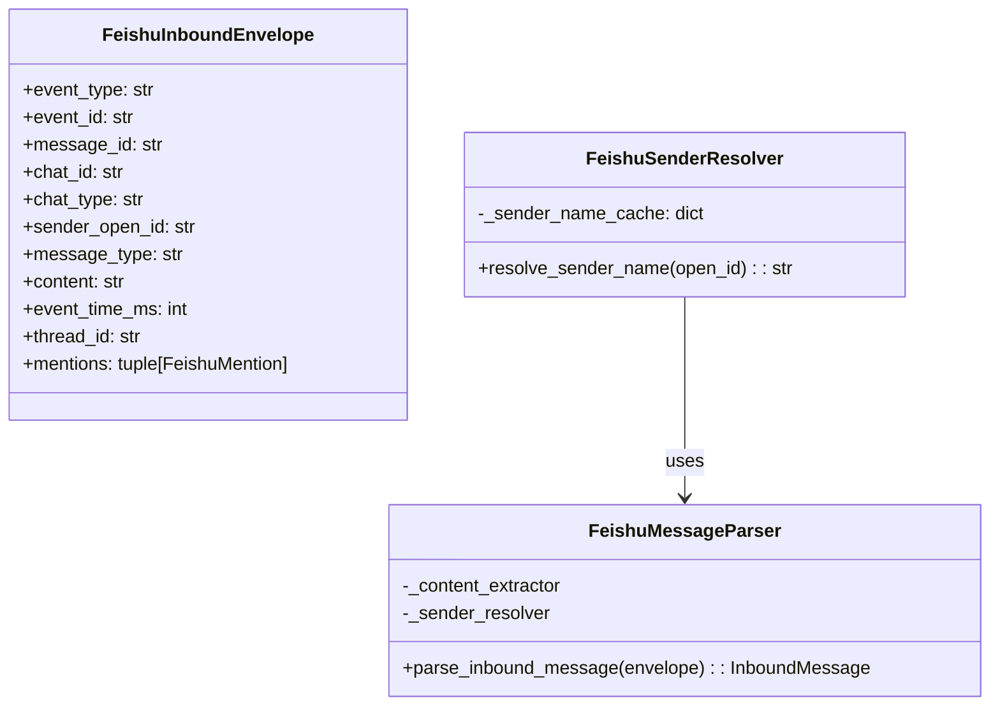
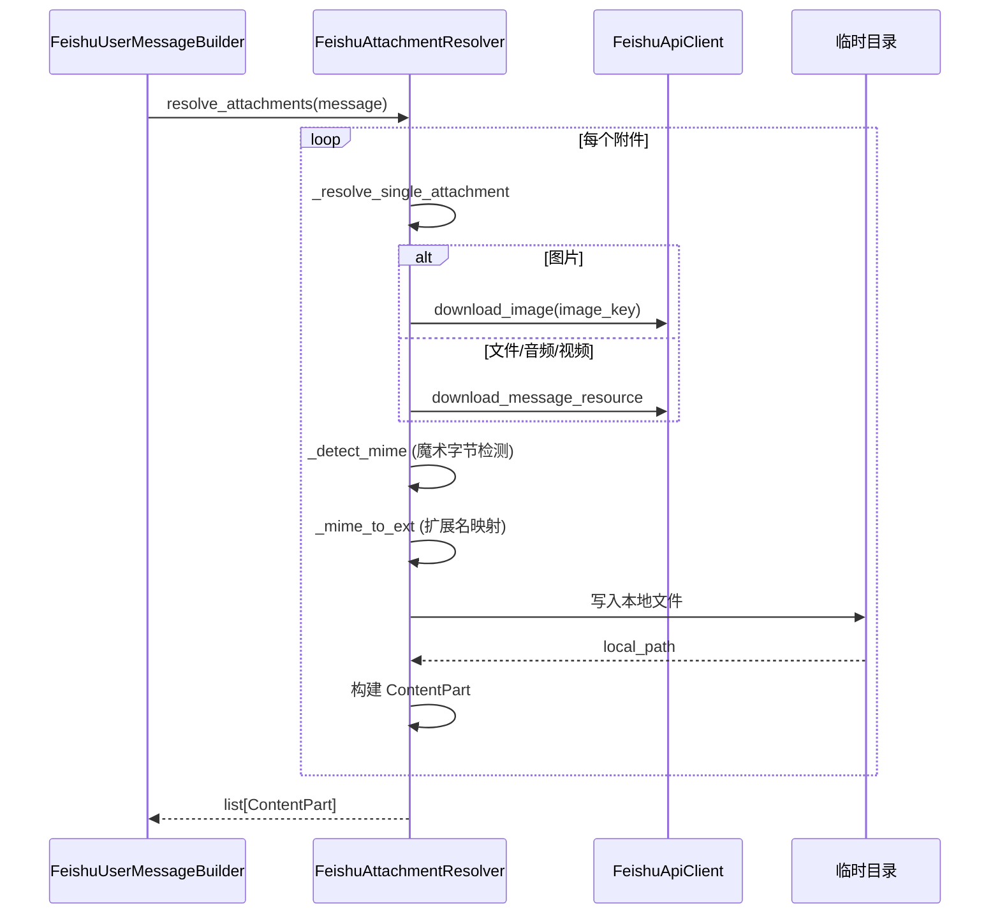
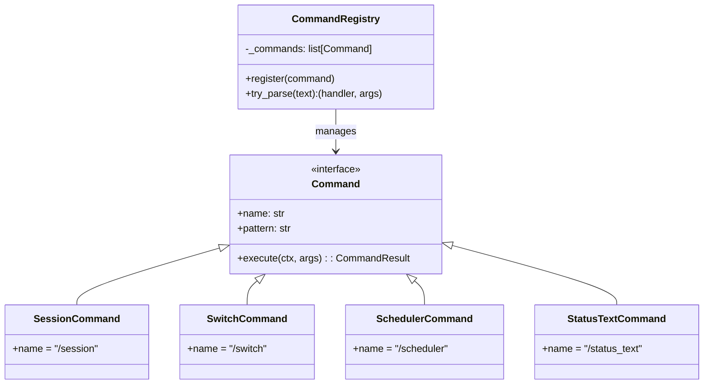
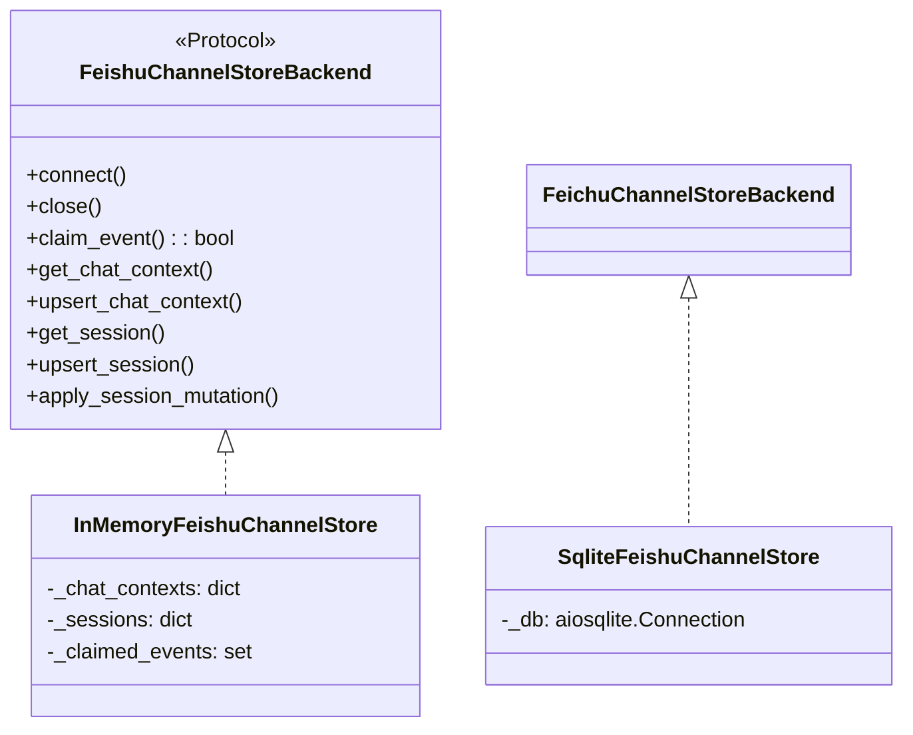

# Feishu 飞书渠道

飞书渠道的完整实现，让 Agent 可以通过飞书机器人与用户交互。

---

## 一句话概括

飞书渠道是 **Agent 的"飞书账号"** —— 它维护 WebSocket 长连接接收消息，把用户的@消息和私聊转发给 Agent，再把 Agent 的回复发回飞书。

---

## 架构定位



---

## 核心数据流

### 消息入站流程



### 消息出站流程



---

## 模块详解

### 1. FeishuConnection — WebSocket 长连接

**文件**: `connection.py`

维护飞书 Lark SDK 的 WebSocket 长连接，接收实时消息。



**关键设计**:
- 使用独立线程运行 Lark SDK（SDK 使用自己的事件循环）
- 通过 `asyncio.run_coroutine_threadsafe` 把事件回调回传到主循环
- 支持优雅关闭：设置 `_closed` 标志 → 禁用自动重连 → 停止事件循环 → 等待线程结束

### 2. FeishuInboundHandler — 入站处理器

**文件**: `inbound_handler.py`

消息处理的主入口，协调去重、触发规则、命令拦截、消息入队。

**处理流程**:

```mermaid
flowchart TD
    A[process_envelope] --> B{event_type?}
    B -->|非 im.message.receive_v1| C[忽略]
    B -->|消息事件| D[parse_inbound_message]

    D --> E[claim_event]
    E -->|重复| F[忽略重复]
    E -->|新事件| G[record_message]

    G --> H{_should_trigger?}
    H -->|白名单不通过| I[忽略]
    H -->|群聊未@| I
    H -->|触发| J[try_handle_command]

    J -->|是命令| K[执行命令]
    K --> L[send_command_response]
    J -->|普通消息| M[send_ack]
    M --> N[_enqueue_message]
```

**触发规则** (`_should_trigger`):
1. `default_agent_name` 必须配置
2. 发送者在白名单中（如配置）
3. 群聊必须 @机器人
4. 私聊直接触发

**会话标识** (`_build_chat_context_scope_id`):
- 私聊: `feishu:{instance_id}:p2p:{sender_id}`
- 群聊: `feishu:{instance_id}:group:{chat_id}:user:{sender_id}`

### 3. FeishuMessageParser — 消息解析器

**文件**: `message_parser.py`

解析飞书 SDK 事件，提取结构化信息。



**发送者名称缓存**:
- 调用飞书 API 获取用户显示名
- 缓存 1 小时 (3600s)
- 降级策略: 失败时使用 `user_{open_id后6位}`

### 4. FeishuContentExtractor — 内容提取器

**文件**: `content_extractor.py`

处理飞书各种消息类型的内容解析。

**支持的消息类型**:

| 类型 | 处理方式 | 附件提取 |
|------|----------|----------|
| `text` | 直接取 text 字段 | 无 |
| `post` | 遍历 rich text 节点 | img → 图片 |
| `image` | 提取 image_key | 图片 |
| `file` | 提取 file_key + file_name | 文件 |
| `audio` | 提取 file_key | 音频 |
| `media` | 提取 file_key | 视频 |
| `sticker` | 标记为表情 | 忽略 |
| `interactive` | 标记为卡片 | 无 |
| `share_chat/user` | 标记为分享 | 无 |

**Post 消息解析示例**:
```json
{
  "zh_cn": {
    "title": "标题",
    "content": [
      [{"tag": "text", "text": "正文"}],
      [{"tag": "at", "user_name": "张三"}],
      [{"tag": "img", "image_key": "img_xxx"}]
    ]
  }
}
```

### 5. FeishuUserMessageBuilder — 消息构建器

**文件**: `message_builder.py`

构建 Agent 能理解的 `UserMessage`，处理附件下载。

**附件下载流程**:



**MIME 类型检测**:
```python
# 魔术字节检测
PNG  : b"\x89PNG\r\n\x1a\n"
JPEG : b"\xff\xd8"
GIF  : b"GIF8"
WEBP : b"RIFF" + b"WEBP"
PDF  : b"%PDF"
MP4  : b"....ftyp"
```

### 6. FeishuDeliveryService — 发送服务

**文件**: `delivery_service.py`

处理消息回执和回复的发送。

**发送策略**:

| 场景 | 方法 | 失败降级 |
|------|------|----------|
| 收到确认 | `send_ack` | 表情 → 文本回复 |
| 首条回复 | `deliver_reply` | 回复消息 → 创建消息 |
| 后续消息 | `deliver_message` | 创建消息 |
| 命令响应 | `send_command_response` | 回复消息 → 创建消息 |

**群聊艾特格式**:
```python
# 群聊时自动艾特触发人
if chat_type == "group":
    text = f'<at user_id="{user_id}">发起人</at> ' + text
```

### 7. 命令系统 (commands/)

**目录**: `commands/`

飞书特有的斜杠命令处理。



**命令列表**:

| 命令 | 功能 | 来源模块 |
|------|------|----------|
| **会话管理** || `session.py` |
| `/new` | 创建新会话，重置当前对话上下文 | |
| `/list` | 列出历史会话和概览 | |
| `/switch {session_id}` | 切换到指定会话 | |
| **上下文查看** || `context.py` |
| `/context` | 查看当前会话的 SystemPrompt 和概览 | |
| `/status` | 查看当前对话的统计信息 (Token 用量、耗时等) | |
| **调度器控制** || `scheduler.py` |
| `/agents` | 列出所有调度器 Agent 状态 | |
| `/detail {state_id}` | 查看 Agent 详情 | |
| `/steer {state_id} {message}` | 向 Agent 发送引导消息 | |
| `/cancel {state_id}` | 取消 Agent 执行 | |
| `/resume {state_id} {message}` | 恢复持久 Agent | |

### 存储实现

### FeishuChannelStore

**文件**: `store/__init__.py`, `store/memory.py`, `store/sqlite.py`

存储飞书渠道的元数据（会话、聊天上下文、事件去重）。



**数据表** (SQLite):
- `feishu_chat_contexts` — 聊天上下文
- `feishu_sessions` — 会话
- `feishu_claimed_events` — 已处理事件（去重）

---

## 配置项

| 环境变量 | 说明 | 默认值 |
|----------|------|--------|
| `AGIWO_CONSOLE_FEISHU_ENABLED` | 是否启用飞书渠道 | `False` |
| `AGIWO_CONSOLE_FEISHU_APP_ID` | 飞书应用 ID | 必填 |
| `AGIWO_CONSOLE_FEISHU_APP_SECRET` | 飞书应用密钥 | 必填 |
| `AGIWO_CONSOLE_FEISHU_VERIFICATION_TOKEN` | 验证 Token | `""` |
| `AGIWO_CONSOLE_FEISHU_ENCRYPT_KEY` | 加密密钥 | `""` |
| `AGIWO_CONSOLE_FEISHU_BOT_OPEN_ID` | 机器人 Open ID | `""` |
| `AGIWO_CONSOLE_FEISHU_DEFAULT_AGENT_NAME` | 默认 Agent 名称 | 必填 |
| `AGIWO_CONSOLE_FEISHU_WHITELIST_OPEN_IDS` | 白名单用户列表 | `[]` |
| `AGIWO_CONSOLE_FEISHU_DEBOUNCE_MS` | 防抖时间 | `3000` |
| `AGIWO_CONSOLE_FEISHU_MAX_BATCH_WINDOW_MS` | 最大批处理窗口 | `15000` |
| `AGIWO_CONSOLE_FEISHU_SCHEDULER_WAIT_TIMEOUT` | 调度器等待超时 | `900` |
| `AGIWO_CONSOLE_FEISHU_ACK_REACTION_EMOJI` | 收到确认表情 | `"Typing"` |
| `AGIWO_CONSOLE_FEISHU_ACK_FALLBACK_TEXT` | 收到确认回退文本 | `"收到，正在处理。"` |

---

## 错误处理

### 用户可见错误映射

```python
def _to_user_facing_error(self, error: Exception) -> str:
    raw = str(error)
    if raw == "previous_task_still_running_after_timeout":
        return "上一条任务仍在处理中，请稍后再试。"
    if raw.startswith("base_agent_not_found:"):
        return "默认 Agent 不存在或已被删除，请检查 AGIWO_CONSOLE_FEISHU_DEFAULT_AGENT_NAME。"
    if raw.startswith("default_agent_name_not_found:"):
        return "当前默认 Agent 名称不存在，请检查 AGIWO_CONSOLE_FEISHU_DEFAULT_AGENT_NAME。"
    return f"执行失败: {raw}"
```

---

## 调试技巧

### 查看连接状态

```bash
curl http://localhost:8422/api/channels/feishu/status
```

响应:
```json
{
  "enabled": true,
  "mode": "long_connection",
  "long_connection_alive": true,
  "session_count": 5
}
```

### 日志关键字

| 关键字 | 含义 |
|--------|------|
| `feishu_message_received` | 收到新消息 |
| `feishu_message_ignored` | 消息被忽略（重复/不触发） |
| `feishu_ack_sent` | 发送收到确认 |
| `feishu_response_sent` | 发送 Agent 回复 |
| `feishu_command_received` | 收到命令 |
| `feishu_long_connection_started` | 长连接启动 |
| `feishu_long_connection_failed` | 长连接失败 |
