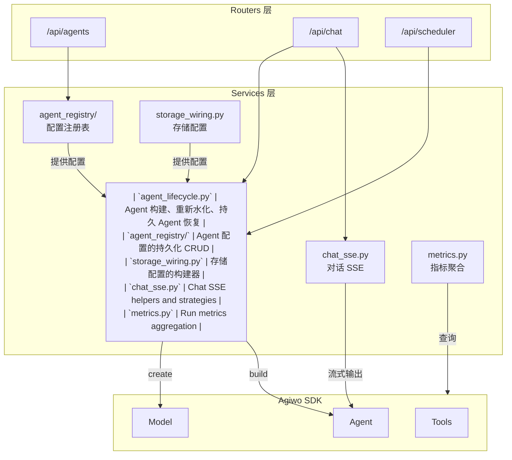
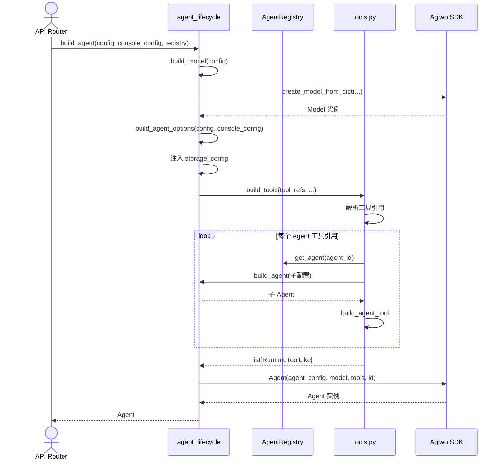
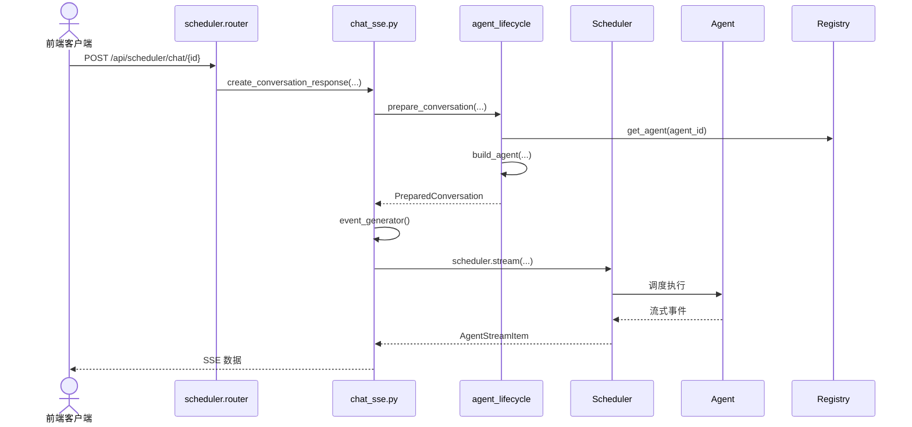
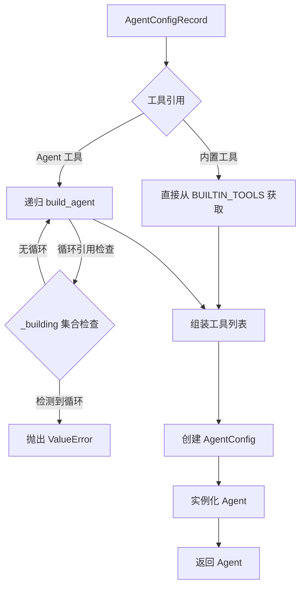
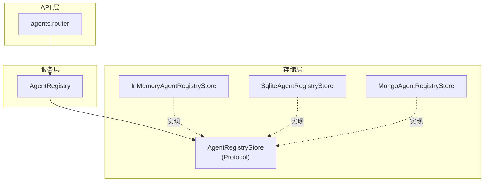
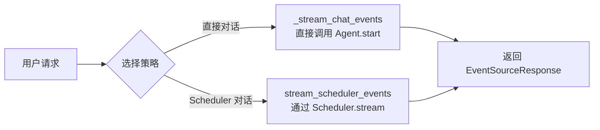
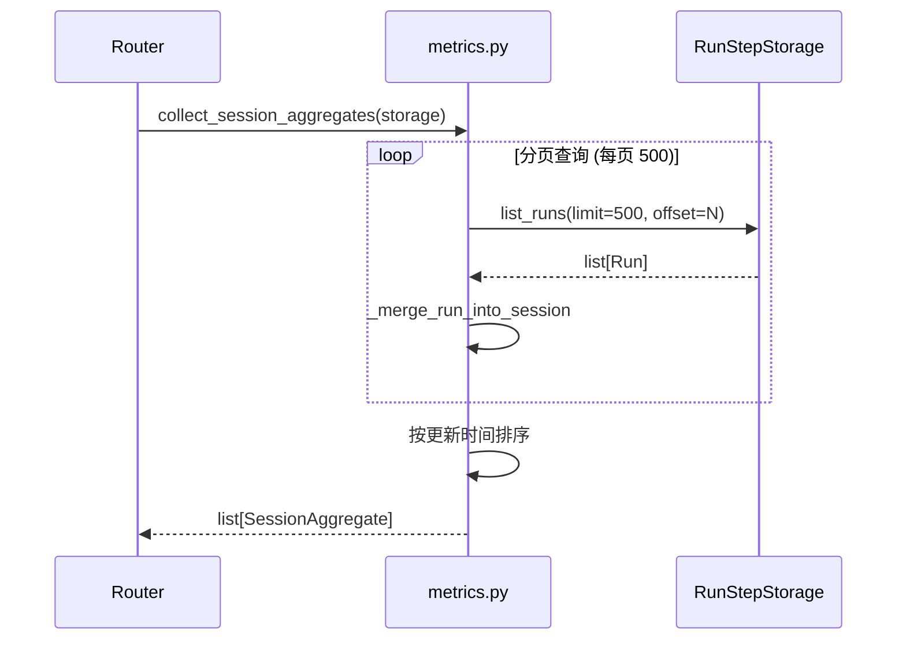
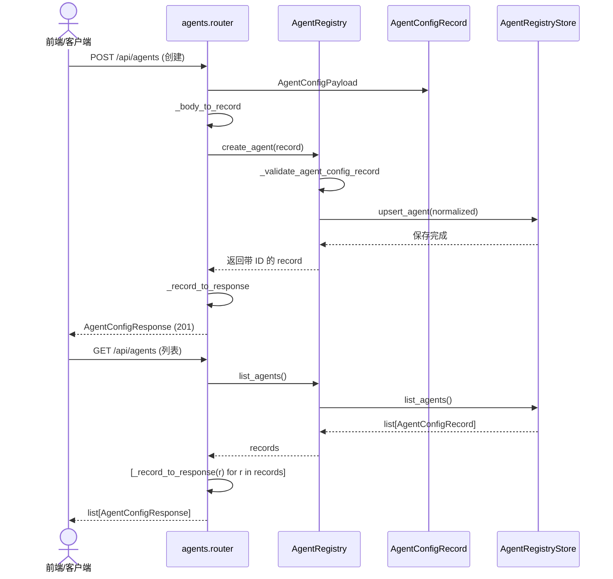
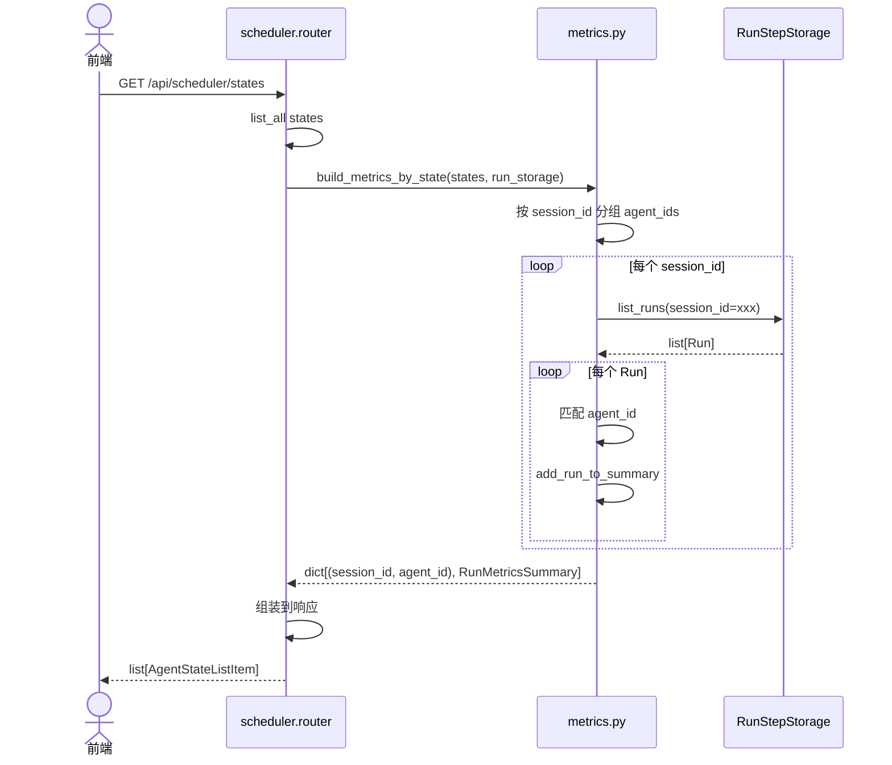

# Services 业务服务层

Console Server 的核心业务逻辑层，封装 Agent 生命周期管理、存储配置、对话 SSE 和指标聚合。

---

## 一句话概括

Services 是 **Agent 的"后勤部门"** —— 负责组装 Agent、配置存储、处理实时对话流，以及收集运行指标。

---

## 架构定位



---

## 核心流程

### Agent 构建流程



### Scheduler Chat 对话流程



---

## 模块详解

### 1. agent_lifecycle.py — Agent 生命周期管理

**职责**: 构建、重新水化、恢复 Agent 实例

#### 核心函数

| 函数 | 职责 | 调用场景 |
|------|------|----------|
| `build_agent` | 从配置构建 Agent | 新建对话、创建子 Agent |
| `build_model` | 构建 LLM Model | build_agent 内部使用 |
| `build_agent_options` | 构建 AgentOptions | build_agent 内部使用 |
| `rehydrate_agent` | 从 State 恢复 Agent | 服务重启后恢复持久 Agent |
| `resume_persistent_agent` | 恢复并继续执行 | Scheduler Resume API |

#### Agent 构建细节



**循环引用检测**:
```python
if config.id in _building:
    raise ValueError(f"Circular agent reference detected: {config.id}")
_building.add(config.id)
# 递归构建子 Agent 时传递 _building.copy()
```

#### 默认配置

```python
def build_default_agent_options() -> dict[str, Any]:
    """Return the canonical default agent options payload."""
    return AgentOptionsInput.model_validate({}).model_dump(exclude_none=True)
```

### 2. agent_registry/ — Agent 配置注册表

**目录**: `agent_registry/`

Agent 配置的持久化 CRUD，支持 SQLite 和 MongoDB。

#### 架构



#### AgentRegistry API

| 方法 | 职责 |
|------|------|
| `list_agents` | 列出所有 Agent 配置 |
| `get_agent` | 根据 ID 获取配置 |
| `get_agent_by_name` | 根据名称获取配置 |
| `create_agent` | 创建新配置（验证 + 保存） |
| `replace_agent` | 全量替换配置 |
| `delete_agent` | 删除配置 |

#### AgentConfigRecord 模型

```python
class AgentConfigRecord(BaseModel):
    id: str                    # UUID
    name: str                  # 显示名称
    description: str           # 描述
    model_provider: str        # openai-compatible / anthropic / ...
    model_name: str            # 模型名称
    system_prompt: str         # 系统提示词
    tools: list[str]           # 工具引用列表
    options: dict              # AgentOptions
    model_params: dict         # LLM 参数 (temperature 等)
    created_at: datetime
    updated_at: datetime
```

### 3. storage_wiring.py — 存储配置

**职责**: 构建存储配置

#### 配置构建器

| 函数 | 返回 | 说明 |
|------|------|------|
| `build_run_step_storage_config` | `RunStepStorageConfig` | Run/Step 存储配置 |
| `build_trace_storage_config` | `TraceStorageConfig` | Trace 存储配置 |
| `build_agent_state_storage_config` | `AgentStateStorageConfig` | Scheduler 状态存储 |
| `build_citation_store_config` | `CitationStoreConfig` | 引用存储配置 |


### 4. chat_sse.py — 对话 SSE 工具

**职责**: 封装 Chat 对话的 SSE 流式响应

#### 核心函数

| 函数 | 职责 |
|------|------|
| `create_conversation_response` | 创建 SSE 响应 |
| `prepare_conversation` | 准备 Agent 和会话 |
| `stream_event_message` | 序列化流式事件 |
| `stream_scheduler_events` | Scheduler 对话策略 |

#### 对话策略



#### 错误处理

```python
async def event_generator() -> AsyncIterator[SseMessage]:
    try:
        async for sse_msg in strategy(...):
            yield sse_msg
    except Exception as exc:
        yield error_event_message(exc)  # 异常封装为 SSE 事件
    finally:
        await prepared.agent.close()    # 确保资源释放
```

### 5. metrics.py — 指标聚合

**职责**: 聚合 Run/Session/State 的运行指标

#### 核心函数

| 函数 | 职责 |
|------|------|
| `collect_session_aggregates` | 按 Session 聚合 Run 指标 |
| `summarize_runs_paginated` | 分页统计 Run 指标 |
| `build_metrics_by_state` | 为 Scheduler State 构建指标 |

#### 指标聚合流程



#### RunMetricsSummary 字段

| 字段 | 说明 |
|------|------|
| `run_count` | Run 总数 |
| `completed_run_count` | 完成数 |
| `step_count` | Step 总数 |
| `tool_calls_count` | 工具调用次数 |
| `input_tokens` | 输入 Token 数 |
| `output_tokens` | 输出 Token 数 |
| `total_tokens` | 总 Token 数 |
| `cache_read_tokens` | 缓存读取 Token |
| `cache_creation_tokens` | 缓存创建 Token |
| `duration_ms` | 总耗时 |
| `token_cost` | Token 成本 |

---

## 数据流详解

### Agent 配置 CRUD 数据流



### 指标查询数据流



---

## 接口定义

### AgentRegistryStore (Protocol)

```python
class AgentRegistryStore(Protocol):
    async def connect(self) -> None: ...
    async def close(self) -> None: ...
    async def list_agents(self, limit: int, offset: int) -> list[AgentConfigRecord]: ...
    async def get_agent(self, agent_id: str) -> AgentConfigRecord | None: ...
    async def get_agent_by_name(self, name: str) -> AgentConfigRecord | None: ...
    async def upsert_agent(self, record: AgentConfigRecord) -> None: ...
    async def delete_agent(self, agent_id: str) -> bool: ...
```

### RunStoragePort (Protocol)

```python
class RunStoragePort(Protocol):
    async def list_runs(
        self,
        *,
        user_id: str | None = None,
        session_id: str | None = None,
        limit: int = 20,
        offset: int = 0,
    ) -> list[Run]: ...
```

---

## 异常体系

### agent_lifecycle 异常

```python
class PersistentAgentResumeError(RuntimeError):
    """Base error for persistent-agent resume failures."""

class PersistentAgentNotFoundError(PersistentAgentResumeError):
    """Raised when the target scheduler state does not exist."""

class PersistentAgentValidationError(PersistentAgentResumeError):
    """Raised when the target state cannot be resumed."""
```

---

## 配置说明

Services 层依赖 ConsoleConfig 的配置项：

| 配置项 | 用途 | 影响模块 |
|--------|------|----------|
| `run_step_storage_type` | Run/Step 存储后端 | storage_wiring |
| `trace_storage_type` | Trace 存储后端 | storage_wiring |
| `metadata_storage_type` | 元数据存储后端 | storage_wiring, agent_registry |
| `sqlite_db_path` | SQLite 数据库路径 | 所有存储配置 |
| `mongodb_uri` | MongoDB 连接串 | 所有存储配置 |
| `default_agent_*` | 默认 Agent 配置 | agent_lifecycle (fallback) |
