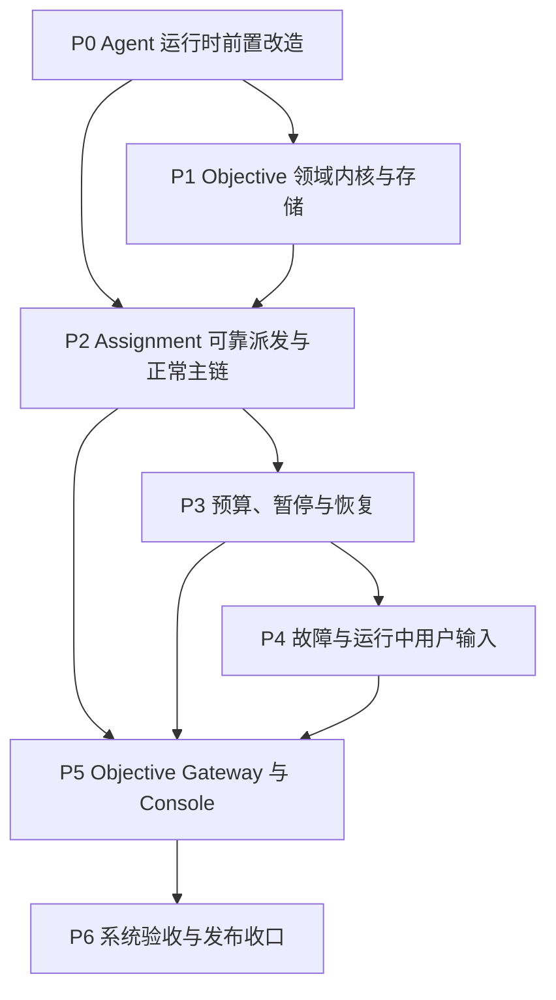

# Agiwo Objective 优化执行总方案

本目录把 `CONTEXT.md` 与 `docs/adr/0001` 至 `0045` 中已经接受的决定，转换为可以逐项实施、测试和验收的工程计划。它不是另一组架构决定；ADR 回答“为什么这样设计”，这里回答“按什么顺序把它做出来”。ADR 0044 已统一早期 ADR 中互相冲突的 Objective/Scheduler 所有权；ADR 0045 收窄 Artifact 为文件索引。

## 1. 使用方法

1. 先阅读本文件，确认阶段顺序、跨阶段依赖和总体验收标准。
2. 开始一个阶段前，阅读该阶段的 `README.md`，确认入口条件已经满足。
3. 每次只执行一个任务文档。任务应形成一个边界清楚、可以独立回退的提交。
4. 任务完成后，把任务文档中的验证命令、验收条件和完成清单逐项落实。
5. 阶段出口未通过时，不进入下一阶段。允许同一阶段中没有依赖关系的任务并行开发，但合并顺序仍遵守依赖表。

## 2. 当前源码基线

本方案基于 2026-07-17 的工作树和 `6222212 fix(agent): restore rebuilt messages across runs`。以下事实已经由源码核对，不是从 ADR 推测：

| 当前事实 | 源码位置 | 对执行顺序的影响 |
| --- | --- | --- |
| `GoalState`、`GoalUpdate`、`RunLedger.goal` 与 `declare_milestones` 旧名仍在使用 | `agiwo/agent/introspect/`、`agiwo/agent/models/run.py`、`agiwo/scheduler/runtime_tools.py` | 必须先统一为 RunPlan，Objective 才能只引用一份计划事实 |
| 计划与轨迹复盘工具仍由 Scheduler 构造和注入 | `agiwo/scheduler/engine.py`、`agiwo/scheduler/runtime_tools.py` | 必须先把工具所有权移回 Agent，保持 `objective -> scheduler -> agent` 依赖方向 |
| trajectory review 仍支持隐藏、改写和 step-back | `agiwo/agent/introspect/repair.py`、`apply.py` | 必须先改为 append-only，避免新 Assignment 历史破坏前缀缓存 |
| `AgentOptions.max_steps` 只按普通 loop step 检查，Provider retry 等调用没有统一 attempt 账本 | `agiwo/agent/termination/limits.py`、`run_loop.py`、各 Provider | Objective 实际成本记账和 `max_steps_per_run` 依赖统一模型调用边界 |
| `UserMessage` 尚无 `is_user_provided` | `agiwo/agent/models/input.py` | Assignment Input 和计划提醒接入前必须先能区分真实用户输入 |
| Run ID 由 `Agent.start()` 内部生成，RunLog 没有一等 `objective_id / assignment_id` | `agiwo/agent/agent.py`、`agiwo/agent/models/log.py` | Transactional outbox 可靠派发前必须增加内部的预分配 identity 路径，同时保持公开 API 不变 |
| Scheduler 已有 `TaskGuard`，但它只保护 child spawn/wake 等调度限制 | `agiwo/scheduler/guard.py` | 保留现有边界；ObjectiveBudget 由 ObjectiveService 与 Agent hook 实施，不扩张 TaskGuard |
| Console Session input 和 Feishu 目前直接进入 Scheduler | `console/server/routers/sessions.py`、`console/server/channels/feishu/` | Objective Gateway 完成前不切换普通用户入口 |
| 跨 Run 恢复 `MessagesRebuilt` 的 bug 已修复 | 提交 `6222212`、`agiwo/agent/run_bootstrap.py` | 不重复开发，只在前缀缓存和恢复测试中保留回归覆盖 |

`CONTEXT.md`、`docs/adr/` 和 `docs/draft/` 当前均为用户已有的未跟踪内容。执行本方案时不得借机重写或清理这些文件；只有任务明确要求同步文档时才更新。

## 3. 总体实施原则

- **先消除冲突，再增加能力。** RunPlan、trajectory review、输入来源和模型调用账本先稳定，Objective 不在旧语义上叠加兼容层。
- **保持唯一真相源。** Run 内事实进入 RunLog；跨 Assignment 的 Objective 事实进入 ObjectiveLog；Scheduler 的 AgentState 只是可重建执行快照。
- **一个层级只有一个 owner。** ObjectiveService 是 Decision、ObjectiveLog、ObjectiveBudget、Assignment 状态迁移、Session 活动占用和 Objective command 的唯一 owner；Scheduler 只拥有 Run/agent 机械执行。稳定调用关系是 `ObjectiveService -> Scheduler -> Agent`，Agent 与 Scheduler 不导入 `agiwo.objective`。
- **不修改 Agent 公开执行 API。** `Agent.start/run/run_stream` 的参数保持不变。预分配 Run ID、Assignment 身份和恢复控制通过 Scheduler 与 Agent 的内部类型化执行请求传递。
- **前缀缓存优先。** 已提交消息不因 Assignment 边界、计划更新或复盘而删除、改写或搬移；新边界信息只追加在历史尾部。只有正式 compaction 可以重建消息列表。
- **先提交事实，再产生副作用。** Objective facts、Session slot、command receipt 和 outbox 在同一事务提交；dispatcher 只消费已提交命令，并用稳定 ID 保证幂等。LLM 成本用调用前上界检查，不预留、不返还；DRAINING 用状态门禁 + Run barrier，不引入 ObjectiveActionLease。
- **中间阶段不切换用户流量。** 直到 Objective 主链、预算、恢复、故障处理和 Gateway 全部通过阶段门禁，Console/渠道仍走现有路径。
- **不提供旧数据 migration 或兼容读取。** MVP 阶段旧开发数据一律清理重建：不写 migration、不保留旧字段/旧 fact kind 别名，也不在代码里加「识别旧数据后友好提示」的兼容门禁。合并破坏性改名的任务前，先删除本地 `.agiwo` / Console SQLite 等开发状态；测试库每次重建。
- **`docs/eval-draft` 不在本次范围。** 执行本方案时不考虑、不依赖、不跟进该目录；通用 benchmark eval 框架与本 Objective 重构解耦。P6-02 仅覆盖 Objective 观测与 trajectory review 指标，不实现 eval-draft 中的 evaluation core。

### 3.1 实施前不可弱化的协议

- **Objective 控制权：** 只有 ObjectiveService 接受 Decision、写 ObjectiveStore 和结算 ObjectiveBudget。Scheduler 不得形成第二条 Objective 控制路径。
- **Session 唯一占用：** ObjectiveStore 以 session_id 唯一 slot 原子保证一个活动 Objective；memory backend 也必须按 session_id 加锁，不能只锁 objective_id。
- **Run 启动投影：** committed RunStarted 必须映射为幂等 `AssignmentExecutionStarted` Objective fact；outbox dispatched 不是领域状态。
- **用户原始事实：** 每条真实用户语义消息只形成一条保存完整 UserMessage 的 ObjectiveUserInput；不存在第二份要求模型、候选确认或贡献晋升。最终模型上下文按 input_id 去重复用已提交历史前缀；新 Assignment 内容只追加尾部。禁止把用户原文复制进系统模板、静默摘要，或因「日志有、历史无」向中段插入用户话（后者视为不变量故障）。
- **超长输入授权：** 未外置用户输入本身超出上下文时进入 WAITING_USER；只有用户引用 input_id 的结构化命令可以把完整原文外置为 Artifact，并令模型上下文改用该 Artifact 的 path 与 summary。
- **动作门禁：** LLM、tool、child spawn、dispatch 在真正开始前确认 Objective 仍可推进；LLM 另做 `used + call_cost_ceiling <= limit` 检查。DRAINING 后拒绝新动作；已经开始的在途操作允许完成。不引入 ObjectiveActionLease。
- **批量恢复：** 全部 Run 先 prepare/validate 并等待同一 barrier，任一失败则全部保持 PAUSED；全部成功后才提交 resume 并统一 release。
- **崩溃分类：** RUNNING/no-runtime 按动作类型与 committed 证据恢复；LLM 只补记可证明的实际响应成本，外部 tool 副作用未知时进入 outcome_unknown。不扫描或对账 ActionLease。
- **模型调用 identity：** phase 表达 logical call 的业务目的，Provider retry 只增加 attempt_no/retry_reason；每个实际 attempt 单独计数并按实际响应记账。
- **LLM 成本上界：** `call_cost_ceiling` 由请求 token 与 `max_output_tokens`（及价格快照）计算，有限可文档化；并行最坏超支不超过 ceiling × 当时通过检查的并发调用数。

## 4. 阶段总览

| 阶段 | 主题 | 任务数 | 阶段交付物 | 进入下一阶段的条件 |
| --- | --- | ---: | --- | --- |
| P0 | Agent 运行时前置改造 | 4 | RunPlan、append-only review、输入来源、统一模型调用账本 | 旧命名与旧工具归属清零，现有 direct Agent/Scheduler 回归全绿 |
| P1 | Objective 领域内核与存储 | 4 | `agiwo.objective`、ObjectiveLog、投影、ObjectiveStore、深模块 facade | 纯内存与 SQLite 都能只靠日志重建 Objective，导入边界成立 |
| P2 | Assignment 可靠派发与正常主链 | 6 | 模板、稳定 Run identity、outbox dispatcher、收尾调用、验收与交付 | SDK 内完成 intake -> work -> verification -> delivered 的可重放闭环 |
| P3 | 预算、暂停与恢复 | 6 | 全局配额、实际成本记账、活动窗口、Run checkpoint、DRAINING、崩溃恢复 | 并行分支下所有硬边界都能全局收敛并从原 Run 恢复 |
| P4 | 故障与运行中用户输入 | 4 | 安全重试、耗尽接力、用户安全边界、运行中输入注入 | 每类 fault 有唯一可重放路径；运行中输入不结束 Assignment |
| P5 | Objective Gateway 与 Console | 6 | 异步 API、SSE、Session/渠道适配、时间线、模板 UI、归档 | 普通用户入口不再绕过 ObjectiveService，最终交付与过程视图区分明确 |
| P6 | 系统验收与发布收口 | 3 | E2E 恢复矩阵、观测与 eval、文档和发布门禁 | 完整本地门禁通过，所有 ADR 有实现或测试证据 |

## 5. 主依赖图

这张图表达合并顺序，不要求开发完全串行。例如 P0-03 与 P0-04 可以同时开发；P5-04 的前端原型也可以提前准备，但不能在 P5-01 至 P5-03 完成前接入真实用户流量。

## 6. 任务索引

| ID | 任务 | 主要交付 | 直接依赖 |
| --- | --- | --- | --- |
| P0-01 | [统一 RunPlan 与 update_plan](phase-0-agent-runtime/P0-01-run-plan-and-update-plan.md) | 唯一 Run 计划模型和 Agent 内建工具 | 无 |
| P0-02 | [改造 append-only trajectory review](phase-0-agent-runtime/P0-02-append-only-trajectory-review.md) | 不改写历史的复盘与有用性评分 | P0-01 |
| P0-03 | [贯通 UserMessage 来源与前缀稳定性](phase-0-agent-runtime/P0-03-user-input-provenance-and-prefix.md) | `is_user_provided` 全链路 | 无 |
| P0-04 | [统一模型调用 attempt 与 max_steps_per_run](phase-0-agent-runtime/P0-04-model-call-ledger-and-run-limit.md) | logical call/phase 稳定，每次真实 attempt 可计数 | 无 |
| P1-01 | [建立 Objective 领域模型](phase-1-objective-kernel/P1-01-objective-domain-model.md) | Objective/Assignment/Decision/Outcome 等类型与不变量 | P0-03 |
| P1-02 | [建立 ObjectiveLog 与投影](phase-1-objective-kernel/P1-02-objective-log-and-projection.md) | append-only facts 和可重建 ObjectiveView | P1-01 |
| P1-03 | [实现 ObjectiveStore 与事务 Outbox](phase-1-objective-kernel/P1-03-objective-store-and-outbox.md) | facts、Session slot、command receipt、outbox 原子存储 | P1-02 |
| P1-04 | [建立 ObjectiveService 深模块边界](phase-1-objective-kernel/P1-04-objective-service-boundary.md) | 唯一 facade 和导入护栏 | P1-02、P1-03 |
| P2-01 | [实现 Assignment 模板配置与渲染](phase-2-assignment-mainline/P2-01-assignment-templates-and-rendering.md) | 三类模板、快照、hash、Registry 持久化 | P1-01、P1-04、P0-03 |
| P2-02 | [增加稳定 Run identity 与内部执行请求](phase-2-assignment-mainline/P2-02-run-identity-and-execution-request.md) | 预分配 run_id、一等关联、Scheduler facade 契约 | P0-04、P1-01 |
| P2-03 | [实现 Outbox dispatcher 与幂等派发](phase-2-assignment-mainline/P2-03-outbox-dispatcher.md) | 唯一 root Run 与 AssignmentExecutionStarted 投影 | P1-03、P1-04、P2-02 |
| P2-04 | [装配 Assignment Input 与前缀安全上下文](phase-2-assignment-mainline/P2-04-assignment-input-and-context.md) | ObjectiveView、历史相关性和 Run 边界 | P0-03、P2-01、P2-02 |
| P2-05 | [实现计划门禁与系统收尾调用](phase-2-assignment-mainline/P2-05-plan-guard-and-finalization.md) | report、Decision、Contribution、Objective update | P0-01、P0-04、P2-02、P2-04 |
| P2-06 | [打通正常接力、验收与最终交付](phase-2-assignment-mainline/P2-06-handoff-verification-delivery.md) | 正常 Objective 主链闭环 | P1-02、P2-03、P2-05 |
| P3-01 | [实现 ObjectiveBudget 账本与状态配额](phase-3-budget-and-resume/P3-01-objective-budget-ledger.md) | handoff/verification 原子检查与增量 facts | P1-02、P2-06 |
| P3-02 | [实现 LLM 实际成本检查与记账](phase-3-budget-and-resume/P3-02-llm-actual-cost-accounting.md) | 调用前检查、响应后记账和并发越界边界 | P0-04、P3-01 |
| P3-03 | [实现 Objective 活动窗口](phase-3-budget-and-resume/P3-03-active-time-window.md) | active_seconds 检查与等待区间 | P3-01 |
| P3-04 | [实现 Run checkpoint 与可恢复中断 resume](phase-3-budget-and-resume/P3-04-run-checkpoint-pause-resume.md) | 同 run_id、消息末项恢复 | P0-04、P2-02 |
| P3-05 | [实现 DRAINING 与全局暂停屏障](phase-3-budget-and-resume/P3-05-draining-and-global-pause.md) | 全分支收敛和两阶段 resume | P2-03、P3-01 至 P3-04 |
| P3-06 | [实现重启恢复与 Outbox 对账](phase-3-budget-and-resume/P3-06-restart-recovery-and-reconciliation.md) | RUNNING/no-runtime 的确定恢复 | P2-03、P3-04、P3-05 |
| P4-01 | [建立结构化重试契约与协调器](phase-4-faults-and-steering/P4-01-retry-contract-and-coordinator.md) | Retry Disposition、幂等性、attempt/backoff | P0-04、P3-02 |
| P4-02 | [实现重试耗尽接力](phase-4-faults-and-steering/P4-02-retry-exhausted-handoff.md) | 系统 report 与 fresh Assignment | P2-06、P3-01、P4-01 |
| P4-03 | [实现 non-retryable 与 outcome_unknown 分流](phase-4-faults-and-steering/P4-03-nonretryable-and-outcome-unknown.md) | 可继续 tool fault 与用户安全边界 | P2-06、P3-05、P4-01 |
| P4-04 | [实现运行中用户输入注入](phase-4-faults-and-steering/P4-04-user-steering.md) | ObjectiveUserInput + 同一 root Run 注入 | P2-04、P2-02 |
| P5-01 | [提供异步 Objective HTTP API](phase-5-gateway-and-console/P5-01-objective-http-api.md) | create/get/input/pause/resume 命令 | P2-06、P3-05、P4-04 |
| P5-02 | [提供可重放 Objective SSE](phase-5-gateway-and-console/P5-02-replayable-objective-sse.md) | sequence 游标补发与实时订阅 | P1-03、P5-01 |
| P5-03 | [接入 Session、Web 与渠道入口](phase-5-gateway-and-console/P5-03-session-and-channel-adapters.md) | 一 Session 一活动 Objective，用户路径统一 | P5-01、P5-02 |
| P5-04 | [实现 Objective 时间线与最终交付视图](phase-5-gateway-and-console/P5-04-objective-timeline-and-delivery-view.md) | 过程折叠、Run 下钻、调试收尾调用 | P5-01、P5-02 |
| P5-05 | [实现 Assignment 模板管理界面](phase-5-gateway-and-console/P5-05-assignment-template-console.md) | 校验、预览、持久化与内存刷新 | P2-01 |
| P5-06 | [实现 Session 归档、恢复与 Fork 语义](phase-5-gateway-and-console/P5-06-session-archive-and-fork.md) | 可恢复归档和一次性 fork notice | P3-05、P5-01、P5-03 |
| P6-01 | [建立端到端状态与恢复测试矩阵](phase-6-release/P6-01-end-to-end-state-and-recovery-tests.md) | 正常、并行、暂停、故障、重启测试 | P0 至 P5 |
| P6-02 | [完成观测、指标与 trajectory review 评估](phase-6-release/P6-02-observability-and-evaluation.md) | Objective 观测与 review 指标（不含 eval-draft） | P0-02、P3、P4、P5-04 |
| P6-03 | [完成架构护栏、文档与发布收口](phase-6-release/P6-03-guards-docs-and-release.md) | import-linter、AGENTS、全门禁与发布说明 | P6-01、P6-02 |

## 7. ADR 覆盖矩阵

“主责任务”负责把决定落到代码和测试；其他任务只能消费该契约，不应再定义第二套语义。

| ADR | 决策主题 | 主责任务 |
| --- | --- | --- |
| 0001 | 分布式语义决策、集中执行控制 | P1-04、P2-03 |
| 0002 | 委派与接力分离 | P1-01、P2-06 |
| 0003 | Objective 是全局工作边界 | P1-01 |
| 0004 | 入口与验收使用独立 Assignment | P2-06 |
| 0005 | Assignment 以唯一 Decision 结束 | P1-01、P2-05 |
| 0006 | 系统发起 Assignment 收尾调用 | P2-05 |
| 0007 | ObjectiveUserInput 与 Contribution 分离 | P1-01、P1-02、P2-04 |
| 0008 | 按职责创建新 Assignment Run | P2-06 |
| 0009 | 验收不通过创建新工作 Assignment | P2-06 |
| 0010 | ObjectiveBudget 硬边界 | P3-01 至 P3-05 |
| 0011 | 安全自动重试 | P4-01 至 P4-03 |
| 0012 | max_steps_per_run 收口与接力 | P0-04、P2-05 |
| 0013 | checkpoint 恢复重开活动窗口 | P3-03 |
| 0014 | 第一版只统计 LLM 成本 | P0-04、P3-02 |
| 0015 | 重试耗尽 fresh handoff | P4-02 |
| 0016 | outcome_unknown 交给用户 | P4-03 |
| 0017 | non-retryable 按 Run 可继续性分流 | P4-03 |
| 0018 | ObjectiveLog 是真相源 | P1-02、P1-03 |
| 0019 | Transactional outbox | P1-03、P2-02、P2-03、P3-06 |
| 0020 | Objective 时间线与 Run 下钻 | P5-04 |
| 0021 | 异步 Objective API | P5-01、P5-03 |
| 0022 | 可重放 SSE | P5-02 |
| 0023 | 运行中输入注入同一 root Run | P4-04 |
| 0024 | 每个终态 Assignment 都有 Outcome | P1-02、P2-05、P4-02、P4-03 |
| 0025 | Assignment 职责共享默认 AgentConfig | P2-01、P2-06 |
| 0026 | 共享 planning policy 与可配置模板 | P0-01、P2-01、P2-04、P5-05 |
| 0027 | 模板随默认 AgentConfig 持久化 | P2-01、P5-05 |
| 0028 | DRAINING 仅服务可恢复中断 | P3-05 |
| 0029 | 可恢复中断（pause/budget/停止） | P3-04、P3-05 |
| 0030 | 八种 ObjectiveStatus | P1-01、P1-02、P3-05、P5-01 |
| 0031 | 六种 AssignmentStatus | P1-01、P1-02、P3-05 |
| 0032 | RunStatus pause/resume | P2-02、P3-04 |
| 0033 | 薄 RunCheckpoint | P3-04、P3-06 |
| 0034 | Objective 是 Scheduler 之上的深模块 | P1-04、P2-03 |
| 0035 | Session 中 Objective 依次执行 | P1-01、P1-04、P2-04、P5-03、P5-06 |
| 0036 | Assignment 复用 Session agent identity | P0-03、P2-02、P2-04、P5-03 |
| 0037 | current_goal 是可修订投影 | P1-01、P1-02、P2-01 |
| 0038 | Assignment 计划复用 RunPlan | P0-01、P2-05、P5-04 |
| 0039 | Objective 只在输入与收尾边界更新 | P1-02、P2-05、P4-04 |
| 0040 | ObjectiveStore 跟随 RunLog（MVP: memory/SQLite） | P1-03、P3-06 |
| 0041 | Session 删除改为归档 | P5-06 |
| 0042 | UserInput 记录真实用户来源 | P0-03、P2-04、P5-03 |
| 0043 | append-only trajectory review | P0-02、P5-04、P6-02 |
| 0044 | ObjectiveService/ Scheduler 分层所有权 | P1-04、P2-03、P3-05 |
| 0045 | Artifact 只索引 Session artifacts 文件 | P1-01、P2-04、P2-05、P5-01、P5-04、P5-06 |

## 8. 每个任务的共同完成标准

除任务文档另有更严格要求外，每项实现都必须满足：

- 代码、测试、日志事件名和用户可见文案使用 `CONTEXT.md` 中的统一术语。
- 不保留 ADR 已明确拒绝的旧 API、旧配置名或兼容别名。
- 新状态变化有 first-class fact；不能只改内存对象或从自然语言反推。
- 写命令使用持久化 receipt；同 scope/key/hash 重放原响应，同 key 不同 hash 冲突。
- objective-managed 外部动作在真正开始前经过可推进门禁；LLM 另做调用前成本上界检查。不能把只读 preflight 当作执行许可；direct Agent 不依赖 Objective。不引入 ObjectiveActionLease。
- 对外 public API 与核心数据结构具有类型注解；错误使用封闭、可测试的结构。
- 日志遵守 `logger.{level}("event_name", key=value, ...)`。
- Python 任务至少运行受影响测试与 `uv run python scripts/lint.py ci`。
- Console 后端任务还运行 `uv run python scripts/check.py console-tests`。
- 前端任务运行 `npm run lint`、`npm test`、`npm run build`。
- 阶段出口和发布任务运行 `uv run python scripts/check.py pre-push`。
- 若目录职责、public API 或机器护栏发生变化，同一任务更新 `AGENTS.md`。

## 9. 明确不在第一版范围内

- 不统计工具调用美元成本，不引入通用 CostEntry。
- 不允许一个 Session 同时运行多个 Objective。
- 不建立 Worker/Verifier 专用 AgentConfig 或 AgentRegistry 语义路由表。
- 不让 HandoffDecision 指定具体 agent、pattern 或 config。
- 不引入 Objective 数据库的第二套部署配置。
- 不提供普通用户物理 purge。
- 不为旧 SQLite schema 编写 migration、兼容读取层或遗留 kind/枚举探测逻辑；开发数据清理重建。
- 不用常驻 heartbeat 处理进程崩溃期间的 active-time 极端计时问题。
