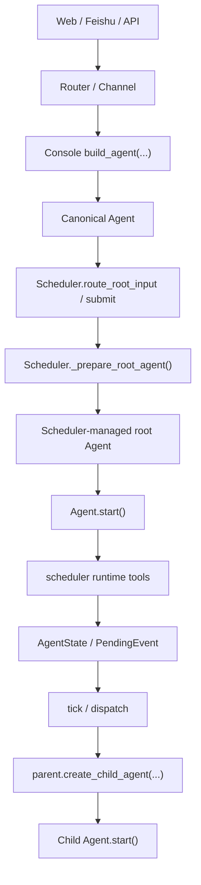
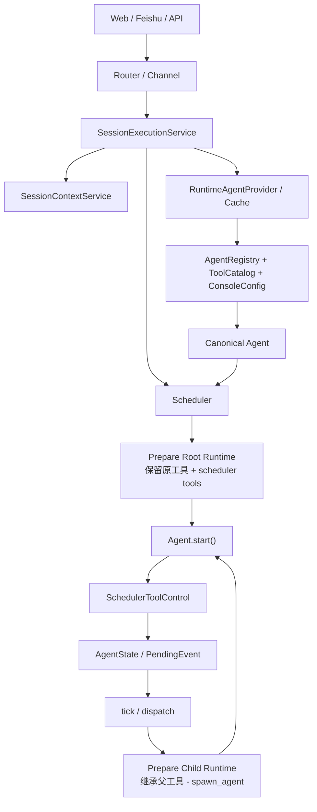

# Scheduler / Console Runtime Refactor Proposal

## 背景

最近在 Console 通过 `Scheduler` 与 `Agent` 对话的端到端测试里，暴露出一个明显的语义问题：

- root agent 在进入 scheduler 后，丢失了原本的 builtin tools
- spawned child agent 却仍然携带这些 builtin tools，并且可以正常调用

这不是配置层的问题，而是当前 `Console -> Scheduler -> Agent` 的运行时装配边界不够清晰，导致 root runtime 和 child runtime 的派生逻辑发生了串味。

本文档整理当前问题、根因分析，以及推荐的重构方向。

## 当前实现概览

当前 Console 和 Scheduler 的协作大致如下：



几个关键事实：

- Console 应用层先把 registry/config/tool refs 物化成一个 `Agent`
- Scheduler 不直接运行这个 `Agent`，而是会再做一次 root runtime 派生
- child agent 也通过 parent 的 `create_child_agent(...)` 派生
- root 和 child 目前实际上复用了同一套 child-style 派生机制

## 已发现的问题

### 1. Root tool 语义错误

当前 `Scheduler.submit()` / `route_root_input()` 在 root 进入运行前，会调用 `_prepare_root_agent()`。

这一步不是“保留原 root agent 并追加 scheduler tools”，而是把 root 当成 child 一样重新派生，并显式排除了 root 当前已有的全部工具名。

结果：

- root runtime 上只剩 scheduler tools
- 原本来自 Console config 的 builtin tools 不再可用

这与 Console 用户的直觉不一致，也与 session-based chat 的预期不一致。

### 2. Child tool 语义与 root 不对称

当前 child 派生时只排除了 `spawn_agent`，其他工具基本沿用 parent，并且 default builtin tools 还会被 SDK 的 tool assembly 自动补回。

结果：

- root 没有 builtin tools
- child 却有 builtin tools

这说明当前系统并没有一个清晰、统一、显式的“root runtime policy / child runtime policy”。

### 3. Scheduler 对 root 复用了 child 派生机制

`_prepare_root_agent()` 目前本质上是在借用 `create_child_agent(...)` 来构造 scheduler-managed root。

这类复用表面上减少了代码，但实际上把两种不同语义混成了一种：

- root runtime：应该是“原 agent 进入调度系统后的运行时包装”
- child runtime：应该是“由 parent 派生出的受限执行单元”

这两者不应该共用同一套派生规则。

### 4. Console 层重复持有 Agent 构造逻辑

当前 Console 有多处显式构造 `Agent`：

- `console/server/services/runtime/agent_factory.py`
- `console/server/services/runtime/agent_runtime_cache.py`
- `console/server/routers/sessions.py`

其中 Web chat 甚至在 router 里直接 `build_agent(...)`，而 Feishu 已经走 runtime cache。两条入口的行为并不完全一致。

这使得：

- Agent materialization policy 分散
- Web / Feishu 对 runtime identity 的处理不统一
- 后续如果要调整 root runtime 规则，很容易遗漏调用点

### 5. SDK / Console 的边界还可以更清晰

当前 Scheduler 仍然只接受 canonical `Agent`，这一点本身是对的；但 Console 在把 alias/config 物化为 `Agent` 后，Scheduler 又立刻重新包装成另一种 runtime agent。

所以现在的问题不是“Scheduler 不该接收 Agent”，而是：

- Console 和 Scheduler 之间缺少一个明确的 runtime handoff boundary
- Scheduler 内部缺少 root runtime / child runtime 的显式建模

## 设计目标

重构后建议满足以下目标：

1. root runtime 保留原工具，并追加 scheduler tools
2. child runtime 继承父能力，但明确禁止 `spawn_agent`
3. root runtime 和 child runtime 使用两条显式、独立的派生路径
4. Console 侧只有一个统一的 Agent materialization 入口
5. Web / Feishu / API 统一走同一套 session execution flow
6. Scheduler 继续只面向 canonical `Agent`，不直接理解 Console alias / registry
7. Console alias、tool refs、storage wiring、skills 等宿主语义仍停留在应用层

## 推荐的分层

推荐的整体分层如下：



核心原则：

- Console 负责 `alias/config -> canonical Agent`
- Scheduler 负责 `canonical Agent -> scheduler-managed runtime`
- Router / Channel 不直接构造 Agent，不直接编码 runtime policy

## 推荐方案

### A. 保持 Scheduler 只接收 canonical Agent

这是最重要的边界结论。

不建议让 `agiwo.scheduler` 直接接受 Console alias 或 registry id。原因是：

- alias 是 Console 的宿主概念，不是 SDK 通用概念
- alias 解析依赖 `AgentRegistry`、`ConsoleConfig`、`ToolCatalog`、storage wiring、skill manager
- 如果 Scheduler 直接理解这些概念，会把 `sdk -> console` 的依赖方向反过来污染

因此，推荐继续保持：

- Console 应用层负责 materialize canonical `Agent`
- Scheduler 只接收 canonical `Agent`

### B. 在 Console 收口一个统一的 runtime agent provider

虽然 Scheduler 不该理解 alias，但 Console 也不该到处 `build_agent(...)`。

推荐把当前几处分散的构造逻辑收敛成一个统一入口，例如：

- `RuntimeAgentProvider`
- 或 `SessionExecutionService` 内部的唯一 materialization facade

职责：

- 根据 `session.base_agent_id` 读取 registry config
- 构造 canonical `Agent`
- 做 runtime cache 和 config fingerprint 刷新
- 统一 Web / Feishu / API 的 agent 获取路径

这样 router/channel 只负责“拿 session、提交 input、返回 stream”，不再直接参与 Agent 构造。

### C. 在 Scheduler 内显式拆分两条 runtime 派生路径

这是本次重构的核心。

建议把当前隐式复用的 child-style 派生拆成两条明确路径：

#### 1. Root runtime preparation

语义：

- 输入：canonical root `Agent`
- 输出：scheduler-managed root runtime `Agent`

规则：

- 保留 root 原工具
- 追加 scheduler tools
- 不再通过“排除全部工具再重建”的方式实现
- 不再复用 child 派生逻辑

期望效果：

- root 仍然可以正常使用 `bash`、`bash_process`、`web_search`、`web_reader`、`memory_retrieval`
- 同时获得 `spawn_agent`、`sleep_and_wait`、`query_spawned_agent`、`cancel_agent`、`list_agents`

#### 2. Child runtime preparation

语义：

- 输入：parent runtime `Agent` + child overrides
- 输出：scheduler-managed child runtime `Agent`

规则：

- 继承 parent 的正常执行能力
- 明确移除 `spawn_agent`
- 保留其他 scheduler tools
- child runtime 的“不可再派生”约束要在这里显式表达，而不是靠 incidental side effect

期望效果：

- child 可以执行真正的工作
- child 可以 `sleep_and_wait`、查询 sibling/self state、取消自身可见 subtree
- child 不能无限继续 `spawn_agent`

### D. 统一 Console 的 session execution 入口

推荐让 Web / Feishu 都通过同一层执行入口，例如：

```text
SessionExecutionService.execute(session_id, user_input)
```

内部流程：

1. 解析/读取 session
2. 通过 `RuntimeAgentProvider` 获取 canonical Agent
3. 调用 `scheduler.route_root_input(...)`
4. 返回 `RouteResult` / stream

这样可以消除当前：

- Feishu 走 runtime cache
- Web router 直接 `build_agent(...)`

这类不对称路径。

## 为什么这比“Scheduler 直接接收 alias”更优雅

如果让 Scheduler 直接接收 alias，短期看调用更简洁，但长期会带来几个问题：

- Scheduler 必须知道宿主配置模型
- Scheduler 必须拥有 registry / tool catalog / storage wiring 依赖
- SDK 失去宿主无关性
- 以后如果有第二个宿主，不一定沿用 Console 的 alias 模型

相比之下，保留“Console 负责 materialization，Scheduler 负责 orchestration”的边界更稳：

- SDK 仍然干净
- 宿主层保留足够灵活性
- root/child runtime 语义可以在 Scheduler 内部清楚表达

## 建议的重构步骤

### Phase 1. 明确 runtime policy

目标：

- 新增独立的 root runtime preparation
- 新增独立的 child runtime preparation
- 删除 root 对 child-style 派生的复用

结果：

- root: 原工具 + scheduler tools
- child: 继承父工具，但无 `spawn_agent`

### Phase 2. 收口 Console materialization

目标：

- Web chat 不再在 router 直接 `build_agent(...)`
- Web / Feishu 统一走 `RuntimeAgentProvider` 或统一 execution facade

结果：

- Console 中 canonical Agent 的构造逻辑只有一个入口
- config change / cache refresh / stable id 逻辑只维护一份

### Phase 3. 收敛命名与职责

目标：

- 将当前 `build_agent` 更明确地区分为“materialize canonical agent”
- 将 Scheduler 内部的 root/child runtime 派生 helper 命名成显式 policy

建议的命名方向：

- Console：`materialize_agent(...)` / `get_runtime_agent(...)`
- Scheduler：`prepare_root_runtime_agent(...)` / `prepare_child_runtime_agent(...)`

结果：

- 代码语义更直观
- 减少“一个 build/prepare 到底在做哪层事情”的歧义

## 非目标

这次重构不建议同时做以下事情：

- 不把 Console alias 模型下沉到 SDK `Scheduler`
- 不重做 scheduler state machine
- 不修改 `route_root_input()` 的外部语义
- 不引入新的双轨 public API
- 不顺手做无关的大范围工具系统重构

## 成功标准

完成后，应满足以下可验证结果：

1. Console session chat 下，root agent 可见原配置工具与 scheduler tools
2. child agent 不可调用 `spawn_agent`
3. child agent 仍可使用其他允许的 builtin tools
4. Web / Feishu 使用统一的 canonical Agent materialization 路径
5. Scheduler 内部不再通过 child-style 逻辑准备 root runtime
6. `sdk -> console` 依赖方向仍然保持干净

## 总结

当前问题的根因，不是“Console 不该构造 Agent”，也不是“Scheduler 应该直接接受 alias”，而是：

- Console 与 Scheduler 的 handoff boundary 还不够清晰
- Scheduler 把 root runtime 和 child runtime 误合并到了一套派生逻辑里

建议的方向是：

- Console 继续负责 `alias/config -> canonical Agent`
- Scheduler 专注于 `canonical Agent -> scheduler-managed root/child runtime`
- root / child runtime policy 显式拆开
- Web / Feishu 统一走同一个 session execution facade

这样既能修复当前 root/child tool 语义错误，也能把 Console 应用层与 Scheduler SDK 的边界重新拉直。
