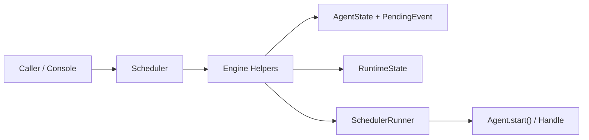
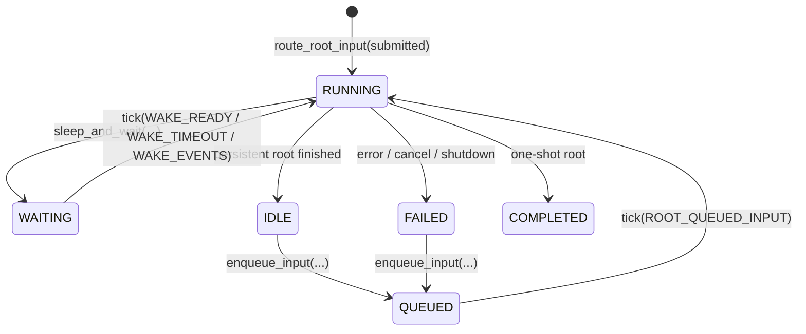
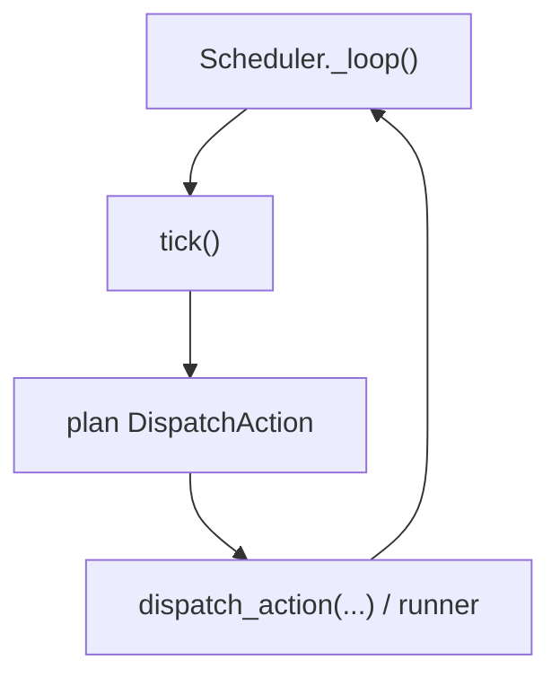

# Scheduler

`Scheduler` 是 `Agent` 之上的编排层。它不负责 agent 内部推理，而是负责这几件事：

- root/child agent 的生命周期
- persistent root 的多轮输入续跑
- sleep/wake 和 pending event
- steer / cancel / shutdown
- 流式输出和等待结果

如果只是一次性执行，优先用 `Agent.run()` / `Agent.run_stream()`。只有在你需要“长期存在的 root”或“multi-agent orchestration”时才需要 `Scheduler`。

## Mental Model



可以把 scheduler 看成两层：

- 持久化层：`AgentState` + `PendingEvent`
- 执行层：engine helpers 决定谁该跑，`SchedulerRunner` 负责把一轮 run 跑完

## Quick Start

```python
import asyncio

from agiwo.agent import Agent, AgentConfig
from agiwo.scheduler import Scheduler
from agiwo.llm import OpenAIModel


async def main() -> None:
    agent = Agent(
        AgentConfig(
            name="orchestrator",
            description="Coordinates long-running work",
            system_prompt="Delegate only truly independent work.",
        ),
        model=OpenAIModel(name="gpt-5.4"),
    )

    async with Scheduler() as scheduler:
        route = await scheduler.route_root_input(
            "Research two approaches and compare them.",
            agent=agent,
            persistent=False,
        )
        result = await scheduler.wait_for(route.state_id)
        print(result.response)


asyncio.run(main())
```

## Core Entry Points

### One-shot root

```python
route = await scheduler.route_root_input(
    "Do something complex",
    agent=agent,
    persistent=False,
)
result = await scheduler.wait_for(route.state_id)
```

### Route and wait later

```python
route = await scheduler.route_root_input(
    "Background work",
    agent=agent,
    persistent=False,
)
result = await scheduler.wait_for(route.state_id, timeout=30)
```

### Persistent root

`enqueue_input()` 只接受 `IDLE` 或 `FAILED` 的 persistent root，不是消息队列。

```python
route = await scheduler.route_root_input(
    "First message",
    agent=agent,
    persistent=True,
)
state_id = route.state_id
await scheduler.wait_for(state_id)

await scheduler.enqueue_input(state_id, "Second message")
await scheduler.wait_for(state_id)
```

### Route root input from an integration

`route_root_input()` 是 Console/Channel 集成用的高层入口。它会根据当前 root state 自动决定返回 `submitted` / `enqueued` / `steered`。

```python
result = await scheduler.route_root_input(
    "Continue the conversation",
    agent=agent,
    state_id=existing_state_id,
    persistent=True,
)
print(result.action)   # submitted / enqueued / steered
print(result.state_id)
```

### Stream output

```python
route = await scheduler.route_root_input(
    "Write a summary",
    agent=agent,
    persistent=False,
)
assert route.stream is not None

async for item in route.stream:
    if item.type == "step_delta" and item.delta.content:
        print(item.delta.content, end="", flush=True)
```

## State Model

| State | Meaning |
| --- | --- |
| `PENDING` | child state 已落库，但这轮还没真正启动 |
| `RUNNING` | 当前正在执行一轮 agent cycle |
| `WAITING` | 正在等待 wake condition |
| `IDLE` | persistent root 本轮完成，正在待命 |
| `QUEUED` | persistent root 已收到下一条输入，等待下一轮启动 |
| `COMPLETED` | 非 persistent、one-shot run 完成 |
| `FAILED` | 当前 state 失败或被终止 |

### Root lifecycle



### Why `IDLE`, `QUEUED`, `WAITING` are separate

- `WAITING`：在等真实条件，比如 timer、waitset、debounced events
- `IDLE`：persistent root 这一轮结束了，但实例还活着
- `QUEUED`：下一条输入已经到了，只是还没开始下一轮

## Tick Model

后台 loop 会周期性调用 `tick()`；初次 root submit 会直接 dispatch，而 `QUEUED` / `WAITING` 的后续推进由 tick 驱动。



`tick()` 的核心逻辑是：

- 传播 terminal child 到 parent waitset
- 为 `PENDING` child 产出 `CHILD_PENDING`
- 为 `QUEUED` root 产出 `ROOT_QUEUED_INPUT`
- 为 `WAITING` state 产出 `WAKE_READY / WAKE_TIMEOUT / WAKE_EVENTS`

## Scheduling Tools

运行在 scheduler 下的 agent 会自动获得这些 runtime tools：

| Tool | Purpose |
| --- | --- |
| `spawn_child_agent` | 派生一个新的 child agent |
| `fork_child_agent` | fork 当前 agent 为继承上下文的 child |
| `sleep_and_wait` | 让当前 agent 进入 `WAITING` |
| `query_spawned_agent` | 查看 child state |
| `cancel_agent` | 取消 child subtree |
| `list_agents` | 列出直接 child |
| `declare_milestones` | 声明当前任务的具体里程碑 |
| `review_trajectory` | 回应系统 review，并在偏离时提供经验摘要 |

这些 tools 由 `Scheduler` 自动注入，不需要手动注册。

## Runtime vs Persistence

这一点最容易帮助你读懂代码：

- `AgentStateStorage` 里保存的是事实快照
- `RuntimeState` 里保存的是进程内 live object

```python
RuntimeState(
    agents=...,             # live scheduler-managed Agent instances
    execution_handles=...,  # live execution handles
    abort_signals=...,
    waiters=...,
    stream_channels=...,
)
```

所以这层代码的主线其实只有三条：

1. `route_root_input()` 决定 root 输入怎么进入系统
2. `tick()` 决定哪些 state 该被 dispatch
3. dispatch path 执行一次 action，并把结果翻译回 state

## Console and Feishu Integration

Both Console and Feishu enter through session-first, scheduler-mediated flows:

- Console creates sessions through `POST /api/agents/{agent_id}/sessions`
- Session input streams through `POST /api/sessions/{session_id}/input`
- Feishu delegates through `SessionContextService` and `SessionRuntimeService`, which in turn call scheduler routing APIs
- Session persistence and read models live under `console/server/services/session_store/` and `console/server/services/runtime/`
