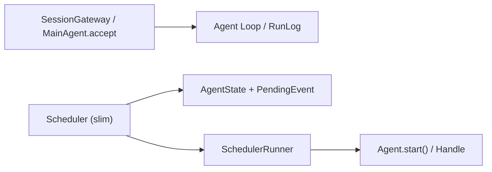
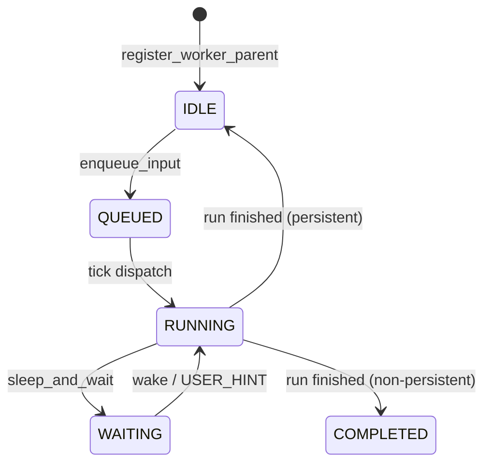

# Scheduler

`Scheduler` 是 `Agent` 之上的编排层。它不负责 agent 内部推理，而是负责这几件事：

- child agent 生命周期与 waitset
- persistent root 的输入入队（`enqueue_input`）
- sleep/wake 和 pending event
- cancel / shutdown
- Worker spawn parent 注册

**Session 用户聊天**走 `MainAgent.accept`（Console `SessionGateway`），不是 Scheduler。

如果只是一次性执行，优先用 `Agent.run()` / `Agent.run_stream()`。只有在你需要 child 委派、waitset 或 persistent scheduler root 时才需要 `Scheduler`。

## Mental Model


```mermaid
flowchart LR
    Session["SessionGateway / MainAgent.accept"] --> AgentLoop["Agent Loop / RunLog"]
    Scheduler["Scheduler (slim)"] --> Store["AgentState + PendingEvent"]
    Scheduler --> Runner["SchedulerRunner"]
    Runner --> Agent["Agent.start() / Handle"]
```

可以把 scheduler 看成两层：

- 持久化层：`AgentState` + `PendingEvent`
- 执行层：tick 决定谁该跑，`SchedulerRunner` 负责把一轮 run 跑完

## Quick Start

```python
import asyncio

from agiwo.agent import Agent, AgentConfig
from agiwo.scheduler import Scheduler
from agiwo.llm import OpenAIModel


async def main() -> None:
    agent = Agent(
        AgentConfig(
            name="orchestrator",
            description="Coordinates long-running work",
            system_prompt="Delegate only truly independent work.",
        ),
        model=OpenAIModel(name="gpt-5.4"),
        id="orchestrator-root",
    )

    async with Scheduler() as scheduler:
        await scheduler.register_worker_parent(
            state_id=agent.id,
            session_id="sess-1",
            agent=agent,
        )
        await scheduler.enqueue_input(
            agent.id,
            "Research two approaches and compare them.",
            agent=agent,
        )
        result = await scheduler.wait_for(agent.id)
        print(result.response)


asyncio.run(main())
```

## Core Entry Points

### Session chat (product path)

Console / channel 用户消息：

```python
from agiwo.agent import MainAgent

await main_agent.accept(user_message)
output = await main_agent.wait_for_current_run()
```

### Persistent scheduler root

`enqueue_input()` 是 persistent root 的统一入队面：

- `IDLE` / `FAILED` → `pending_input`（下一轮 root cycle）
- `RUNNING` → live Loop `enqueue_message`
- `WAITING` / `QUEUED` → `USER_HINT`（WAITING 为 urgent，立即唤醒）

```python
await scheduler.register_worker_parent(
    state_id=agent.id,
    session_id="sess-1",
    agent=agent,
)
await scheduler.enqueue_input(agent.id, "First message", agent=agent)
await scheduler.wait_for(agent.id)

await scheduler.enqueue_input(agent.id, "Second message", agent=agent)
await scheduler.wait_for(agent.id)
```

### Cancel / shutdown

```python
await scheduler.cancel(state_id)
await scheduler.shutdown(state_id)
```

## State Machine (simplified)


```mermaid
stateDiagram-v2
    [*] --> IDLE: register_worker_parent
    IDLE --> QUEUED: enqueue_input
    QUEUED --> RUNNING: tick dispatch
    RUNNING --> WAITING: sleep_and_wait
    WAITING --> RUNNING: wake / USER_HINT
    RUNNING --> COMPLETED: run finished (non-persistent)
    RUNNING --> IDLE: run finished (persistent)
```

## What Scheduler Does Not Own

- Session 历史与用户 bubble（`MainAgent.accept` + RunLog）
- Console SSE 主路径（`SessionGateway` → `MainAgent` → `handle.stream()`）
- 已删除的 Session facade：`route_root_input`、`dispatch_execution`、`inject_user_message`、`steer`

## Related Reading

- [Multi-agent guide](../guides/multi-agent.md)
- [Streaming guide](../guides/streaming.md)
- [Scheduler API reference](../api/scheduler.md)
