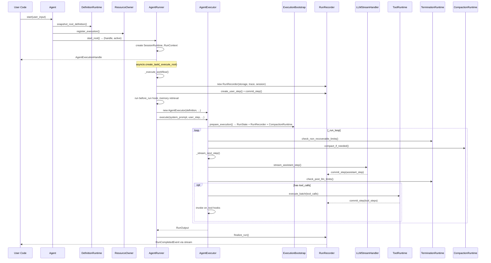
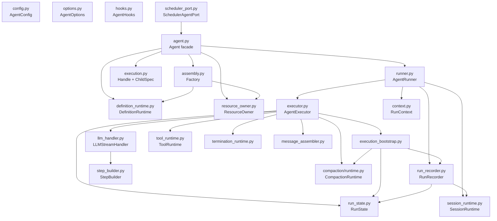

# Agent Layer — Current Architecture Analysis

> Status (2026-03): this document describes the pre-refactor `inner/` architecture and is now historical context only. The implemented structure has moved to `agiwo/agent/lifecycle/` + `agiwo/agent/engine/`.
> Scope: `agiwo/agent/` 及其所有子包的深度审计  
> Date: 2025-01  
> Author: Cascade (AI pair-programmer)

---

## 1. Package Overview

```text
agiwo/agent/                    # 63 Python files, ~5800 LoC
├── __init__.py                 # Public API re-exports (102)
├── agent.py                    # Agent facade (281)
├── assembly.py                 # Factory: DefinitionRuntime + ResourceOwner (38)
├── config.py                   # AgentConfig dataclass (16)
├── compact_types.py            # CompactMetadata + CompactResult (41)
├── execution.py                # AgentExecutionHandle + ChildAgentSpec (81)
├── hooks.py                    # AgentHooks dataclass (71)
├── input.py                    # UserInput domain models (104)
├── input_codec.py              # UserInput serialization helpers (153)
├── memory_hooks.py             # DefaultMemoryHook (132)
├── memory_types.py             # MemoryRecord (16)
├── options.py                  # AgentOptions + storage configs (82)
├── scheduler_port.py           # SchedulerAgentPort adapter (124)
├── streaming.py                # consume_execution_stream helper (29)
│
├── inner/                      # Core execution internals (~2500 LoC, 22 files)
│   ├── context.py              # AgentRunContext (76)
│   ├── definition.py           # ResolvedExecutionDefinition + AgentCloneSpec (35)
│   ├── definition_runtime.py   # AgentDefinitionRuntime (314) ★
│   ├── execution_bootstrap.py  # prepare_execution (85)
│   ├── executor.py             # AgentExecutor main loop (387) ★
│   ├── llm_handler.py          # LLMStreamHandler (150)
│   ├── message_assembler.py    # MessageAssembler (169)
│   ├── resource_owner.py       # AgentResourceOwner (89)
│   ├── run_payloads.py         # Event payload helpers (61)
│   ├── run_recorder.py         # RunRecorder (235) ★
│   ├── run_state.py            # RunState mutable bag (114)
│   ├── runner.py               # AgentRunner orchestrator (255)
│   ├── session_runtime.py      # AgentSessionRuntime (81)
│   ├── steering.py             # Steering message injection (38)
│   ├── step_builder.py         # StepBuilder streaming accumulator (128)
│   ├── summarizer.py           # Termination summary (108)
│   ├── termination_runtime.py  # Limit checks + summary gen (154)
│   ├── tool_runtime.py         # ToolRuntime + ResolvedToolCall (341)
│   └── compaction/             # Context compaction sub-package
│       ├── runtime.py          # CompactionRuntime (219)
│       ├── messages.py         # build_compacted_messages (37)
│       ├── parser.py           # parse_compact_response (70)
│       ├── prompt.py           # Default compact prompt (46)
│       └── transcript.py       # save_transcript (37)
│
├── runtime/                    # Public domain models (~530 LoC, 5 files)
│   ├── core.py                 # AgentContext protocol, enums (62)
│   ├── run.py                  # Run, RunOutput, RunMetrics, LLMCallContext (96)
│   ├── step.py                 # StepRecord, StepDelta, StepMetrics (244)
│   └── stream_events.py        # AgentStreamItem union types (78)
│
├── runtime_tools/              # Tool adapter layer (~360 LoC, 4 files)
│   ├── contracts.py            # AgentRuntimeTool protocol (51)
│   ├── adapters.py             # BaseToolAdapter + adapt_runtime_tool (74)
│   └── agent_tool.py           # AgentTool for nested execution (219)
│
├── prompt/                     # System prompt building (~280 LoC, 4 files)
│   ├── runtime.py              # AgentPromptRuntime (102)
│   ├── sections.py             # Section renderers (130)
│   └── snapshot.py             # PromptSnapshot + EnvironmentSnapshot (30)
│
├── storage/                    # Run/Step/Session persistence (~1680 LoC, 7 files)
│   ├── base.py                 # RunStepStorage ABC + InMemory (324)
│   ├── factory.py              # StorageFactory (56)
│   ├── mongo.py                # MongoRunStepStorage (420)
│   ├── serialization.py        # Serialize/Deserialize helpers (122)
│   ├── session.py              # SessionStorage + InMemory + SQLite (221)
│   └── sqlite.py               # SQLiteRunStepStorage (515)
│
└── trace/                      # Agent-to-Trace adapter (~450 LoC, 3 files)
    ├── collector.py            # AgentTraceCollector (186)
    └── span_builder.py         # Span builder helpers (260)
```

> ★ 标记文件是最大/最复杂的模块，也是重构的重点。

---

## 2. Execution Flow — As-Is



### 调用深度问题

从 `Agent.start()` 到实际 LLM 调用经过 **5 层间接调用**：

```text
Agent.start()
  → AgentRunner.start_root()
    → AgentRunner._execute_root()
      → AgentRunner._execute_workflow()
        → AgentExecutor.execute()
          → AgentExecutor._run_loop()
            → AgentExecutor._run_cycle()
              → LLMStreamHandler.stream_assistant_step()
```

---

## 3. Dependency Graph



---

## 4. Pain Points — 详细分析

### 4.1 `RunRecorder` 是 God Object (SRP 违反)

`RunRecorder` 同时承担 **6 种职责**：

| # | Responsibility | Methods |
|---|---|---|
| 1 | Step 创建 | `create_user_step()`, 内部调用 `StepRecord.user/assistant/tool` |
| 2 | Storage 持久化 | `commit_step()` → `storage.save_step()`, `save_run()` |
| 3 | Trace 回调 | `commit_step()` → `trace_runtime.on_step()` |
| 4 | Hook 触发 | `commit_step()` → `hooks.on_step()` |
| 5 | Stream Fanout | `publish()` → `session_runtime.publish()` → subscribers |
| 6 | State 追踪 | `commit_step()` → `state.track_step()` + message append |

**后果**：
- 每次改动任何一个环节都要修改 RunRecorder
- 测试时需要 mock 5 种外部依赖
- 新增 observer 类型（比如 metrics collector）需要侵入 RunRecorder

### 4.2 Runner ↔ Executor 边界模糊

| Concern | Runner handles | Executor handles |
|---|---|---|
| RunRecorder 创建 | ✅ | ❌ (receives it) |
| Before-run hooks | ✅ | ❌ |
| Memory retrieval | ✅ | ❌ |
| User step commit | ✅ | ❌ |
| Run state creation | ❌ | ✅ (via bootstrap) |
| LLM loop | ❌ | ✅ |
| Tool execution | ❌ | ✅ |
| Compaction | ❌ | ✅ |
| Termination | ❌ | ✅ |
| Summary generation | ❌ | ✅ |
| Run finalization | ✅ | ❌ |

Runner 做 "before/after" 包装，Executor 做 "during" 循环。问题在于 RunRecorder 在两者之间共享，产生了隐式依赖。

### 4.3 Child Agent 规格类型过多

```text
ChildAgentSpec      (execution.py)    — 用户可见的 child override 规格
  ↓
ChildDefinitionInputs (definition_runtime.py) — 内部 snapshot 输入，和 ChildAgentSpec 几乎一样
  ↓
ResolvedExecutionDefinition (definition.py) — 最终不可变快照
  ↓
AgentCloneSpec      (definition.py)    — scheduler clone 专用
```

4 个层次的类型转换，其中 `ChildAgentSpec → ChildDefinitionInputs` 几乎是 1:1 映射。

### 4.4 DefinitionRuntime 职责过重 (314 LoC)

`AgentDefinitionRuntime` 同时管理：
- Skill manager 初始化和刷新
- Hooks 构建（含 default memory hooks）
- Tools 列表管理（builtin + provided + SDK）
- Prompt runtime 创建
- Root definition snapshot
- Child definition snapshot
- Scheduler clone definition

**后果**：所有定义层面的变更都汇聚到此文件。

### 4.5 Mutable RunState 是一个松散的属性包

`RunState` 有 20+ 个可变字段，外部代码通过直接属性访问来读写：

```python
state.messages           # list[dict] — 当前 LLM messages
state.current_step       # int — 当前步数
state.total_input_tokens # int
state.total_output_tokens# int
state.token_cost         # float
state.tool_calls_count   # int
state.tool_errors_count  # int
state.termination_reason # TerminationReason | None
state.last_compact_metadata # CompactMetadata | None
state.compact_start_seq  # int
...
```

任何持有 `state` 引用的组件都可以随意修改它，无法追踪变更来源。

### 4.6 Storage 层重复代码

SQLite (515 LoC) 和 MongoDB (420 LoC) 实现在模式上高度相似：
- 每个方法都是：ensure_connection → try/except → query → deserialize
- `_ensure_connection()` pattern 重复
- Error logging pattern 完全一致
- Serialization/deserialization 已经抽取到 `serialization.py`，但每个实现仍有大量样板代码

### 4.7 Input 类型系统过于复杂

```text
UserInput = str | list[ContentPart] | UserMessage
                    ↕
ContentPart: text/image/file/audio (Pydantic models)
                    ↕
MessageContent = str | list[dict[str, Any]]   (LLM 格式)
                    ↕
input_codec.py: 153 行的转换函数
```

四层表示意味着每次触碰用户输入都需要经过转换。

### 4.8 `scheduler_port.py` — 过度适配

`AgentSchedulerPort` 对 `Agent` 的每个方法做 1:1 转发，引入了 124 行代码来满足一个 Protocol。这是典型的 "面向接口编程" 过度使用场景。

---

## 5. Metrics Summary

| Sub-package | Files | LoC | Complexity Rating |
|---|---|---|---|
| Top-level | 14 | ~1280 | Medium |
| `inner/` | 22 | ~2500 | **High** — 核心复杂度集中地 |
| `runtime/` | 5 | ~530 | Low — 纯数据模型 |
| `runtime_tools/` | 4 | ~360 | Low |
| `prompt/` | 4 | ~280 | Low |
| `storage/` | 7 | ~1680 | Medium — 样板代码多 |
| `trace/` | 3 | ~450 | Low |
| **Total** | **63** | **~5800** | — |

> `inner/` 占总代码量的 43%，是重构的核心战场。

---

## 6. What Works Well（值得保留的设计）

1. **`runtime/` 包的数据模型设计** — 清晰的分层（core enums → step → run → stream events），StepRecord 的工厂方法优雅
2. **`AgentStreamItem` typed union** — 类型安全的流式事件协议
3. **`AgentHooks` dataclass 模式** — 可选回调 dataclass 比 ABC 继承更灵活
4. **`ToolRuntime` 的 gate → execute → cache 管线** — 工具执行生命周期清晰
5. **`CompactionRuntime` 作为独立子包** — 关注点分离良好
6. **`StepBuilder` 的流式累积模式** — 干净的 chunk → finalize 生命周期
7. **`AgentRuntimeTool` protocol** — 工具适配层设计合理，允许 BaseTool 和 AgentTool 共存
