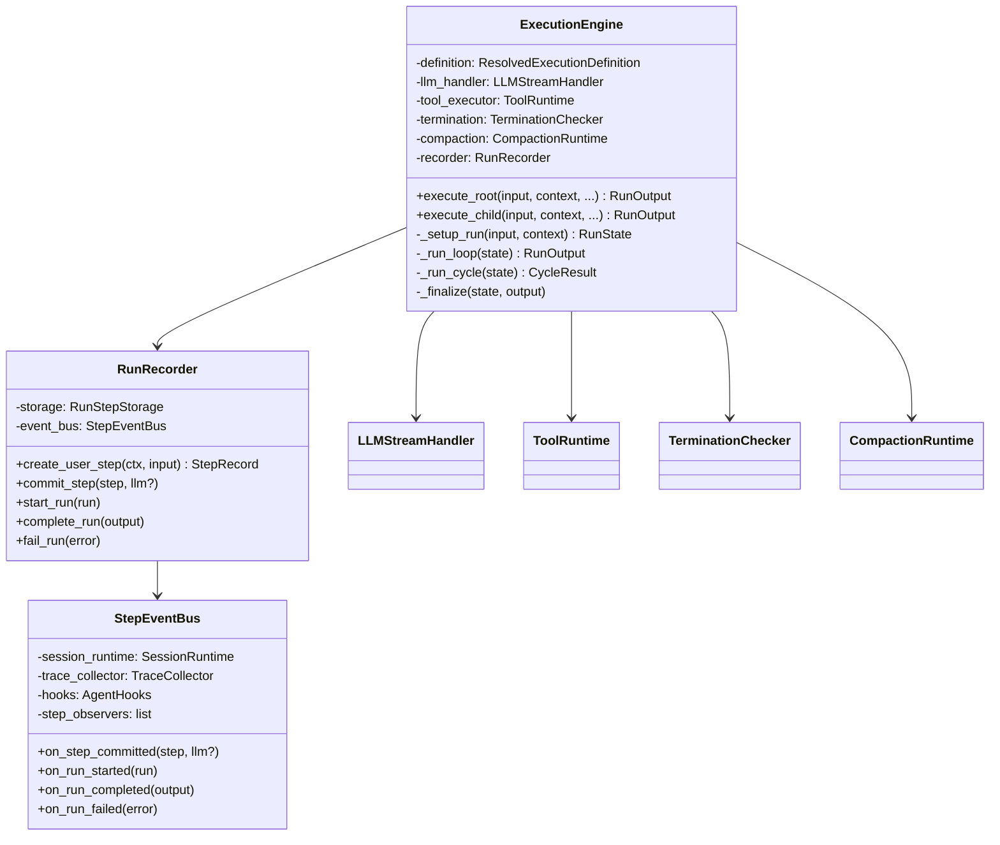
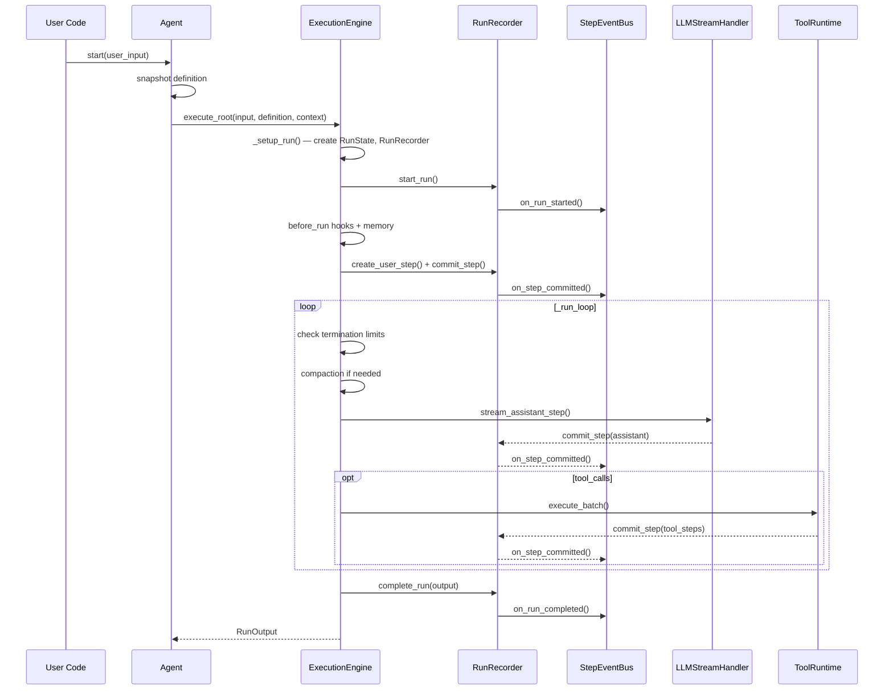
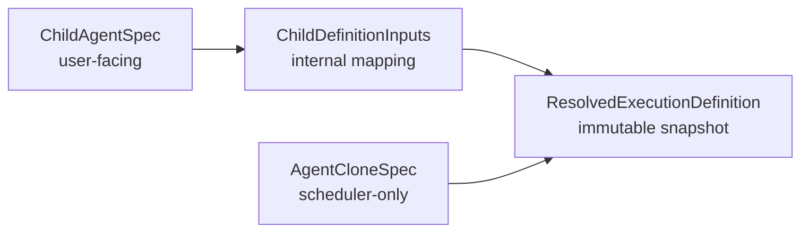
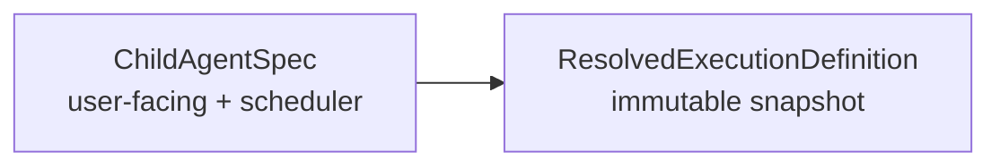
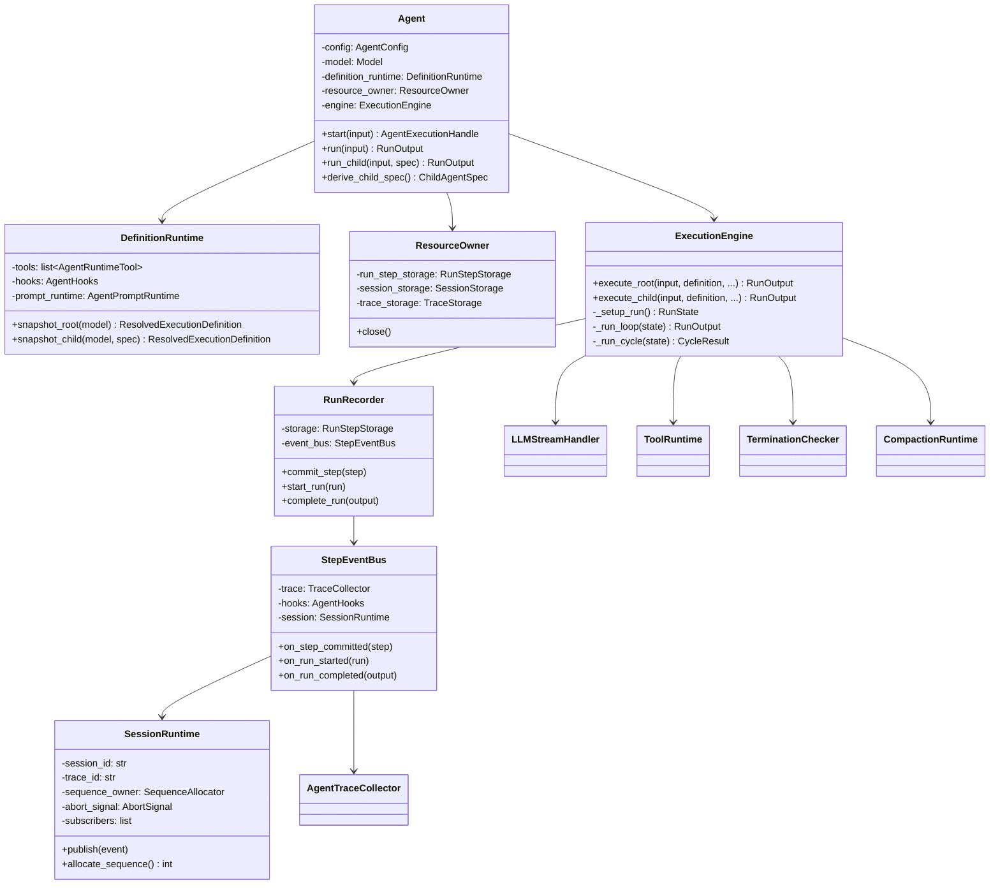

# Agent Layer — Refactored Architecture Design

> 状态说明（2026-03）：这是 `by-opus` 方案的目标稿，保留用于回顾设计取舍。最终实现没有采纳本文中的 `Runner + Executor` 合并、`recording/` 目录和 `EventBus` 方案；请以 `docs/refactor/agent-layer-merged/` 与当前代码为准。

> 基于 `01-current-analysis.md` 的洞察，本文提出重构后的 Agent 层架构。  
> 核心目标：**更少的层次、更清晰的职责边界、更少的代码量**，同时保持功能完全不变。

---

## 1. Design Principles

| Principle | Rationale |
|---|---|
| **Single Owner** | 每个关注点只有一个 owner class，消灭 God Object |
| **Flatten Layers** | Runner + Executor 合并，减少调用深度 |
| **Event-Driven Side Effects** | 核心循环只发事件，side effects（storage/trace/hooks/stream）由独立 sink 处理 |
| **Immutable Snapshots** | RunState 内部状态通过方法变更，不暴露可变属性 |
| **Type Simplification** | Child spec 类型从 4 个减少到 2 个 |

---

## 2. Target Package Layout

```
agiwo/agent/                        # 目标 ~45 files, ~4200 LoC (-28% 文件, -28% 代码)
├── __init__.py                     # Public API (unchanged)
├── agent.py                        # Agent facade (simplified)
├── config.py                       # AgentConfig (unchanged)
├── options.py                      # AgentOptions (unchanged)
├── hooks.py                        # AgentHooks (unchanged)
├── execution.py                    # AgentExecutionHandle + ChildAgentSpec (simplified)
├── input.py                        # UserInput models (unchanged)
├── input_codec.py                  # UserInput serialization (unchanged)
├── compact_types.py                # CompactMetadata + CompactResult (unchanged)
├── memory_types.py                 # MemoryRecord (unchanged)
├── memory_hooks.py                 # DefaultMemoryHook (unchanged)
├── streaming.py                    # consume_execution_stream (unchanged)
├── scheduler_port.py               # Simplified adapter
│
├── engine/                         # 执行引擎 (合并 inner/ 中的 runner + executor)
│   ├── __init__.py
│   ├── engine.py                   # ExecutionEngine (合并 Runner + Executor)
│   ├── context.py                  # AgentRunContext (unchanged)
│   ├── run_state.py                # RunState (封装化)
│   ├── llm_handler.py              # LLMStreamHandler (unchanged)
│   ├── step_builder.py             # StepBuilder (unchanged)
│   ├── tool_executor.py            # ToolRuntime (renamed, unchanged)
│   ├── termination.py              # TerminationChecker (simplified)
│   ├── message_assembler.py        # MessageAssembler (unchanged)
│   ├── steering.py                 # apply_steering_messages (unchanged)
│   └── compaction/                 # CompactionRuntime (unchanged)
│       ├── runtime.py
│       ├── messages.py
│       ├── parser.py
│       ├── prompt.py
│       └── transcript.py
│
├── lifecycle/                      # Agent 生命周期管理
│   ├── __init__.py
│   ├── definition.py               # DefinitionRuntime (slimmed)
│   ├── resource_owner.py           # ResourceOwner (unchanged)
│   ├── session.py                  # SessionRuntime (unchanged)
│   └── assembly.py                 # Factory functions (moved from top-level)
│
├── recording/                      # 录制/观测管线 (从 RunRecorder 拆分)
│   ├── __init__.py
│   ├── recorder.py                 # RunRecorder (thin coordinator)
│   ├── event_bus.py                # StepEventBus (fanout)
│   └── run_payloads.py             # Payload helpers (unchanged)
│
├── runtime/                        # Public domain models (UNCHANGED)
│   ├── core.py
│   ├── run.py
│   ├── step.py
│   └── stream_events.py
│
├── runtime_tools/                  # Tool adapter layer (UNCHANGED)
│   ├── contracts.py
│   ├── adapters.py
│   └── agent_tool.py
│
├── prompt/                         # System prompt (UNCHANGED)
│   ├── runtime.py
│   ├── sections.py
│   └── snapshot.py
│
├── storage/                        # Persistence (UNCHANGED)
│   ├── base.py
│   ├── factory.py
│   ├── mongo.py
│   ├── serialization.py
│   ├── session.py
│   └── sqlite.py
│
└── trace/                          # Trace adapter (UNCHANGED)
    ├── collector.py
    └── span_builder.py
```

### 变化摘要

| Area | Before | After | Change |
|---|---|---|---|
| `inner/` | 22 files, ~2500 LoC | `engine/` 12 files + `lifecycle/` 5 files + `recording/` 4 files | 拆分为 3 个语义清晰的子包 |
| Runner + Executor | 2 classes, ~640 LoC | 1 class `ExecutionEngine`, ~450 LoC | 合并，减少 30% |
| RunRecorder | 1 God Object, 235 LoC | Recorder (thin) + EventBus, ~180 LoC | SRP 拆分 |
| Child spec types | 4 types | 2 types | 删除中间类型 |
| scheduler_port.py | 124 LoC adapter | ~60 LoC | 精简 |
| 总计 | 63 files, ~5800 LoC | ~45 files, ~4200 LoC | **-28%** |

---

## 3. Core Redesign: ExecutionEngine

### 3.1 Rationale

当前 `AgentRunner` 和 `AgentExecutor` 的边界不清晰：
- Runner 做 "创建 context → 创建 recorder → 前置 hooks → 委托 executor → 后置 finalize"
- Executor 做 "创建 state → 主循环 → tool/llm/compaction"

这本质上是一个执行流程的 "setup → loop → teardown" 三阶段，用两个类实现徒增了参数传递成本。

### 3.2 Architecture



### 3.3 Execution Flow (After)



**调用深度从 8 层减少到 4 层：**

```
Agent.start()
  → ExecutionEngine.execute_root()
    → ExecutionEngine._run_loop()
      → ExecutionEngine._run_cycle()
        → LLMStreamHandler.stream_assistant_step()
```

---

## 4. RunRecorder SRP 拆分

### 4.1 Before (God Object)

```python
# current run_recorder.py — 6 responsibilities in 1 class
class RunRecorder:
    def commit_step(self, step, *, llm=None, append_message=True):
        # 1. Save to storage
        await self.storage.save_step(step)
        # 2. Update state
        self.state.track_step(step)
        if append_message:
            self.state.messages.append(step_to_message(step))
        # 3. Trace callback
        await self.trace_runtime.on_step(step, llm)
        # 4. Hook invocation
        await self.hooks.on_step(step)
        # 5. Stream fanout
        await self.session_runtime.publish(StepCompletedEvent(...))
        # 6. Observer notification
        for observer in self.step_observers:
            observer(step)
```

### 4.2 After (Split)

```python
# recording/recorder.py — only storage + state + delegation to event_bus
class RunRecorder:
    def __init__(self, storage, state, event_bus):
        self._storage = storage
        self._state = state
        self._event_bus = event_bus

    async def commit_step(self, step, *, llm=None, append_message=True):
        await self._storage.save_step(step)
        self._state.track_step(step)
        if append_message:
            self._state.append_message(step)
        await self._event_bus.on_step_committed(step, llm)


# recording/event_bus.py — all observation side effects
class StepEventBus:
    def __init__(self, session_runtime, trace_collector, hooks, step_observers):
        self._session = session_runtime
        self._trace = trace_collector
        self._hooks = hooks
        self._observers = step_observers

    async def on_step_committed(self, step, llm=None):
        await self._trace.on_step(step, llm)
        if self._hooks.on_step:
            await self._hooks.on_step(step)
        await self._session.publish(StepCompletedEvent.from_step(step))
        for observer in self._observers:
            observer(step)
```

**收益**：
- 新增 observer 类型只需修改 `StepEventBus`
- 测试 `RunRecorder` 只需 mock storage + state
- 测试 side effects 只需直接测 `StepEventBus`

---

## 5. Child Agent 类型简化

### 5.1 Before (4 types)



### 5.2 After (2 types)



- **删除 `ChildDefinitionInputs`** — 它和 `ChildAgentSpec` 几乎 1:1 映射，直接在 `DefinitionRuntime.snapshot_child_definition()` 中消费 `ChildAgentSpec`
- **合并 `AgentCloneSpec` 到 `ChildAgentSpec`** — scheduler clone 只是 child spec 的一个变体，增加一个 `clone_tools: bool` 字段即可

### 5.3 Code Impact

```python
# Before: definition_runtime.py
@dataclass
class ChildDefinitionInputs:
    model: Model
    system_prompt_override: str | None
    tools_override: list[RuntimeToolLike] | None
    hooks_override: AgentHooks | None
    child_id: str | None

async def snapshot_child_definition(self, *, model, spec: ChildAgentSpec):
    inputs = ChildDefinitionInputs(
        model=model,
        system_prompt_override=spec.system_prompt,
        tools_override=spec.tools,
        hooks_override=spec.hooks,
        child_id=spec.child_id,
    )
    return self._resolve_child(inputs)

# After: lifecycle/definition.py
async def snapshot_child_definition(self, *, model, spec: ChildAgentSpec):
    # Directly consume ChildAgentSpec — no intermediate type
    effective_tools = spec.tools if spec.tools is not None else self._tools
    effective_hooks = spec.hooks if spec.hooks is not None else self._hooks
    ...
```

---

## 6. DefinitionRuntime 瘦身

### 6.1 当前职责 (314 LoC)

1. Skill manager 初始化/刷新
2. Hooks 构建 (default memory hooks fallback)
3. Tools 列表管理 (builtin + provided + SDK tools)
4. Prompt runtime 创建
5. Root definition snapshot
6. Child definition snapshot
7. Scheduler clone

### 6.2 重构策略

将 **tools 组装** 和 **hooks 构建** 的逻辑内联到工厂函数中（`assembly.py`），让 `DefinitionRuntime` 只持有已组装好的 runtime objects：

```python
# lifecycle/definition.py — slimmed to ~180 LoC
class DefinitionRuntime:
    def __init__(
        self,
        *,
        config: AgentConfig,
        agent_id: str,
        tools: list[AgentRuntimeTool],  # already assembled
        hooks: AgentHooks,               # already built with defaults
        prompt_runtime: AgentPromptRuntime,
        skill_manager: SkillManager | None,
    ):
        self._config = config
        self._agent_id = agent_id
        self._tools = tools
        self._hooks = hooks
        self._prompt_runtime = prompt_runtime
        self._skill_manager = skill_manager

    async def snapshot_root(self, model: Model) -> ResolvedExecutionDefinition:
        system_prompt = await self._prompt_runtime.get_system_prompt()
        return ResolvedExecutionDefinition(
            model=model,
            system_prompt=system_prompt,
            tools=self._tools,
            hooks=self._hooks,
            agent_id=self._agent_id,
            agent_name=self._config.name,
            options=self._config.options or AgentOptions(),
        )

    async def snapshot_child(
        self, model: Model, spec: ChildAgentSpec
    ) -> ResolvedExecutionDefinition:
        # Apply overrides from spec, fallback to self._*
        ...
```

**工具组装** 移到 `lifecycle/assembly.py`：

```python
# lifecycle/assembly.py
def build_definition_runtime(
    config: AgentConfig,
    agent_id: str,
    provided_tools: list[RuntimeToolLike],
    hooks: AgentHooks | None,
) -> DefinitionRuntime:
    # 1. Build effective hooks (with default memory hook fallback)
    effective_hooks = _build_hooks(hooks, config)
    # 2. Assemble tools (builtin discovery + provided + SDK)
    all_tools = _assemble_tools(provided_tools, agent_id, config)
    # 3. Create prompt runtime
    prompt_runtime = _create_prompt_runtime(config, agent_id, all_tools)
    # 4. Create skill manager
    skill_manager = _create_skill_manager(agent_id)

    return DefinitionRuntime(
        config=config,
        agent_id=agent_id,
        tools=all_tools,
        hooks=effective_hooks,
        prompt_runtime=prompt_runtime,
        skill_manager=skill_manager,
    )
```

---

## 7. RunState 封装化

### 7.1 Before — 裸属性包

```python
@dataclass
class RunState:
    context: AgentRunContext
    messages: list[dict]
    current_step: int = 0
    total_input_tokens: int = 0
    total_output_tokens: int = 0
    token_cost: float = 0.0
    tool_calls_count: int = 0
    tool_errors_count: int = 0
    termination_reason: TerminationReason | None = None
    last_compact_metadata: CompactMetadata | None = None
    compact_start_seq: int = 1
    ...

# 外部代码直接修改:
state.current_step += 1
state.total_input_tokens += step.metrics.input_tokens
state.termination_reason = TerminationReason.MAX_STEPS
```

### 7.2 After — 封装方法

```python
@dataclass
class RunState:
    _context: AgentRunContext
    _messages: list[dict]
    _metrics: _RunMetricsAccumulator  # internal
    _termination_reason: TerminationReason | None = None

    @property
    def messages(self) -> list[dict]:
        return self._messages

    @property
    def context(self) -> AgentRunContext:
        return self._context

    @property
    def termination_reason(self) -> TerminationReason | None:
        return self._termination_reason

    def terminate(self, reason: TerminationReason) -> None:
        self._termination_reason = reason

    def track_step(self, step: StepRecord) -> None:
        """Single entry point for all step tracking."""
        self._metrics.track(step)

    def append_message(self, step: StepRecord) -> None:
        self._messages.append(step_to_message(step))

    def apply_compaction(self, compacted_messages: list[dict], metadata: CompactMetadata) -> None:
        """Single entry point for compaction state update."""
        self._messages = compacted_messages
        self._last_compact_metadata = metadata
        self._compact_start_seq = metadata.end_seq + 1

    def build_output(self) -> RunOutput:
        ...
```

**收益**：
- 状态变更有明确的入口，易于审计和调试
- 内部累积逻辑收口到 `_RunMetricsAccumulator`
- 编译器/linter 可以检测到对 private 属性的非法访问

---

## 8. Overall Class Diagram (After)



---

## 9. Migration Path

重构分 **4 个阶段**，每个阶段都保持测试通过：

### Phase 1: Extract EventBus from RunRecorder
- 创建 `recording/event_bus.py`
- RunRecorder 内部委托给 EventBus
- **所有测试保持通过**

### Phase 2: Merge Runner + Executor → ExecutionEngine
- 创建 `engine/engine.py`
- 逐步迁移 Runner 和 Executor 的逻辑
- Agent.py 切换到使用 ExecutionEngine
- **所有测试保持通过**

### Phase 3: Slim DefinitionRuntime
- 将 tools/hooks 组装逻辑移到 assembly.py
- 删除 ChildDefinitionInputs
- 合并 AgentCloneSpec 到 ChildAgentSpec
- **所有测试保持通过**

### Phase 4: Encapsulate RunState + Cleanup
- RunState 封装化
- 删除旧 inner/ 目录
- 更新 __init__.py re-exports
- **所有测试保持通过**
