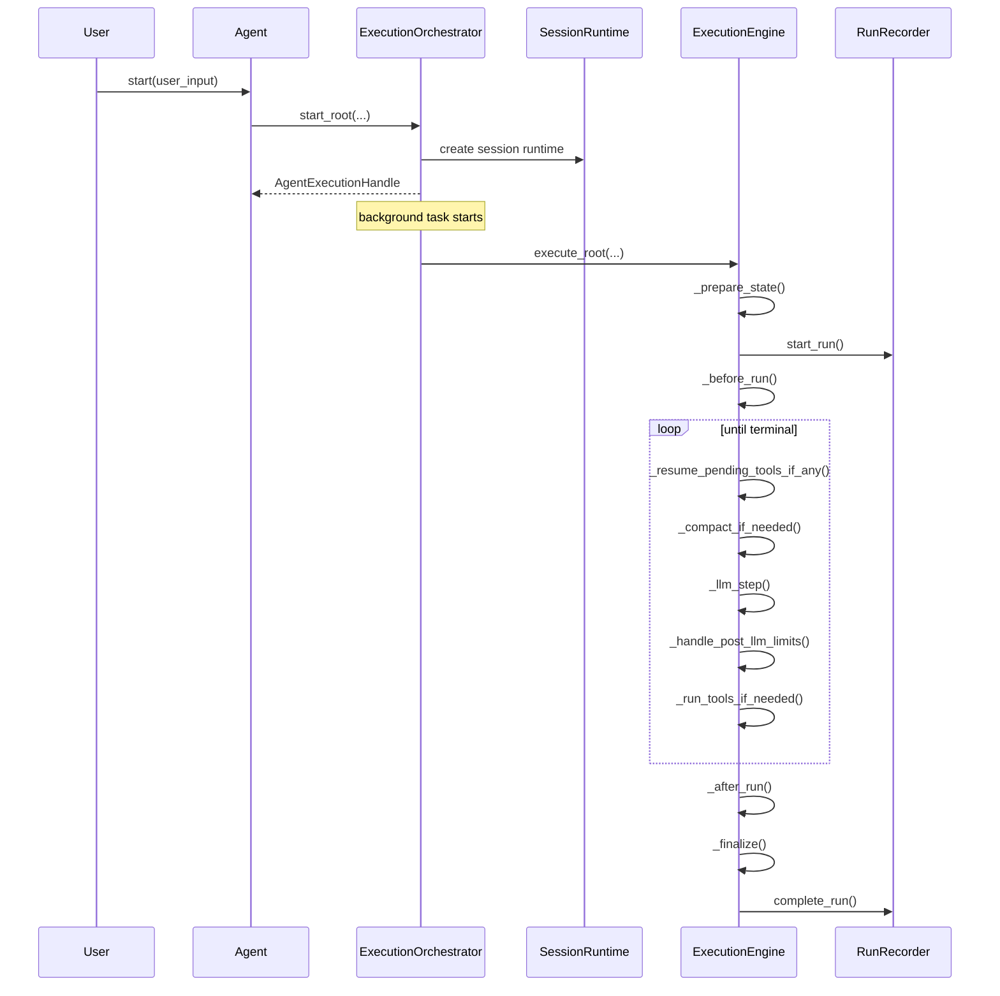

# Agent 层整合方案：目标设计

> 状态说明（2026-03）：本文描述的目标结构已经落地到当前代码。若本文与实现细节不一致，请以 `agiwo/agent/{lifecycle,engine}/`、`AGENTS.md` 和 `agiwo/agent/README.md` 为准。

## 1. 目标目录结构

最终建议的 `agiwo/agent/` 目录如下：

```text
agiwo/agent/
├── __init__.py
├── agent.py
├── config.py
├── options.py
├── hooks.py
├── execution.py
├── input.py
├── input_codec.py
├── compact_types.py
├── memory_types.py
├── memory_hooks.py
├── streaming.py
├── scheduler_port.py
│
├── lifecycle/
│   ├── __init__.py
│   ├── assembly.py
│   ├── definition.py
│   ├── resource_owner.py
│   ├── session.py
│   └── orchestrator.py
│
├── engine/
│   ├── __init__.py
│   ├── context.py
│   ├── engine.py
│   ├── state.py
│   ├── recorder.py
│   ├── llm_handler.py
│   ├── tool_runtime.py
│   ├── termination.py
│   ├── message_assembler.py
│   ├── steering.py
│   └── compaction/
│       ├── __init__.py
│       ├── runtime.py
│       ├── messages.py
│       ├── parser.py
│       ├── prompt.py
│       └── transcript.py
│
├── runtime/
│   ├── core.py
│   ├── run.py
│   ├── step.py
│   └── stream_events.py
│
├── runtime_tools/
│   ├── __init__.py
│   ├── contracts.py
│   ├── adapters.py
│   └── agent_tool.py
│
├── prompt/
│   ├── __init__.py
│   ├── runtime.py
│   ├── sections.py
│   └── snapshot.py
│
├── storage/
│   ├── __init__.py
│   ├── base.py
│   ├── factory.py
│   ├── serialization.py
│   ├── session.py
│   ├── sqlite.py
│   └── mongo.py
│
└── trace/
    ├── __init__.py
    ├── collector.py
    └── span_builder.py
```

这个结构刻意参考了 `agent-layer-by-opus` 的清晰分区，但做了两点收敛：

1. 不单独拆 `recording/` 子包，`RunRecorder` 放回 `engine/`，因为 recording 本质上属于单次 run 执行骨架。
2. 不再保留今天 `inner/` 这种“内部实现大杂烩”包，内部代码按 `lifecycle` 和 `engine` 两个语义域展开。

---

## 2. 模块职责

### 2.1 顶层 public facade

顶层保留外部稳定 API：

- `agent.py`
  - `Agent` facade。
- `execution.py`
  - `AgentExecutionHandle`、`ChildAgentSpec`。
- `config.py / options.py / hooks.py / input.py / runtime/`
  - 公开配置和领域模型。

这些文件不应因为内部重构而大改形态。

### 2.2 `lifecycle/`

#### `lifecycle/assembly.py`

唯一职责：组装 `Agent` 初始化时需要的 runtime objects。

它应该真正承担 assembly，而不是继续做今天那种 pass-through。

应负责：

- effective hooks 构建
- default/sdk/provided/runtime tools 的初始组装
- prompt runtime 构建
- resource owner 构建

#### `lifecycle/definition.py`

统一收口 definition 域：

- `AgentDefinitionRuntime`
- `ResolvedExecutionDefinition`
- scheduler child template materialization 所需的 internal type

这里的目标是减少今天在 `definition_runtime.py` 和 `definition.py` 之间来回跳转。

#### `lifecycle/resource_owner.py`

保持现有职责不变：

- `run_step_storage`
- `session_storage`
- `trace_storage`
- active root executions 生命周期

#### `lifecycle/session.py`

保持 session 级 owner：

- `session_id`
- sequence owner
- abort signal
- steering queue
- stream subscribers
- trace runtime

#### `lifecycle/orchestrator.py`

这是对今天 `ExecutionOrchestrator` 的替代，但会更薄。

它只负责：

- `start_root()`
- `run_child()`
- root task 创建
- handle 创建
- root execution 注册/清理
- root vs child session wiring

它不再负责：

- before-run hook
- memory retrieve
- user step commit
- run finalize
- summary generation

这些都下沉到 `ExecutionEngine`。

### 2.3 `engine/`

#### `engine/context.py`

保留 `AgentRunContext`。

原因是它同时被：

- engine 状态
- tool runtime
- nested child 调用

使用，语义上仍是单次 run 的执行上下文。

#### `engine/state.py`

这是当前 `RunState` 的演进版，但不是全新框架。

目标：

- 保留单一可变状态对象
- 收口修改入口
- 减少 executor 直接写裸属性

建议内部结构：

```python
@dataclass
class RunState:
    context: AgentRunContext
    config: AgentOptions
    messages: list[dict]
    tool_schemas: list[dict] | None = None
    pending_tool_calls: list[dict] | None = None
    response_content: str | None = None
    termination_reason: TerminationReason | None = None
    metrics: RunMetricsAccumulator = field(default_factory=RunMetricsAccumulator)
    compact: CompactState = field(default_factory=CompactState)
```

保留一个主对象，但把 metrics / compact 这些高频子状态内聚进去，避免继续膨胀。

#### `engine/engine.py`

这是整合版的核心。

它吸收今天：

- `executor.py`
- `execution_bootstrap.py`
- `runner.py` 中的 before/after run 流程

主干读起来应该是显式 phase：

```python
class ExecutionEngine:
    async def execute(...):
        state = await self._prepare_state(...)
        await self._before_run(...)
        try:
            while not state.is_terminal:
                await self._resume_pending_tools_if_any(state)
                if state.is_terminal:
                    break
                await self._compact_if_needed(state)
                step, llm = await self._llm_step(state)
                await self._handle_post_llm_limits(state, step, llm)
                if state.is_terminal:
                    break
                await self._run_tools_if_needed(state, step)
            await self._after_run(state)
            await self._finalize(state)
        except Exception as exc:
            await self._fail(state, exc)
            raise
        return state.build_output()
```

注意：这里是“显式 phase”，不是 `phases.py` 框架。

#### `engine/recorder.py`

`RunRecorder` 继续保留为唯一写入 owner：

- `start_run()`
- `create_*_step()`
- `commit_step()`
- `complete_run()`
- `fail_run()`

但要做两个收敛：

1. 删除 `attach_state()` 这种跨 phase 绑定方式。
2. 让 state 在 recorder 创建时就确定，不再通过 bootstrap 返回“换绑 recorder”。

#### `engine/llm_handler.py`

基本保留。

它是非常清晰的 leaf owner，不值得为了重构再打散。

#### `engine/tool_runtime.py`

基本保留。

只做两件增量改动：

1. 保留当前 safe-parallel / unsafe-serial 执行策略。
2. 如果后续真出现第二种调度需求，再抽出最小 `ToolSchedulingPolicy`，现在先不建框架。

#### `engine/termination.py`

保持单 owner：

- pre-llm limits
- post-llm limits
- termination summary

当前 `summarizer.py` 可并入这里，减少文件跳转。

#### `engine/message_assembler.py`

保留。

它与执行 loop 正交，而且职责明确。

#### `engine/steering.py`

保留。

它已经是很好的单一 helper，不必再继续抽象。

#### `engine/compaction/`

整体保留。

这部分已经有独立语义边界，也是当前实现里最不值得再拆的一块。

---

## 3. 关键设计决策

### 3.1 保留 `Orchestrator + Engine`，不直接做一个超大 `ExecutionEngine`

原因不是“喜欢多一层”，而是 root/child 生命周期和单次 run loop 本来就是两类语义：

- orchestrator 管“怎么开始、怎么拿 handle、怎么挂到 resource owner 上”
- engine 管“这一轮具体怎么跑完”

如果把两者彻底合并，`Agent.start()` 的同步 handle 返回语义和 child run session 复用逻辑会重新挤回一个大类里。

### 3.2 删除 `execution_bootstrap.py`

这一步是整合版最确定的减代码点。

今天的问题是：

- runner 先建 recorder
- bootstrap 再建 state
- bootstrap 再返回 `run_recorder.attach_state(state)`

这条链路不自然，也增加一次 recorder 替身对象创建。

整合版应改为：

1. engine 先加载已有 steps / compact metadata / messages
2. engine 构造 `RunState`
3. engine 直接构造 `RunRecorder(state=state, ...)`
4. 后续所有 phase 使用同一个 recorder

### 3.3 `RunRecorder` 不做 event 化

整合版明确维持：

- `RunRecorder` 是唯一写入口
- `RunRecorder` 内部顺序是固定行为
- 不再拆 `StepEventBus`

如果未来真的出现更多 observer 种类，再考虑局部提取 sink helper，但不改变对外 owner。

### 3.4 child materialization 只保留必要对象

最终 child 派生路径建议为：

```text
ChildAgentSpec
  -> AgentDefinitionRuntime._resolve_child_materialization(...)
      -> ResolvedExecutionDefinition   # nested child run
      -> MaterializedChildTemplate     # scheduler child clone
```

要点：

- public 输入是 `ChildAgentSpec`
- nested child 和 scheduler child 共用一套 materialization 规则
- 中间结果不再单独散落到独立文件或多个 public-ish dataclass

---

## 4. 新旧文件映射

| 当前 | 目标 |
| --- | --- |
| `inner/runner.py` | `lifecycle/orchestrator.py` |
| `inner/executor.py` | `engine/engine.py` |
| `inner/execution_bootstrap.py` | 删除，逻辑并入 `engine/engine.py` |
| `inner/run_state.py` | `engine/state.py` |
| `inner/run_recorder.py` | `engine/recorder.py` |
| `inner/context.py` | `engine/context.py` |
| `inner/definition_runtime.py` | `lifecycle/definition.py` |
| `inner/definition.py` | 并入 `lifecycle/definition.py` |
| `inner/session_runtime.py` | `lifecycle/session.py` |
| `inner/resource_owner.py` | `lifecycle/resource_owner.py` |
| `assembly.py` | `lifecycle/assembly.py` |
| `inner/termination_runtime.py` + `inner/summarizer.py` | `engine/termination.py` |

---

## 5. 对代码量的影响

这版方案减少代码的方式不是“重写出更多框架”，而是删掉以下重复层：

1. `execution_bootstrap.py`
2. `RunRecorder.attach_state()`
3. `definition_runtime.py` 与 `definition.py` 之间的跳转层
4. 顶层 `assembly.py` 的透传式 build 函数
5. child definition 的重复 materialization 路径
6. `summarizer.py` 这类过薄 helper 模块

预期效果：

- 文件数下降，但不会像激进方案那样为了压文件而牺牲语义。
- 代码主链缩短，调试路径大幅变短。
- 执行骨架中的参数透传明显减少。

---

## 6. 一次 root run 的目标时序



阅读这个时序时应该只看两个问题：

1. “这轮 run 何时创建与何时结束” 看 `orchestrator`
2. “这轮 run 中间如何推进” 看 `engine`
