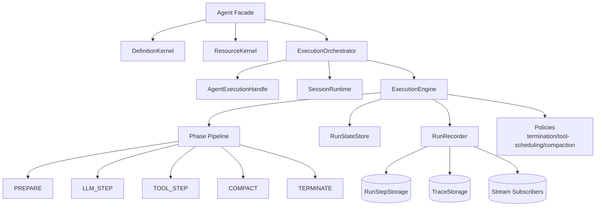
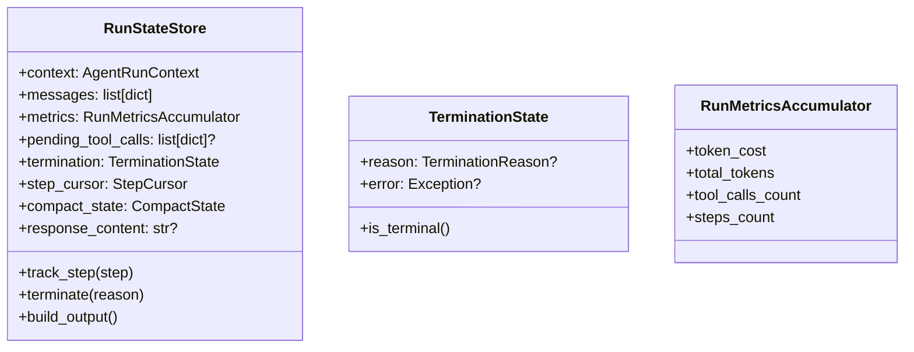

# Agent 层重构设计方案（行为不变、结构升级）

> 状态说明（2026-03）：这是早期目标设计稿，不再代表当前代码的目录布局。当前已实现结构请看 `docs/refactor/agent-layer-merged/` 与 `agiwo/agent/{lifecycle,engine}/`。

## 1. 目标架构：保持外部 API，重写内部执行骨架



核心思想：**把现在的 executor + helper 网络改成 phase pipeline + policy 驱动**，让主干读起来像“状态机”而不是“函数跳转图”。

---

## 2. 模块重组建议

> 不追求“大而全重命名”，而是把薄层合并，减少 cognitive overhead。

### 2.1 Public API 层（保留）

- `agent.py`
- `execution.py`
- `config.py / input.py / runtime/*.py`

### 2.2 Definition 层（合并）

- 保留：`definition_runtime.py`
- 合并：`assembly.py` + definition 相关 builder/normalize 逻辑 -> `definition_kernel.py`
- 目标：`Agent.__init__` 中构建逻辑减少参数拼装噪音。

### 2.3 Execution 层（重构重点）

新目录建议：

```text
agiwo/agent/inner/execution/
  orchestrator.py     # start_root/run_child 生命周期与 task 管理
  engine.py           # phase pipeline 驱动器
  phases.py           # phase 定义与 dispatch
  state_store.py      # 统一 RunState + Context + counters 的可变状态
  effects.py          # side effects: llm/tool/compaction/termination adapters
```

> 不是增加文件，而是把现有分散文件迁入“按执行语义组织”的包，再删掉重复薄封装。

### 2.4 记录与观测层（保持单 owner）

- 保持 `RunRecorder` 主体。
- 增加 `RecorderEvent`（内部枚举），所有 commit/fail/complete 都走统一 `apply(event)`。

### 2.5 Tool 层

- `tool_runtime.py` 保留，增加 `ToolSchedulingPolicy` 注入点。
- 默认仍使用当前“safe parallel + unsafe serial”行为。

---

## 3. 执行主循环重写草图

```python
class ExecutionEngine:
    async def run(self, state: RunStateStore) -> RunOutput:
        await self.phases.prepare(state)
        while not state.terminated:
            await self.phases.compact_if_needed(state)
            await self.phases.llm_step(state)
            await self.phases.tool_step_if_needed(state)
            await self.phases.terminate_if_needed(state)
        await self.phases.finalize(state)
        return state.build_output()
```

对比当前实现收益：
- 读主流程只看 10~15 行。
- 每个 phase 的输入输出清晰（读/写哪个状态字段）。
- 可以单测 phase，不必每次从 root run 启动全链路集成测试。

---

## 4. 统一状态模型（减少“状态散落”）



把 `RunState` 从“字段大杂烩”转为几个聚合子对象（metrics / termination / compact）。

---

## 5. Policy 化扩展点（为可扩展性而不是过度抽象）

### 5.1 TerminationPolicy

```python
class TerminationPolicy(Protocol):
    def pre_llm(self, state: RunStateStore) -> TerminationReason | None: ...
    def post_llm(self, state: RunStateStore, step: StepRecord, llm_ctx: LLMCallContext) -> TerminationReason | None: ...
    async def finalize(self, state: RunStateStore, recorder: RunRecorder) -> None: ...
```

默认实现复用当前 `ExecutionTerminationRuntime` 逻辑，不改变行为。

### 5.2 CompactionPolicy

- `should_compact(state)`
- `compact(state, recorder)`

### 5.3 ToolSchedulingPolicy

- `plan(prepared_calls) -> list[ExecutionBatch]`
- 默认策略完全对齐当前并发安全规则。

---

## 6. 迁移步骤（可分批落地）

1. **Phase-0：建立快照测试**
   - 固化 run stream、run output、step 序列行为。
2. **Phase-1：引入 `RunStateStore`，但不改外部 API。**
3. **Phase-2：把 executor 主循环替换为 phase pipeline。**
4. **Phase-3：policy 注入（termination/tool scheduling/compaction）。**
5. **Phase-4：删除冗余 helper 与重复参数透传。**

---

## 7. 代码量减少策略（重点不是“少写”，而是“少维护”）

1. 合并重复构建逻辑（definition assembly + clone inputs）。
2. 删除仅透传参数的薄函数。
3. 把重复的错误映射/日志模板提到 effect handler。
4. 用小型 dataclass 聚合参数，减少函数签名长度。
5. 统一 lifecycle event 分发，减少 fanout 重复代码。

**预期：** 在行为不变前提下，agent 层可减少约 15%~25% 的维护代码（尤其是执行链路）。
