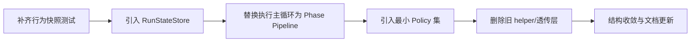

# Agent 层重构 Trade-Off 评估

## 1) 总体判断

重构方向是可行的，但它不是“免费收益”：
- 可维护性、可读性、扩展性会上升；
- 短期迁移成本、回归验证成本会上升；
- 对团队的一致编码纪律提出更高要求。

---

## 2) 关键 Trade-Off 清单

| 设计选择 | 收益 | 代价/风险 | 决策建议 |
| --- | --- | --- | --- |
| Phase Pipeline 替代现有 executor helper 链 | 主流程更清晰、单测粒度更细、debug 更快 | 需要重排调用顺序，容易引入行为细小偏差 | **做**，但必须先补快照测试 |
| `RunState -> RunStateStore(聚合子状态)` | 状态职责清晰，变更点集中 | 一次性迁移字段映射成本较高 | **做**，分两批迁移（只迁移，再优化） |
| Policy 注入 termination/compaction/tool-scheduling | 扩展点稳定，新增策略无需改主循环 | 过度抽象风险，类数量可能反弹 | **做最小集合**，仅保留真实变化点 |
| `RunRecorder.apply(event)` 事件化 | 生命周期副作用统一入口，降低遗漏 | 事件定义设计不当会造成理解成本 | **做**，但事件枚举控制在小集合 |
| 合并薄模块减少文件数 | 阅读路径更短、维护成本下降 | merge 不当会形成新 God object | **做**，按“执行语义”聚合，而非随意拼接 |
| 全量一次性重写 | 快速获得最终结构 | 高回归风险，难定位问题 | **不做**，采用渐进式迁移 |

---

## 3) 不可回避的风险与缓解方案

### 风险 A：行为漂移（尤其是 termination 和 tool 调度）

- **表现**：相同输入下 step 序列、终止原因或 stream item 顺序变化。
- **缓解**：
  1. 构建 golden snapshot（run output + stream event timeline + step list）。
  2. root / child / scheduler-child 三类执行都覆盖。
  3. 对比不仅看结果，还看事件顺序。

### 风险 B：过度抽象导致“代码更少但更难懂”

- **表现**：读者要先理解太多 protocol/policy 才能追踪流程。
- **缓解**：
  1. 仅在已有第二个 use case 时再抽象 policy。
  2. 默认实现与旧逻辑保持 1:1 对应命名。
  3. phase 数量控制在 5 个以内。

### 风险 C：迁移窗口内双实现并存

- **表现**：旧 executor 与新 engine 共存导致认知分裂。
- **缓解**：
  1. 明确时间盒，每个 phase 迁移后立即删除旧路径。
  2. 增加临时 feature flag 但不长期保留。

---

## 4) 关于“更少代码”的现实边界

以下代码**不应为了减少 LOC 而压缩**：
- runtime 类型定义（对外契约）
- storage adapter 边界（SQLite/Mongo）
- trace/stream 生命周期完整性检查

更适合删减的是：
- 参数透传 helper
- 重复的 builder + clone 逻辑
- 同构错误处理模板
- 分散在多处的 fanout 调用

---

## 5) 推荐落地策略

**结论**：这次重构的价值不在“酷炫架构”，而在于让 Agent 层成为“可预测系统”。只要坚持“行为先冻结、结构后迁移”，就能在不牺牲稳定性的前提下，把复杂度降下来。
