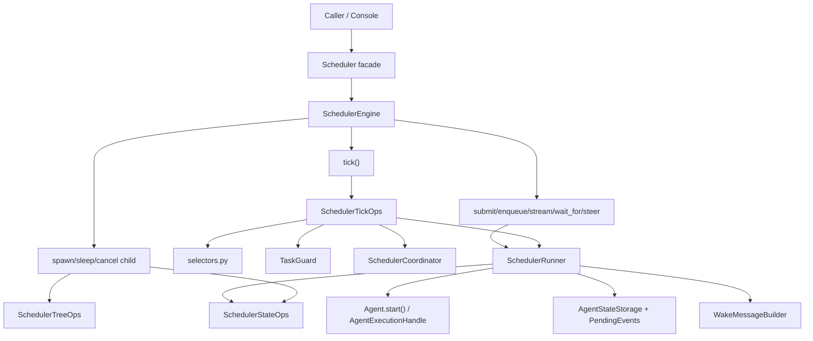

# Scheduler 层现状 Review

> 这份 review 基于以下代码：
> `agiwo/scheduler/**`
> `tests/scheduler/**`
> `console/server/channels/agent_executor.py`

## 1. 当前实现做对了什么

先说结论：当前 scheduler 不是“推倒重来型烂代码”，它已经有几个非常关键、而且必须保留的正确方向。

### 1.1 语义层级已经基本正确

- `Scheduler` 只做 facade 和 loop lifecycle。
- `SchedulerEngine` 负责公开编排语义。
- `SchedulerRunner` 负责单次 agent cycle 执行。
- `SchedulerCoordinator` 只保存进程内 live state。
- `store/` 只负责持久化。

这比把所有逻辑堆在一个类里好很多。

### 1.2 状态机语义已经明显优于旧式 “SLEEPING 一把梭”

`WAITING / IDLE / QUEUED` 的拆分是 scheduler 可读性的关键基础：

- `WAITING`
  - 真正在等 timer / waitset / pending events。
- `IDLE`
  - persistent root 本轮结束，正在待命。
- `QUEUED`
  - persistent root 已收到下一条输入，但还没开始下一轮。

这三个状态必须保留。

### 1.3 scheduler tools 边界是对的

`SchedulerControl` 这个方向是对的：tool 不直接碰 store / coordinator / runner。

即使未来整层重写，我也会继续保留一个窄的 tool-facing control port。

### 1.4 `AgentStreamItem` 复用是对的

scheduler 没有再造第二套 live-output protocol，而是直接复用 agent typed stream item。

这降低了 Console 和 channel 侧的适配成本，也避免了“同一语义两套协议”的长期债务。

## 2. 当前实现最重要的 review findings

如果按 code review 视角看，我认为下面几个问题优先级最高。

## 2.1 [P1] `QUEUED` 状态下的 `steer()` 提示会丢

相关代码：

- `agiwo/scheduler/engine.py:309`
- `agiwo/scheduler/tick_ops.py:83`
- `console/server/channels/agent_executor.py:74`

当前行为链是：

1. Console 看到 root 处于 `RUNNING / WAITING / QUEUED` 时，会统一走 `steer()`
2. `steer()` 对 `RUNNING` 直接调用 live handle；对其他状态会写一条 `PendingEvent(USER_HINT)`
3. `process_pending_events()` 只会唤醒 `WAITING` agent
4. 如果目标 state 不是 `WAITING`，这些事件会被直接删掉

这意味着：

- 当 persistent root 已经 `QUEUED`，但 tick 还没把它拉起来时；
- 新来的 steer/hint 会被存成 event；
- 随后被 tick 当成“非 WAITING agent 的垃圾事件”删掉；
- 最终这条用户输入不会进入下一轮执行。

这不是“语义有争议”，而是实际消息丢失风险。

## 2.2 [P1] `shutdown()` 对 `RUNNING` root 可能是 no-op

相关代码：

- `agiwo/scheduler/engine.py:350`
- `agiwo/scheduler/tree_ops.py:42`

`engine.shutdown()` 只要 state 是 active 就返回 `True`。

但 `tree_ops.shutdown_subtree()` 只真正处理了这些情况：

- root 且 `WAITING / IDLE` -> `QUEUED` 一个 shutdown summary task
- child 且 `WAITING` -> `FAILED`
- `PENDING` -> `FAILED`

它没有对 `RUNNING` root 做任何动作。

结果是：

- 调用方得到一个“shutdown 成功”的返回值；
- 但正在运行的 root 实际没有收到任何 shutdown 请求。

这是 API 语义与真实执行语义不一致。

## 2.3 [P1] `spawn_child()` 没有防 child id 冲突

相关代码：

- `agiwo/scheduler/engine.py:382`
- `agiwo/scheduler/store/memory.py:18`
- `agiwo/scheduler/store/sqlite.py:181`
- `agiwo/scheduler/store/mongo.py:128`

`spawn_child()` 会构造一个 `child_id`，然后直接 `save_state()`。

当前没有任何步骤检查：

- 这个 id 是否已经存在；
- 是否对应 active child；
- 是否意外撞上已有 root state。

而 store 实现是 upsert / replace 语义。

所以一旦自定义 `child_id` 冲突，当前实现可能直接覆盖已有 state。

## 2.4 [P2] state mutation model 依赖“可变对象 + 后端偶然行为”

相关代码：

- `agiwo/scheduler/store/memory.py:21`
- `agiwo/scheduler/runner.py:400`
- `agiwo/scheduler/state_ops.py:17`

当前设计默认 `AgentState` 是可变对象，很多逻辑是：

1. 先拿到 state
2. 直接改字段
3. 再保存

但不同 store 的读取语义并不一致：

- memory store 直接返回原对象引用；
- SQLite/Mongo 返回反序列化后的新对象。

这会带来两个问题：

1. “不 save 也可能生效”的偶发路径只在 memory store 上成立。
2. 业务代码中出现大量 “refresh 一次再改” 的 defensive dance。

这也是 `runner.py` 中多次 `get_state()` / `refreshed_for_idle` / `refreshed_for_wait` 的根源。

## 2.5 [P2] 存在多个未声明的单消费者假设

相关代码：

- `agiwo/scheduler/engine.py:254`
- `agiwo/scheduler/coordinator.py:65`
- `agiwo/scheduler/coordinator.py:97`

当前实现里有两个隐藏假设：

1. 每个 `state_id` 只有一个 `wait_for()` waiter
2. 每个 root 只有一个 `stream()` consumer

但代码没有显式声明这个约束，而是通过实现细节“默默成立”：

- `wait_for()` 使用一个 `asyncio.Event`，结束时会 `pop_state_event()`
- `stream()` 调 `open_stream_channel()` 时会直接覆盖旧 channel

如果后续有并发 waiter 或多个 stream consumer，行为会很难预测。

## 3. 当前复杂度热点

这些问题不一定是 bug，但它们直接决定了为什么现在这层代码读起来累。

| 热点 | 现状 | 为什么会累 |
| --- | --- | --- |
| `engine.py` | 566 LOC | 同时承担 public API、tool control、sleep builder、child inspection |
| `runner.py` | 583 LOC | 同时承担 dispatch mode、state prep、output translation、cleanup、event emit |
| `tick_ops.py` | 184 LOC | 每个 phase 都直接查 store + 直接 dispatch，选择和副作用缠在一起 |
| `state_ops.py` + 直接字段修改 | 混用 | 语义 owner 不单一，读代码要来回确认“谁才是真正改状态的人” |
| `coordinator.py` | 160 LOC | agent/handle/abort/waiter/stream/dispatch reservation 全放一起 |

## 4. 当前结构的根本问题

一句话总结：

> 当前 scheduler 不是职责没有拆开，而是“同一个语义被拆到了太多 owner 里”。

最典型的有三组 split-brain：

### 4.1 调度决策 split-brain

- `engine.tick()`
- `tick_ops.py`
- `selectors.py`
- `guard.py`

读者需要在多个文件里拼出“谁会被 dispatch，为什么会被 dispatch”。

### 4.2 状态迁移 split-brain

- `state_ops.py`
- `runner.py`
- `tree_ops.py`
- `engine.py`

虽然 `state_ops.py` 存在，但“状态迁移规则”并没有真正集中。

### 4.3 输入通道 split-brain

- `pending_input`
- `PendingEvent`
- live `handle.steer()`

这三条输入通路都合理，但当前代码没有把它们明确定义成三个独立 channel，所以边界条件会变得含糊。

## 5. 当前实现的真实运行模型

我会把当前实现概括成下面这张图：

它的问题不是“没有分层”，而是：

- 纵向链太长；
- 横向 owner 太多；
- 很多边界条件要靠读者自己拼起来。

## 6. 如果重写，哪些语义必须保留

这些是我认为真正的兼容基线：

1. `Scheduler` facade 的公开 API 不改。
2. `WAITING / IDLE / QUEUED` 仍然保留。
3. root 仍然可以 `persistent=True`，并继续用 `enqueue_input()` 进入下一轮。
4. child 仍通过 scheduler tool surface 管理，不让 tool 直接碰 scheduler internals。
5. scheduler 仍直接输出 `AgentStreamItem`。
6. scheduler 仍是单进程 owner，而不是一上来做分布式 lease。
7. waitset / timer / periodic / pending-events 这几类唤醒语义仍然成立。

## 7. 我会主动修掉，而不是兼容继承的问题

如果真的重写整层，我不会为了“功能不变”去保留以下问题：

1. `QUEUED` 状态 steer 丢消息。
2. `shutdown()` 对 `RUNNING` root 的 no-op。
3. `custom_child_id` 覆盖已有 state。
4. store 后端之间的 mutable alias 差异。
5. 多 waiter / 多 stream consumer 的隐含行为。
