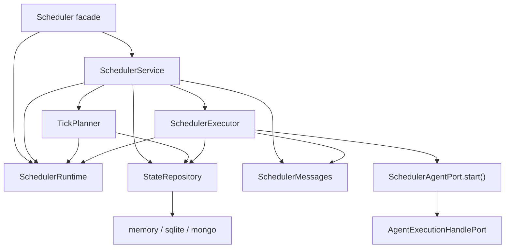
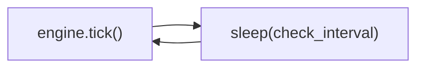
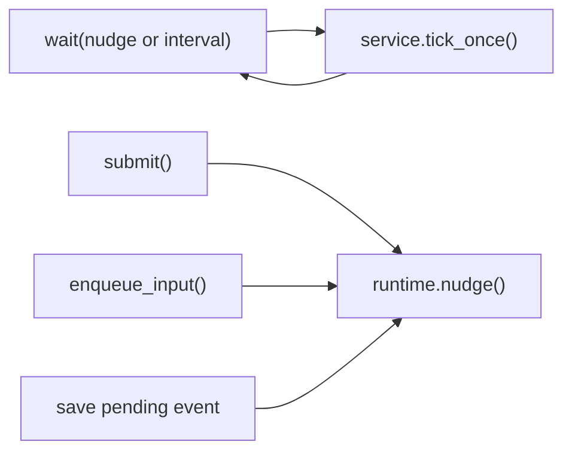
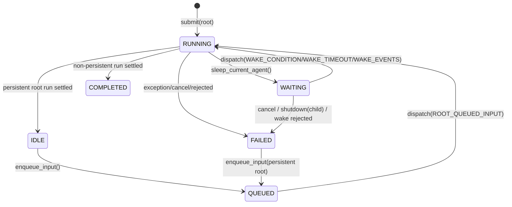

# Scheduler 层重写方案

> 目标：保持功能与主要运行语义不变，但让代码更短、owner 更少、边界更硬。

## 1. 设计原则

我会用下面五条原则约束整个重写：

1. 一个语义只能有一个 owner。
2. 选择逻辑必须尽量 pure，执行逻辑必须尽量集中。
3. persisted state 只走 copy-on-write，不再依赖可变对象别名。
4. 所有 dispatch 都走一条统一入口，不再出现多个“差不多但不完全一样”的 fast path。
5. 单进程模型保持不变，但要把单进程假设写进代码结构，而不是藏在实现细节里。

## 2. 我会把顶层结构收敛成什么样

我不会继续保留现在这些 top-level 协作文件：

- `engine.py`
- `runner.py`
- `tick_ops.py`
- `tree_ops.py`
- `state_ops.py`
- `selectors.py`
- `wake_messages.py`
- `formatting.py`

而是把 top-level 收敛成下面这组更强的 owner：

```text
agiwo/scheduler/
├── __init__.py
├── scheduler.py        # facade + loop lifecycle
├── service.py          # public API + tool control 的唯一语义 owner
├── runtime.py          # 进程内 live state owner
├── planning.py         # pure tick planner
├── executor.py         # 单次 scheduler-managed cycle 执行
├── messages.py         # wake/timeout/event message builder
├── models.py           # domain model + state transition helpers
├── tools.py            # runtime tools
└── store/
    ├── __init__.py
    ├── base.py
    ├── codec.py
    ├── memory.py
    ├── sqlite.py
    └── mongo.py
```

这版布局的核心不是“文件更少”本身，而是：

- 读者能迅速知道语义应该去哪找；
- 不再出现“状态迁移在 A，补字段在 B，dispatch 判断在 C”的来回跳。

## 3. 目标架构图



### 这张图最重要的变化

1. `service.py` 成为唯一语义 owner。
2. `planning.py` 只“决定做什么”，不“直接做”。
3. `executor.py` 只“执行一个 dispatch action”，不参与 tick 选择。
4. `runtime.py` 只保存进程内 live state，不碰持久化。

## 4. 统一 dispatch 模型

当前 `runner.py` 里最大的复杂度来源之一，是 `AgentRunMode + AgentRunSpec` 这套布尔矩阵。

我会把它换成一个显式的 dispatch action。

```python
from dataclasses import dataclass
from enum import Enum

class DispatchReason(str, Enum):
    ROOT_SUBMIT = "root_submit"
    ROOT_QUEUED_INPUT = "root_queued_input"
    CHILD_PENDING = "child_pending"
    WAKE_CONDITION = "wake_condition"
    WAKE_TIMEOUT = "wake_timeout"
    WAKE_EVENTS = "wake_events"
    SHUTDOWN_SUMMARY = "shutdown_summary"


@dataclass(frozen=True)
class DispatchAction:
    state_id: str
    reason: DispatchReason
    input_override: object | None = None
    event_ids: tuple[str, ...] = ()
    increment_wake_count: bool = False
    clear_wake_condition: bool = False
```

这个改变带来的收益是：

- 调度原因变成第一等语义；
- planner 和 executor 之间的交接变得可测试；
- 不需要再把行为编码进一组 flag 组合。

## 5. State transition 不再依赖 `state_ops.py`

我会把迁移规则尽量移回 `models.py`，让 `AgentState` 自己知道如何产生下一份 state snapshot。

```python
from dataclasses import dataclass, replace
from datetime import datetime, timezone

@dataclass(frozen=True, slots=True)
class AgentState:
    ...

    def with_running(
        self,
        *,
        task,
        pending_input=None,
        wake_condition=None,
        wake_count: int | None = None,
        result_summary=None,
        explain=None,
    ) -> "AgentState":
        return replace(
            self,
            status=AgentStateStatus.RUNNING,
            task=task,
            pending_input=pending_input,
            wake_condition=wake_condition,
            wake_count=self.wake_count if wake_count is None else wake_count,
            result_summary=result_summary,
            explain=explain,
            updated_at=datetime.now(timezone.utc),
        )
```

同理还会有：

- `with_waiting(...)`
- `with_idle(...)`
- `with_queued(...)`
- `with_completed(...)`
- `with_failed(...)`

这样可以直接删除：

- `state_ops.py`
- `_apply_fields(...)`
- 一批 “refresh -> mutate -> save” 的胶水代码

## 6. `runtime.py` 只做进程内 live owner

我会把当前 `SchedulerCoordinator` 明确重命名成更语义化的 `SchedulerRuntime`，并收口成这些职责：

- 已注册 agent
- active execution handle
- abort signal
- dispatch reservation
- active asyncio task
- waiters
- stream subscribers
- 一个 `nudge_event`

其中最重要的新点是 `nudge_event`。

### 为什么要加 `nudge_event`

当前 loop 是纯轮询：



我会改成：



这样做的好处是：

- 保持 periodic sweep 作为兜底；
- 同时消除“为什么这次 submit 没立刻动”的延迟感；
- 还能把当前 scattered fast path 统一掉。

## 7. `planning.py` 变成 pure tick planner

当前 `tick_ops.py` 的问题不是 phase 多，而是 phase 同时做了三件事：

1. 查 store
2. 判断 eligibility
3. 直接 dispatch

我会把第 2 件事纯化成 planner：

```python
class TickPlanner:
    def plan(
        self,
        *,
        states: list[AgentState],
        events: list[PendingEvent],
        now: datetime,
    ) -> list[DispatchAction]:
        ...
```

它会把当前这几组逻辑统一产出成 action：

- terminal child signal propagation
- timed-out waiting states
- debounced pending-events wake
- pending child starts
- queued root starts
- ready waiting wakes

然后所有 action 都交给统一 dispatch 入口。

### 这样以后怎么测

测试直接分成两层：

1. planner 单测
   - 输入 states/events snapshot
   - 输出 action list
2. executor 单测
   - 输入 action
   - 断言最终 state / event / stream / cleanup

比现在的“很多事只能靠 integration test 才看清”更稳。

## 8. `executor.py` 只负责执行一个 action

我会把当前 `runner.py` 重写成下面这种形状：

```python
class SchedulerExecutor:
    async def execute(self, action: DispatchAction) -> None:
        state = await self._repo.get_required_state(action.state_id)
        agent = await self._resolve_agent(state, action)
        state = await self._prepare_for_dispatch(state, action)

        try:
            output = await self._run_cycle(
                state=state,
                agent=agent,
                user_input=self._resolve_input(state, action),
            )
            await self._apply_output(state, action, output)
        except Exception as exc:
            await self._apply_failure(state, action, exc)
        finally:
            await self._cleanup(state)
```

这会把当前 `runner.py` 里最绕的部分收束成四个稳定阶段：

1. resolve
2. prepare
3. run
4. translate outcome

## 9. 我会怎么处理三条输入通道

当前 scheduler 实际有三条输入通道：

1. root 下一轮输入
   - `pending_input`
2. live steering
   - `handle.steer(...)`
3. async notification / hint
   - `PendingEvent`

我不会把它们粗暴合并成一个抽象大队列，因为那会让兼容成本和理解成本都上升。

但我会把它们明确定义成三条独立 channel：

| Channel | 作用 | 允许的消费时机 |
| --- | --- | --- |
| next-input slot | persistent root 下一轮开始输入 | `IDLE/FAILED -> QUEUED -> RUNNING` |
| live steer | 当前正在运行的一轮 | `RUNNING` |
| mailbox events | wait/child/user-hint 等异步通知 | `WAITING`，以及被 planner 明确支持的其他状态 |

重点不是“合并数据结构”，而是把语义讲清楚，避免再次出现 `QUEUED` steer 丢消息这种边界问题。

## 10. 重构后的状态机

我会保持当前状态枚举不变，但把“谁能触发哪条边”写得更明确。



## 11. 代码会减少在哪里

如果按“不是只拆文件，而是真的删样板代码”去做，我预计代码会减少在这些地方：

1. 删除 `state_ops.py`
2. 删除 `selectors.py`
3. 删除 `tree_ops.py` 独立文件，树操作回到 `service.py`
4. 删除 `wake_messages.py + formatting.py` 分离
5. 删除 `AgentRunMode + AgentRunSpec`
6. 删除大量 `refreshed = await store.get_state(...)` 重复模板
7. 让 `wait_for` / `stream` 的 runtime registry 语义更明确，减少 defensive glue

## 12. 哪些东西我不会动

为了让这次重构保持克制，我不会做这些事：

1. 不把 scheduler 改造成 actor framework。
2. 不引入通用 workflow DSL。
3. 不直接升级为多进程 lease / distributed scheduler。
4. 不把 tool layer 重写成声明式 codegen。
5. 不为了“少文件”把所有东西重新塞回一个 God object。
