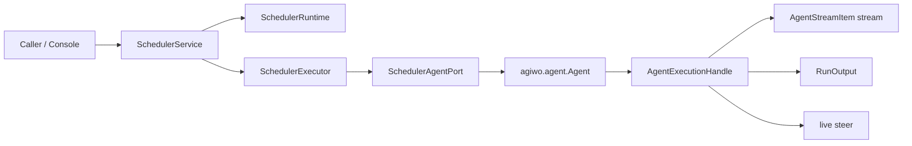

# 重构后的 Scheduler / Agent 边界

> 用户请求里提到了“描述重构后的 `agiwo/agent` 层”。
> 我的判断是：这次真正需要重写的是 `agiwo/scheduler`，但要把它写干净，必须同时把 scheduler 与 agent 的边界重新定义清楚。

## 1. 这次不会重写 `agiwo/agent` 的什么

如果目标是保持功能不变，我不会让 scheduler 重构反向污染 agent 的公开 API。

这些能力我会保持不变：

- `Agent.start(...) -> AgentExecutionHandle`
- `AgentExecutionHandle.stream()/wait()/steer()/cancel()`
- `Agent.create_scheduler_child_agent(...)`
- `Agent.install_runtime_tools(...)`
- `Agent.set_termination_summary_enabled(...)`

换句话说：

> scheduler 的重构应该是 “依赖 agent 的稳定 port”，而不是 “要求 agent 为 scheduler 让路”。

## 2. 我希望 `agiwo/agent` 暴露给 scheduler 的真实最小面

当前 `SchedulerAgentPort` 已经接近这个目标，但还可以再更明确。

我想要 scheduler 真正看到的是下面这组能力：

```python
from typing import Protocol

class SchedulerExecutionPort(Protocol):
    def stream(self): ...
    async def wait(self): ...
    async def steer(self, message: str) -> bool: ...
    def cancel(self, reason: str | None = None) -> None: ...


class SchedulerAgentPort(Protocol):
    id: str

    @property
    def tools(self) -> tuple[object, ...]: ...

    def prepare_for_scheduler(self, *, runtime_tools: list[object]) -> None: ...

    def start(
        self,
        user_input,
        *,
        session_id: str | None = None,
        abort_signal=None,
    ) -> SchedulerExecutionPort: ...

    async def create_scheduler_child(
        self,
        *,
        child_id: str,
        instruction: str | None = None,
        system_prompt: str | None = None,
        exclude_tool_names: set[str] | None = None,
    ) -> "SchedulerAgentPort": ...

    async def close(self) -> None: ...
```

### 我为什么想加 `prepare_for_scheduler(...)`

当前 scheduler 需要在两个地方“预处理” agent：

- `install_runtime_tools(...)`
- `set_termination_summary_enabled(True)`

这两个动作对 scheduler 来说其实是一个原子意图：

> “把这个 agent 变成 scheduler-managed agent”

把它合成一个 adapter action，会让 scheduler 代码少很多“先做 A 再做 B”的样板逻辑。

注意：

- 这不要求 `Agent` 公开 API 改名；
- 完全可以通过 adapter 内部调用现有方法实现；
- 目的是让 scheduler 看到更窄的 port。

## 3. 我希望 agent 和 scheduler 的职责边界更硬

### agent 应该继续负责

- 单次 run 的实际执行
- session/runtime/trace/recorder/tool runtime
- child agent definition 派生
- live execution handle 的行为

### scheduler 应该继续负责

- run 何时开始
- run 何时暂停等待
- run 何时再次恢复
- root persistent lifecycle
- child tree orchestration
- waitset / timer / periodic / mailbox 类唤醒逻辑

### scheduler 不应该重新拿走 agent 的职责

比如这些事仍应归 agent：

- run 内部 messages 怎么组织
- termination summary 怎么生成
- tool execution 顺序怎么落到一次 agent cycle 里
- step / trace / stream item 的产生顺序

## 4. 重构后两层的关系图



这张图里最关键的点是：

- scheduler 永远只通过 port 看 agent；
- agent 永远不知道 scheduler 内部如何 tick；
- 两边只在 child derivation、runtime tools、start/handle 这几个点上耦合。

## 5. 我会怎样让 child 派生更容易读

当前 child 派生路径本身没有原则性问题，但 scheduler 侧要额外知道：

- parent 在 coordinator 里是否已注册
- override 需要从 store codec 反序列化
- child 还要额外去掉 `spawn_agent`

我会把这个过程收束成一个单独的 adapter helper：

```python
@dataclass(frozen=True)
class ChildBlueprint:
    child_id: str
    instruction: str | None = None
    system_prompt: str | None = None
    exclude_tool_names: frozenset[str] = frozenset({"spawn_agent"})


async def materialize_child(
    parent: SchedulerAgentPort,
    blueprint: ChildBlueprint,
) -> SchedulerAgentPort:
    ...
```

这样 scheduler executor 不需要关心：

- override 来自哪里；
- 默认要禁哪些 tool；
- child 构建时有哪些 parent-derived defaults。

## 6. 如果同时小幅优化 `agiwo/agent`，我只会做这三件事

### 6.1 让 scheduler adapter 成为显式一等对象

保留 `adapt_scheduler_agent(...)`，但让 adapter 更主动地承载“scheduler integration 语义”，而不只是被动透传。

### 6.2 把 “prepare for scheduler” 收敛成一个意图

不再让 scheduler 在多处手写：

- 安装 runtime tools
- 开启 termination summary
- 注册 live object

### 6.3 保持 scheduler 对 `agiwo.agent.lifecycle` 和 `agiwo.agent.engine` 零感知

这是边界里最重要的一条：

> scheduler 可以知道 “agent 能做什么”，但不能知道 “agent 内部是怎么做的”。

## 7. 这对代码量有什么帮助

这个边界设计的价值不只是“更优雅”，也能直接减少 scheduler 代码量：

1. 减少 `prepare_agent(...)` 一类胶水逻辑。
2. 减少 child creation 时的 override / cleanup 样板。
3. 让 executor 不需要关心 agent 内部的拼装细节。
4. 让 Console / scheduler / agent 三层之间的依赖方向更稳定。

## 8. 我不会做的激进变化

为了保持兼容，我不会：

1. 让 scheduler 直接构造 `AgentExecutionHandle`。
2. 让 scheduler 直接碰 `agiwo.agent.lifecycle.*`。
3. 把 child derivation 全部搬到 scheduler 侧自己做。
4. 为了省几行代码，把 `Agent` 和 `SchedulerAgentPort` 混成一个对象。
