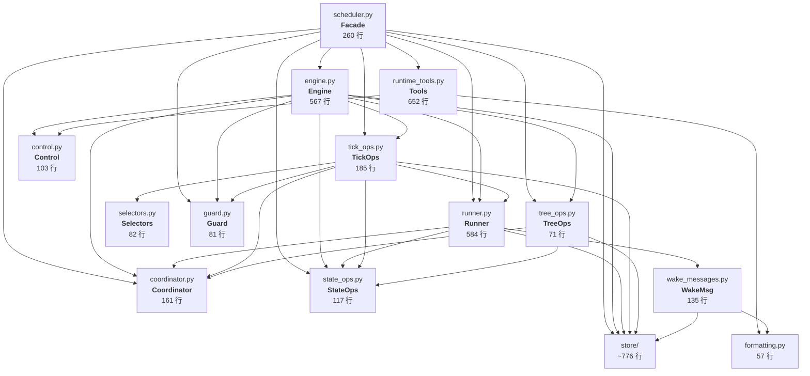

# Scheduler 层现状深度分析

> 本文档基于 `agiwo/scheduler/` 当前源码，逐模块剖析架构现状、度量数据和具体痛点。

## 1. 文件清单与规模

| 文件 | 行数 | 职责 |
|------|------|------|
| `models.py` | 281 | 数据模型、枚举、WakeCondition |
| `scheduler.py` | 260 | Facade + tick loop + 依赖装配 |
| `engine.py` | 567 | 公开编排 API + SchedulerControl 实现 |
| `runner.py` | 584 | 单次 agent 执行周期 |
| `coordinator.py` | 161 | 进程内运行时状态 |
| `control.py` | 103 | Tool-facing protocol + 请求/结果 DTO |
| `guard.py` | 81 | Spawn/wake 限制检查 |
| `state_ops.py` | 117 | 状态迁移持久化 |
| `tick_ops.py` | 185 | Tick 阶段编排 |
| `tree_ops.py` | 71 | 递归 cancel/shutdown |
| `selectors.py` | 82 | 纯选择器函数 |
| `wake_messages.py` | 135 | 唤醒消息构造 |
| `formatting.py` | 57 | 文本格式化工具 |
| `serialization.py` | 68 | 传输序列化 |
| `runtime_tools.py` | 652 | 5 个 scheduler 运行时工具 |
| `__init__.py` | 30 | 包导出 |
| **store/** | ~776 | base + codec + memory + sqlite + mongo |
| **合计** | **~4,210** | |

去掉 store/（独立持久化层，变动较小），核心编排代码约 **3,434 行，分散在 16 个文件中**。

## 2. 当前架构总览



## 3. 核心痛点

### 3.1 过度碎片化：7 个 "ops" 模块形成依赖网

当前 scheduler 核心被拆成了 7 个小模块：`engine`, `state_ops`, `tick_ops`, `tree_ops`, `selectors`, `coordinator`, `runner`。

问题不在于模块数量本身，而在于**它们的依赖关系是网状而非层次化的**：

```
engine ──→ runner ──→ coordinator
  │  ↘        ↗          ↑
  │   state_ops ←── tick_ops
  │        ↑           ↑
  │     tree_ops     selectors
  └──→ store ←── (几乎所有模块)
```

7 个模块中有 5 个直接依赖 `store`，4 个直接依赖 `coordinator`，4 个直接依赖 `state_ops`。这意味着**碎片化并没有带来真正的解耦**——它们共享相同的数据管道，只是把逻辑散到了不同文件里。

### 3.2 Facade 构造函数变成了手工 DI 容器

`scheduler.py` 的 `__init__` 需要手工装配 7 个内部对象：

```python
# scheduler.py __init__ 中的装配代码（简化）
self._store = create_agent_state_storage(...)
self._guard = TaskGuard(limits, self._store)
self._coordinator = SchedulerCoordinator()
self._state_ops = SchedulerStateOps(store=self._store, coordinator=self._coordinator)
self._tree_ops = SchedulerTreeOps(store=self._store, coordinator=self._coordinator, state_ops=self._state_ops)
self._runner = SchedulerRunner(store=self._store, coordinator=self._coordinator, semaphore=..., state_ops=self._state_ops)
self._tick_ops = SchedulerTickOps(config=..., store=self._store, guard=self._guard, coordinator=self._coordinator, runner=self._runner, state_ops=self._state_ops)
self._engine = SchedulerEngine(store=self._store, coordinator=self._coordinator, runner=self._runner, state_ops=self._state_ops, tree_ops=self._tree_ops, tick_ops=self._tick_ops)
```

这段装配代码的问题：
- **参数传递重复**：`store` 被传了 7 次，`coordinator` 被传了 5 次
- **装配顺序敏感**：必须先创建 state_ops 才能创建 tree_ops、runner、tick_ops
- **Engine 的构造函数同时支持外部注入和内部默认创建**，使得 API 既不纯粹是 facade 也不纯粹是 builder

### 3.3 `SchedulerEngine` 是伪装的 God Object

Engine 同时承担了 4 个职责：

| # | 职责 | 方法示例 |
|---|------|---------|
| 1 | 公开编排 API | `submit()`, `enqueue_input()`, `stream()`, `wait_for()` |
| 2 | Tool-facing 控制接口 | `spawn_child()`, `sleep_current_agent()`, `cancel_child()` |
| 3 | Tick 编排入口 | `tick()` → 委托 tick_ops |
| 4 | Sleep condition 构建 | `_build_sleep_condition()`, `_resolve_waitset_targets()` |

它是 `SchedulerControl` protocol 的唯一实现，同时也是 public API 的唯一 owner。两套完全不同的调用方（外部用户 vs agent tools）共享同一个 567 行的类。

### 3.4 `SchedulerCoordinator` 是类型化的字典集合

整个 coordinator 类就是 7 个 `dict` 加上 getter/setter/pop 三件套：

```python
class SchedulerCoordinator:
    self._active_tasks: set[asyncio.Task]
    self._agents: dict[str, SchedulerAgentPort]
    self._execution_handles: dict[str, AgentExecutionHandlePort]
    self._abort_signals: dict[str, AbortSignal]
    self._state_events: dict[str, asyncio.Event]
    self._dispatched_state_ids: set[str]
    self._stream_channels: dict[str, StreamChannelState]
```

161 行中，真正有语义的方法只有 3 个：
- `dispatch_state_task()` — 去重 + 创建 task
- `consume_stream_channel()` — 带超时的 async 队列消费
- `notify_state_change()` — 唤醒等待者

其余全是 `get/set/pop` 访问器。这不是抽象，是命名空间。

### 3.5 `runtime_tools.py` 的样板代码膨胀

652 行中，基类 `SchedulerRuntimeTool` 占 131 行，其中 90+ 行是 `_success()`, `_failed()`, `_denied()` 三个结果构造器。每个工具类都重复相同的模式：

```python
async def execute_for_agent(self, parameters, context, abort_signal):
    start_time = time.time()
    # 1. 从 parameters 提取字段
    # 2. 调用 self._port.xxx()
    # 3. 返回 self._success(...) 或 self._failed(...)
```

5 个工具共 521 行执行逻辑，但真正的业务差异只在 step 2（每个 10-30 行）。

### 3.6 `runner.py` 中冗余的状态刷新

`_handle_agent_output` 在不同分支中反复调用 `await self._store.get_state(state.id)`：

```python
async def _handle_agent_output(self, state, output):
    # 分支 1: periodic wake
    refreshed = await self._store.get_state(state.id)  # 第 1 次
    ...
    refreshed_for_wait = await self._store.get_state(state.id)  # 第 2 次
    ...
    # 分支 2: persistent idle
    refreshed_for_idle = await self._store.get_state(state.id)  # 第 3 次
    ...
    # 分支 3: completed
    refreshed_for_complete = await self._store.get_state(state.id)  # 第 4 次
```

实际上只需要在方法入口刷新一次。

### 3.7 `control.py` 的单实现 Protocol

`SchedulerControl` 是一个 Protocol，但它只有 `SchedulerEngine` 一个实现。7 个方法、103 行代码，纯粹为了"tools 不直接依赖 engine"这个约束存在。

在当前代码库中，tools 通过构造函数注入 `port: SchedulerControl`，而实际传入的永远是 `SchedulerEngine` 实例。这个 protocol 增加了间接层但没有带来可替换性。

## 4. 依赖耦合度量

用一个简单指标衡量：**每个模块直接 import 了多少个 scheduler 内部模块**。

| 模块 | 内部依赖数 | 依赖列表 |
|------|-----------|---------|
| `scheduler.py` | 10 | coordinator, engine, guard, models, runtime_tools, runner, state_ops, store, tick_ops, tree_ops |
| `engine.py` | 9 | control, coordinator, guard, models, runner, state_ops, store, tick_ops, tree_ops |
| `tick_ops.py` | 6 | coordinator, guard, models, runner, selectors, state_ops, store |
| `runner.py` | 5 | coordinator, models, state_ops, store, wake_messages |
| `tree_ops.py` | 4 | coordinator, models, state_ops, store |
| `runtime_tools.py` | 3 | control, formatting, models |
| `wake_messages.py` | 3 | formatting, models, store |
| `state_ops.py` | 3 | coordinator, models, store |

前 3 个模块的内部依赖数都 ≥ 6，说明**模块之间的接缝不是真正的解耦边界**。

## 5. 对比思考：什么是好的拆分

好的模块拆分应该满足：
- **高内聚**：模块内的代码变更原因高度相关
- **低耦合**：模块间通过窄接口通信，不共享大量内部状态
- **真实边界**：如果删掉一个模块，其他模块不需要大量改动

当前拆分在第 2、3 点上不达标。`state_ops`, `tick_ops`, `tree_ops`, `selectors` 这四个模块共享 `store + coordinator` 数据管道，它们之间的边界是人为的代码组织，而不是架构约束。

真正的架构边界应该是：

```
┌─────────────────────────────────────────┐
│           Public API (facade)            │ ← 外部调用方
├─────────────────────────────────────────┤
│     State Machine + Scheduling Engine    │ ← 编排核心
├──────────────────┬──────────────────────┤
│  Agent Execution │  Runtime Tools       │ ← 两个独立的"叶子"
├──────────────────┴──────────────────────┤
│           Storage Layer                  │ ← 持久化
└─────────────────────────────────────────┘
```

## 6. 总结

| 维度 | 评价 |
|------|------|
| **状态机设计** | ✅ 优秀：IDLE/QUEUED/WAITING 语义清晰，WakeCondition 简洁实用 |
| **Store 边界** | ✅ 优秀：纯 repo，不承载编排语义 |
| **模块粒度** | ❌ 过度碎片化：7 个紧耦合模块不如合并为 2-3 个内聚模块 |
| **依赖装配** | ❌ 手工 DI 样板过多，参数重复传递 |
| **Engine 职责** | ❌ 同时服务外部 API 和 tool-facing control，违反 SRP |
| **Tools 代码量** | ❌ 652 行中 ~40% 是样板，可大幅压缩 |
| **Runner 内部质量** | ⚠️ 冗余刷新、分支过长，但整体思路正确 |
| **可扩展性** | ⚠️ 添加新 tick phase 或新 tool 不难，但理解整体依赖图成本较高 |
