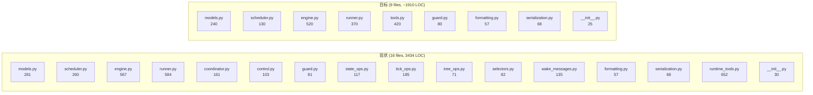
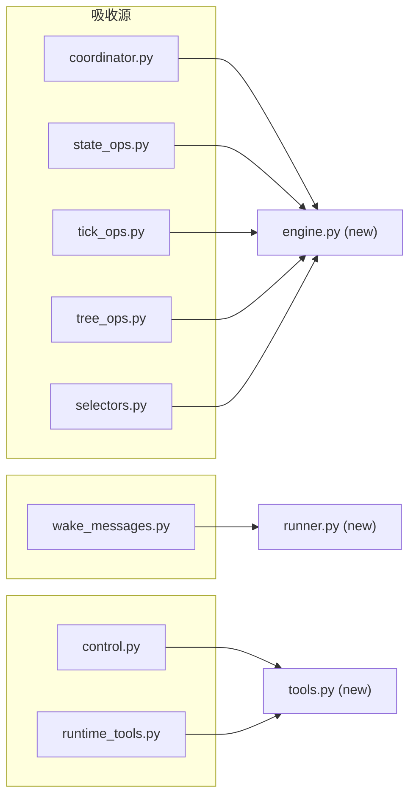
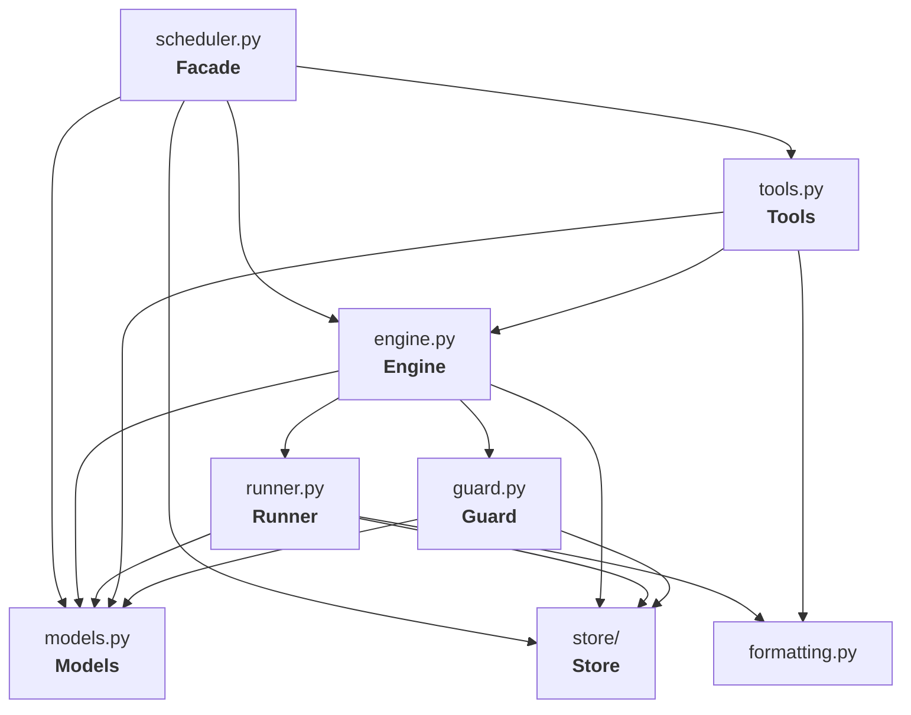
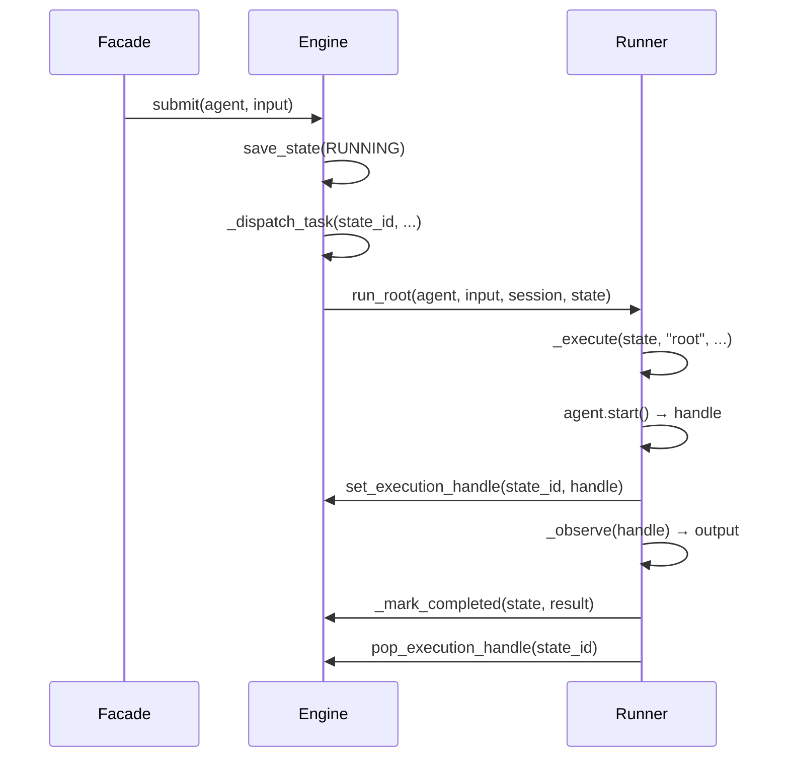

# Scheduler 层重构设计方案

> 基于 01-analysis.md 的诊断，本文档给出保持功能不变前提下的重构目标架构。

## 1. 设计目标

| 优先级 | 目标 | 度量 |
|--------|------|------|
| P0 | **功能完全不变** | 现有 ~30 个测试全部通过，public API 签名不变 |
| P1 | **更少的代码** | 核心编排代码从 ~3,434 行降至 ~2,100 行（-39%） |
| P1 | **更好的可读性** | 模块从 16 个降至 9 个，内部依赖边数从 43 降至 ~18 |
| P2 | **更好的可维护性** | 每个模块的变更原因单一化 |
| P3 | **更好的可扩展性** | 新增 tick phase / 新增 tool / 新增 wake type 的改动范围可预测 |

## 2. 目标文件结构

```
scheduler/
├── __init__.py          #  25 行  │ 公开导出
├── models.py            # 240 行  │ 领域模型（略微精简）
├── scheduler.py         # 130 行  │ Facade: 生命周期 + 公开 API
├── engine.py            # 520 行  │ 状态机 + tick + 调度协调
├── runner.py            # 370 行  │ 单次执行 + 唤醒消息
├── tools.py             # 420 行  │ 5 个运行时工具（含 DTO）
├── guard.py             #  80 行  │ 限制检查（不变）
├── formatting.py        #  57 行  │ 文本格式化（不变）
├── serialization.py     #  68 行  │ 传输序列化（不变）
└── store/               # 776 行  │ 持久化层（不变）
    ├── __init__.py
    ├── base.py
    ├── codec.py
    ├── memory.py
    ├── sqlite.py
    └── mongo.py
```

**预估合计：~2,686 行**（含 store/），核心编排 ~1,910 行

### 与现状对比



## 3. 模块合并映射



### 合并理由

| 被合并模块 | 合入目标 | 理由 |
|-----------|---------|------|
| `coordinator.py` | `engine.py` | 只是 engine 的内部状态容器，无独立抽象价值 |
| `state_ops.py` | `engine.py` | 状态迁移是状态机的核心，不应外置 |
| `tick_ops.py` | `engine.py` | tick 阶段是 engine 主循环的组成部分 |
| `tree_ops.py` | `engine.py` | 树操作只有 cancel/shutdown 两个方法，71 行 |
| `selectors.py` | `engine.py` | 纯函数，作为 engine 的私有 helper |
| `wake_messages.py` | `runner.py` | 唤醒消息只在 runner 执行时构造 |
| `control.py` | `tools.py` | DTO 和 protocol 只被 tools 使用 |

## 4. 新架构依赖图



**关键改进：**
- 边数从 43 降至 18（-58%）
- `store` 只被 3 个模块直接依赖（engine, runner, guard），而非 5 个
- 没有环状或双向依赖
- Tools → Engine 是单向依赖（替代了 Tools → Control ← Engine 的间接路径）

## 5. 各模块详细设计

### 5.1 `engine.py` — 状态机 + 调度核心

这是重构后最大的模块（~520 行），承担当前 6 个模块的职责。

#### 内部结构

```python
class SchedulerEngine:
    """状态机 + tick 调度 + tool-facing control。"""

    # ── 构造 ──────────────────────────────────────────
    def __init__(self, *, store, guard, semaphore, config): ...

    # ── Runtime 内存状态（原 coordinator） ───────────────
    _agents: dict[str, SchedulerAgentPort]
    _execution_handles: dict[str, AgentExecutionHandlePort]
    _abort_signals: dict[str, AbortSignal]
    _state_events: dict[str, asyncio.Event]
    _dispatched: set[str]
    _active_tasks: set[asyncio.Task]
    _stream_channels: dict[str, StreamChannelState]

    # ── Public API（供 Facade 委托） ────────────────────
    async def submit(self, agent, user_input, **kw) -> str: ...
    async def enqueue_input(self, state_id, user_input, **kw) -> None: ...
    async def stream(self, user_input, **kw) -> AsyncIterator: ...
    async def wait_for(self, state_id, timeout) -> RunOutput: ...
    async def cancel(self, state_id, reason) -> bool: ...
    async def steer(self, state_id, user_input, urgent) -> bool: ...
    async def shutdown(self, state_id) -> bool: ...

    # ── Tool-facing control（供 tools 调用） ─────────────
    async def spawn_child(self, request) -> AgentState: ...
    async def sleep_current_agent(self, request) -> SleepResult: ...
    async def get_child_state(self, target_id) -> AgentState | None: ...
    async def list_child_states(self, **kw) -> list[AgentState]: ...
    async def cancel_child(self, request) -> CancelChildResult: ...

    # ── Tick phases（原 tick_ops） ──────────────────────
    async def tick(self) -> None: ...
    async def _propagate_signals(self) -> None: ...
    async def _enforce_timeouts(self) -> None: ...
    async def _process_pending_events(self) -> None: ...
    async def _start_pending(self) -> None: ...
    async def _start_queued_roots(self) -> None: ...
    async def _wake_waiting(self) -> None: ...

    # ── State transitions（原 state_ops） ──────────────
    async def _mark_running(self, state, **kw) -> None: ...
    async def _mark_waiting(self, state, **kw) -> None: ...
    async def _mark_idle(self, state, **kw) -> None: ...
    async def _mark_queued(self, state, **kw) -> None: ...
    async def _mark_completed(self, state, **kw) -> None: ...
    async def _mark_failed(self, state, reason) -> None: ...

    # ── Tree ops（原 tree_ops） ────────────────────────
    async def _cancel_subtree(self, state_id, reason) -> None: ...
    async def _shutdown_subtree(self, state_id) -> None: ...

    # ── Dispatch helpers（原 coordinator 方法） ─────────
    def _dispatch_task(self, state_id, coro_factory) -> bool: ...
    def _track_task(self, task) -> None: ...

    # ── Selectors（原 selectors.py，现为私有方法） ──────
    @staticmethod
    def _select_timed_out(states, now) -> list: ...
    @staticmethod
    def _select_ready_waiting(states, now) -> list: ...
    @staticmethod
    def _select_debounced_targets(events, **kw) -> list: ...
```

#### 关键设计决策

1. **Coordinator 变成实例属性**：7 个 dict 直接成为 engine 的字段，消除 161 行中间层。
2. **State transitions 变成 `_mark_*` 私有方法**：取消独立的 `SchedulerStateOps` 类，但保留清晰的方法命名。
3. **Selectors 变成 `@staticmethod`**：纯函数保持可测试，但不需要独立文件。
4. **不再需要 `SchedulerControl` protocol**：Tools 直接依赖 `SchedulerEngine` 类型。engine 是唯一实现，protocol 带来的间接层没有收益。

### 5.2 `runner.py` — 单次执行周期

从现有 runner 精简，吸收 wake_messages。

```python
class SchedulerRunner:
    """执行一次 agent 运行并翻译结果为 scheduler 状态变更。"""

    def __init__(self, *, engine: SchedulerEngine): ...
    #  注意：runner 持有 engine 引用来调用 _mark_*
    #  而不是像现在那样持有 store + coordinator + state_ops

    # ── 公开执行入口 ──────────────────────────────────
    async def run_root(self, agent, user_input, session_id, state) -> None: ...
    async def run_queued_root(self, state) -> None: ...
    async def run_pending_child(self, state) -> None: ...
    async def wake_agent(self, state) -> None: ...
    async def wake_for_events(self, state, events) -> None: ...
    async def wake_for_timeout(self, state) -> None: ...

    # ── 执行核心 ──────────────────────────────────────
    async def _execute(self, state, mode, *, agent, user_input, session_id) -> None: ...
    async def _run_cycle(self, state, agent, user_input, session_id, abort) -> RunOutput: ...
    async def _observe(self, state, handle) -> RunOutput: ...

    # ── 结果处理 ──────────────────────────────────────
    async def _handle_output(self, state, output) -> None: ...
    async def _emit_parent_event(self, state, event_type, payload) -> None: ...

    # ── 唤醒消息构造（原 wake_messages.py） ────────────
    async def _build_wake_message(self, state) -> UserInput: ...
    async def _build_timeout_message(self, state) -> str: ...
    def _build_events_message(self, events) -> str: ...
    async def _collect_child_results(self, state) -> tuple: ...
```

#### 关键改进

1. **构造函数只接收 `engine` 引用**：不再单独接收 store/coordinator/state_ops/semaphore。Runner 需要的一切都通过 engine 访问。
2. **消除冗余状态刷新**：`_handle_output` 中只在方法入口刷新一次 state。
3. **wake_messages 内联**：WakeMessageBuilder 消失，其方法直接成为 runner 的私有方法。

### 5.3 `tools.py` — 运行时工具

合并 `control.py` 和 `runtime_tools.py`，大幅压缩样板。

#### 核心改进：精简基类

```python
@dataclass(frozen=True)
class SpawnChildRequest:
    parent_agent_id: str
    session_id: str
    task: str
    instruction: str | None = None
    system_prompt: str | None = None
    custom_child_id: str | None = None

@dataclass(frozen=True)
class SleepRequest:
    agent_id: str
    session_id: str
    wake_type: WakeType
    wait_mode: WaitMode = WaitMode.ALL
    wait_for: list[str] | None = None
    timeout: float | None = None
    delay_seconds: float | int | None = None
    time_unit: TimeUnit = TimeUnit.SECONDS
    explain: str | None = None

# ... 其他 DTOs (SleepResult, CancelChildRequest, CancelChildResult)


class SchedulerTool(ABC):
    """精简基类：只定义契约，不重复构造样板。"""
    cacheable = False
    timeout_seconds = 30

    def __init__(self, engine: SchedulerEngine) -> None:
        self._engine = engine

    @abstractmethod
    def get_name(self) -> str: ...
    @abstractmethod
    def get_description(self) -> str: ...
    @abstractmethod
    def get_parameters(self) -> dict: ...
    @abstractmethod
    async def execute_for_agent(self, parameters, context, abort_signal) -> RuntimeToolOutcome: ...

    def is_concurrency_safe(self) -> bool:
        return True

    def get_short_description(self) -> str:
        return self.get_description()

    def get_definition(self) -> ToolDefinition:
        return ToolDefinition(
            name=self.get_name(),
            description=self.get_description(),
            parameters=self.get_parameters(),
            is_concurrency_safe=self.is_concurrency_safe(),
            timeout_seconds=self.timeout_seconds,
            cacheable=self.cacheable,
        )

    # ── 结果构造器合并为一个方法 ──────────────────────
    def _result(
        self,
        *,
        parameters: dict,
        start_time: float,
        content: str,
        status: Literal["success", "failed", "denied"] = "success",
        error: str | None = None,
        reason: str | None = None,
        output: object | None = None,
        input_args: dict | None = None,
        termination_reason: TerminationReason | None = None,
    ) -> RuntimeToolOutcome:
        tool_call_id = str(parameters.get("tool_call_id", ""))
        args = input_args if input_args is not None else parameters
        if status == "success":
            result = ToolResult.success(tool_name=self.get_name(), tool_call_id=tool_call_id, input_args=args, content=content, output=output, start_time=start_time)
        elif status == "failed":
            result = ToolResult.failed(tool_name=self.get_name(), error=error or content, tool_call_id=tool_call_id, input_args=args, content=content, output=output, start_time=start_time)
        else:
            result = ToolResult.denied(tool_name=self.get_name(), reason=reason or content, tool_call_id=tool_call_id, input_args=args, content=content, output=output, start_time=start_time)
        return RuntimeToolOutcome(result=result, termination_reason=termination_reason)
```

**核心变化：**
- 3 个结果构造器（`_success`, `_failed`, `_denied`）合并为 1 个 `_result(status=...)`，消除 ~60 行重复代码
- 基类构造函数统一接收 `engine`，不再需要 `SchedulerControl` protocol
- `is_concurrency_safe()` 提供默认值 `True`（5 个工具中 4 个是 True）

### 5.4 `scheduler.py` — Facade

大幅简化，因为不再需要手工装配 7 个子对象：

```python
class Scheduler:
    """Public facade — 生命周期管理 + API 委托。"""

    def __init__(self, config: SchedulerConfig | None = None) -> None:
        self._config = config or SchedulerConfig()
        self._store = create_agent_state_storage(self._config.state_storage)
        self._guard = TaskGuard(self._config.task_limits, self._store)
        self._engine = SchedulerEngine(
            store=self._store,
            guard=self._guard,
            semaphore=asyncio.Semaphore(self._config.max_concurrent),
            config=self._config,
        )
        self._running = False
        self._loop_task: asyncio.Task | None = None

    # ── 生命周期 ──────────────────────────────────────
    async def start(self) -> None: ...
    async def stop(self) -> None: ...
    async def __aenter__(self) -> Scheduler: ...
    async def __aexit__(self, *args) -> None: ...

    # ── Public API（1:1 委托 engine） ─────────────────
    async def run(self, agent, user_input, **kw) -> RunOutput: ...
    async def submit(self, agent, user_input, **kw) -> str: ...
    async def enqueue_input(self, state_id, user_input, **kw) -> None: ...
    async def stream(self, user_input, **kw) -> AsyncIterator: ...
    async def wait_for(self, state_id, timeout) -> RunOutput: ...
    async def cancel(self, state_id, reason) -> bool: ...
    async def steer(self, state_id, user_input, urgent) -> bool: ...
    async def shutdown(self, state_id) -> bool: ...
    async def get_state(self, state_id) -> AgentState | None: ...

    @property
    def store(self) -> AgentStateStorage: ...

    # ── 后台循环 ──────────────────────────────────────
    async def _loop(self) -> None: ...
```

**关键改进：**
- 构造函数从 15 行装配代码减少到 6 行
- 不再暴露 `_coordinator`, `_state_ops`, `_tick_ops`, `_tree_ops`, `_runner`
- Tools 在 engine 内部创建和管理，facade 不需要知道

### 5.5 `models.py` — 精简

小幅精简：

```python
# 删除：ChildAgentConfigOverrides dataclass
#   → config_overrides 已经是 dict，序列化逻辑在 store/codec.py
#   → 反序列化直接返回 dict，runner 按需提取字段

# 删除：to_seconds() 全局函数
#   → 移入 WakeCondition.to_seconds() 实例方法（已存在）

# 删除：normalize_statuses() 全局函数
#   → 内联到 store 实现中（只有 store 用）
```

## 6. 关键改动详解

### 6.1 Engine 如何管理 Runner



Runner 通过持有 engine 引用来调用状态变更方法，而不是像现在那样重复持有 store + coordinator + state_ops。

### 6.2 Tick 循环

```python
# engine.py
async def tick(self) -> None:
    await self._propagate_signals()
    await self._enforce_timeouts()
    await self._process_pending_events()
    await self._start_pending()
    await self._start_queued_roots()
    await self._wake_waiting()
```

与现状完全相同的 6 个 phase，只是从 `tick_ops.method()` 变成 `self._method()`。逻辑一行不变。

### 6.3 Tools 创建与注入

```python
# engine.py
def _create_tools(self) -> list[SchedulerTool]:
    return [
        SpawnAgentTool(self),
        SleepAndWaitTool(self),
        QuerySpawnedAgentTool(self),
        CancelAgentTool(self),
        ListAgentsTool(self),
    ]

def prepare_agent(self, agent: SchedulerAgentPort) -> None:
    agent.install_runtime_tools(list(self._tools))
    agent.set_termination_summary_enabled(True)
    self._agents[agent.id] = agent
```

Tools 在 engine 构造时创建一次，不再需要 facade 持有并注入。

## 7. 数据流对比

### 现状：spawn_agent 工具调用路径

```
SpawnAgentTool
  → port: SchedulerControl (protocol)
    → SchedulerEngine.spawn_child()
      → self._guard.check_spawn()
      → self._store.save_state()
```

4 层间接。

### 重构后：

```
SpawnAgentTool
  → self._engine.spawn_child()
    → self._guard.check_spawn()
    → self._store.save_state()
```

3 层间接，去掉了 protocol 中间层。

### 现状：tick → wake → 执行 路径

```
Scheduler._loop()
  → Engine.tick()
    → TickOps.wake_waiting()
      → Selectors.select_ready_waiting_states()
      → Coordinator.dispatch_state_task()
        → Runner.wake_agent()
          → WakeMessageBuilder.build()
          → Runner._execute_agent_run()
            → Coordinator.set_execution_handle()
            → StateOps.mark_running()
              → Store.save_state()
              → Coordinator.notify_state_change()
```

10 层间接，跨 6 个模块。

### 重构后：

```
Scheduler._loop()
  → Engine.tick()
    → Engine._wake_waiting()
      → Engine._select_ready_waiting() [static]
      → Engine._dispatch_task()
        → Runner.wake_agent()
          → Runner._build_wake_message()
          → Runner._execute()
            → Engine.set_execution_handle()
            → Engine._mark_running()
              → Store.save_state()
              → Engine._notify_state_change()
```

同样的逻辑深度，但只跨 3 个模块（Engine, Runner, Store）。

## 8. Public API 兼容性

所有 public API 签名 **完全不变**：

```python
# 以下签名与重构前 100% 一致
class Scheduler:
    async def run(self, agent: Agent, user_input: UserInput, *, session_id=None, timeout=None, abort_signal=None, persistent=False) -> RunOutput
    async def submit(self, agent: Agent, user_input: UserInput, *, session_id=None, abort_signal=None, persistent=False, agent_config_id=None) -> str
    async def enqueue_input(self, state_id: str, user_input: UserInput, *, agent: Agent | None = None) -> None
    async def stream(self, user_input: UserInput, *, agent=None, state_id=None, session_id=None, abort_signal=None, persistent=False, agent_config_id=None, timeout=None, include_child_events=True) -> AsyncIterator[AgentStreamItem]
    async def wait_for(self, state_id: str, timeout: float | None = None) -> RunOutput
    async def cancel(self, state_id: str, reason: str = "Cancelled by user") -> bool
    async def steer(self, state_id: str, user_input: UserInput, *, urgent: bool = False) -> bool
    async def shutdown(self, state_id: str) -> bool
    async def get_state(self, state_id: str) -> AgentState | None
    @property
    def store(self) -> AgentStateStorage
    def get_registered_agent(self, state_id: str) -> Agent | None
```

Console 侧不需要做任何改动。

## 9. 迁移策略

### 阶段 1：Engine 内聚化（最高优先级）

1. 将 `coordinator.py` 的所有字段和方法内联到 `engine.py`
2. 将 `state_ops.py` 的 `_mark_*` 方法内联到 `engine.py`
3. 将 `selectors.py` 的纯函数内联为 `engine.py` 的 `@staticmethod`
4. 将 `tick_ops.py` 的 tick phase 方法内联到 `engine.py`
5. 将 `tree_ops.py` 的 cancel/shutdown 内联到 `engine.py`
6. 删除 5 个被吸收的文件

**验证**：所有测试通过，public API 不变。

### 阶段 2：Runner 内聚化

1. 将 `wake_messages.py` 内联到 `runner.py`
2. Runner 构造函数改为只接收 `engine` 引用
3. 消除 `_handle_agent_output` 中的冗余状态刷新
4. 删除 `wake_messages.py`

**验证**：所有测试通过。

### 阶段 3：Tools 精简

1. 将 `control.py` 的 DTOs 移入 `tools.py` 顶部
2. 删除 `SchedulerControl` protocol
3. 精简基类：3 个结果构造器合并为 1 个
4. 重命名 `runtime_tools.py` → `tools.py`
5. 删除 `control.py`

**验证**：所有测试通过。

### 阶段 4：清理

1. 精简 `models.py`（删除 `ChildAgentConfigOverrides`, `to_seconds`, `normalize_statuses`）
2. 精简 `scheduler.py` 构造函数
3. 更新 `__init__.py` 导出
4. 将旧文件 mv 到 trash/

## 10. 预期收益矩阵

| 维度 | 现状 | 重构后 | 改善 |
|------|------|--------|------|
| 源文件数（不含 store） | 16 | 9 | -44% |
| 代码行数（不含 store） | 3,434 | ~1,910 | -44% |
| 内部依赖边数 | 43 | ~18 | -58% |
| Engine 构造参数 | 6 个对象 | 4 个原语 | -33% |
| Facade 构造代码行 | 15 | 6 | -60% |
| 理解入口点 | 需读 7 个文件 | 需读 3 个文件 | -57% |
| 新增 tick phase | 改 tick_ops + 可能 selectors | 改 engine 一个方法 | 更集中 |
| 新增 runtime tool | 改 runtime_tools + control | 改 tools 一个文件 | 更集中 |
