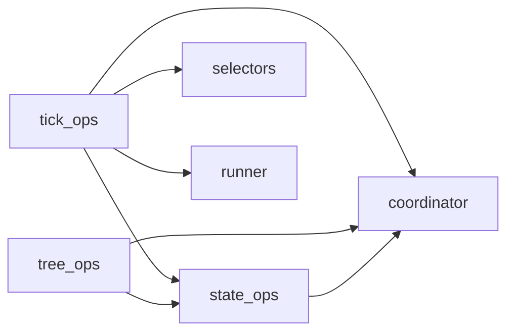

# Scheduler 层重构 Trade-Off 分析

> 每一个重构决策都有代价。本文档逐项列出关键 trade-off，给出判断理由和风险评估。

## Trade-Off 总览

| # | 决策 | 收益 | 代价 | 判断 |
|---|------|------|------|------|
| T1 | 合并 5 个 ops 模块进 engine | 消除依赖网，-58% 内部边数 | engine.py 膨胀至 ~520 行 | ✅ 合并 |
| T2 | 删除 SchedulerControl protocol | 减少间接层，少 103 行 | tools 直接依赖 engine 类型 | ✅ 删除 |
| T3 | Coordinator 内联到 engine | 消除 161 行薄包装 | engine 字段增多 | ✅ 内联 |
| T4 | wake_messages 内联到 runner | 消除跨模块调用 | runner 增大 ~100 行 | ✅ 内联 |
| T5 | 3 个工具结果构造器合并为 1 个 | 消除 ~60 行重复 | 单方法参数稍多 | ✅ 合并 |
| T6 | Runner 持有 engine 引用 | 消除 4 个构造参数 | 增加 runner→engine 耦合 | ⚠️ 有条件合并 |
| T7 | 保留 guard.py 独立 | 限制检查保持可测试 | 多一个文件 | ✅ 保留 |
| T8 | Store 层完全不动 | 零风险，不影响持久化 | 错过某些优化 | ✅ 不动 |

---

## T1: 合并 5 个 ops 模块进 engine

### 被合并模块

| 模块 | 行数 | 合并理由 |
|------|------|---------|
| `coordinator.py` | 161 | 只是 dict 集合，无独立抽象 |
| `state_ops.py` | 117 | 状态迁移是状态机核心 |
| `tick_ops.py` | 185 | tick phase 是 engine 主循环 |
| `tree_ops.py` | 71 | 只有 2 个方法，太小 |
| `selectors.py` | 82 | 纯函数，作为 static method |

合计 616 行 → 合并后 engine 预计 ~520 行（因消除了装配样板和重复 import）。

### 收益

**1. 消除依赖网**

现状：这 5 个模块之间的依赖关系：



合并后：这些全变成 engine 的内部方法调用，不再有跨模块依赖。

**2. 消除装配样板**

现在每个 ops 模块的构造函数都要接收 `store + coordinator + ...`：

```python
# 现状：scheduler.py 中
self._state_ops = SchedulerStateOps(store=self._store, coordinator=self._coordinator)
self._tree_ops = SchedulerTreeOps(store=self._store, coordinator=self._coordinator, state_ops=self._state_ops)
self._tick_ops = SchedulerTickOps(config=..., store=self._store, guard=self._guard, coordinator=self._coordinator, runner=self._runner, state_ops=self._state_ops)
```

合并后：这些全消失。

**3. 状态机逻辑在一个文件里**

要理解 "一个 state 怎么从 WAITING 变成 RUNNING" 的完整路径，现在需要跳 4 个文件：
`tick_ops._wake_waiting()` → `selectors.select_ready()` → `coordinator.dispatch_task()` → `state_ops.mark_running()`

合并后只在 engine.py 内部跳方法。

### 代价

**1. engine.py 变大**

520 行虽然比现在的 567 行还少（因为消除了装配代码），但它承担的职责面更宽了。

**缓解措施**：
- 用清晰的注释分区（`# ── Tick phases ──`, `# ── State transitions ──` 等）
- 私有方法用下划线前缀 + 统一命名规范
- 纯函数用 `@staticmethod` 标记，保持可独立测试

**2. 单文件改动的 git blame 颗粒度下降**

以前 "改了 tick 逻辑" 只影响 `tick_ops.py`，现在影响 `engine.py`。

**我的判断**：这个代价可以接受。git blame 的价值在于"找到谁改了什么"，而不是"改了哪个文件"。方法级别的 blame 已经足够。

### 判断：✅ 合并

理由：当前拆分的 "接缝" 不是真正的解耦边界。它们共享 store + coordinator 数据管道，合并后反而更内聚。520 行的 engine 是完全可管理的规模。

---

## T2: 删除 SchedulerControl protocol

### 现状

```python
# control.py
class SchedulerControl(Protocol):
    async def spawn_child(self, request: SpawnChildRequest) -> AgentState: ...
    async def sleep_current_agent(self, request: SleepRequest) -> SleepResult: ...
    async def get_child_state(self, target_id: str) -> AgentState | None: ...
    async def list_child_states(self, *, caller_id, session_id) -> list[AgentState]: ...
    async def inspect_child_processes(self, target_id: str) -> list[dict]: ...
    async def cancel_child(self, request: CancelChildRequest) -> CancelChildResult: ...
    def age_seconds(self, timestamp, *, now=None) -> int: ...
```

唯一实现者是 `SchedulerEngine`。

### 收益

- 少 103 行代码
- 减少一层间接：Tools 直接 `self._engine.spawn_child()` 而非 `self._port.spawn_child()`
- IDE 跳转更直接，不需要从 protocol 再跳到实现

### 代价

**丧失了 "tools 不知道 engine 存在" 的抽象边界**

理论上 protocol 可以让 tools 在不知道 engine 细节的情况下工作。但实际上：
- 只有一个实现
- 没有测试用 mock 实现（测试直接用真 Scheduler）
- Protocol 的方法签名和 engine 方法完全一致

### 替代方案

如果未来需要可替换性，可以随时从 engine 的 tool-facing 方法提取一个 `Protocol`。成本极低（加 ~20 行），不需要现在预留。

### 判断：✅ 删除

理由：YAGNI（You Ain't Gonna Need It）。单实现 protocol 是过早抽象。如果将来确实需要多实现，重新提取 protocol 的成本几乎为零。

---

## T3: Coordinator 内联到 engine

### 现状

`SchedulerCoordinator` 持有 7 个 dict：

```python
self._active_tasks: set[asyncio.Task]
self._agents: dict[str, SchedulerAgentPort]
self._execution_handles: dict[str, AgentExecutionHandlePort]
self._abort_signals: dict[str, AbortSignal]
self._state_events: dict[str, asyncio.Event]
self._dispatched_state_ids: set[str]
self._stream_channels: dict[str, StreamChannelState]
```

和 ~20 个 getter/setter/pop 方法。

### 收益

- 消除 161 行中间层
- Engine 直接操作自己的字段，不需要 `self._coordinator.get_xxx()` 间接调用
- 减少构造函数参数传递

### 代价

**Engine 实例字段增多（7 → 14 个字段）**

这确实让 engine 看起来更 "重"。

**缓解措施**：用注释分组，例如：

```python
class SchedulerEngine:
    # ── Persistent state ──
    _store: AgentStateStorage
    _guard: TaskGuard

    # ── Runtime coordination ──
    _agents: dict[str, SchedulerAgentPort]
    _execution_handles: dict[str, AgentExecutionHandlePort]
    _abort_signals: dict[str, AbortSignal]
    _state_events: dict[str, asyncio.Event]
    _dispatched: set[str]
    _active_tasks: set[asyncio.Task]
    _stream_channels: dict[str, StreamChannelState]

    # ── Config ──
    _config: SchedulerConfig
    _semaphore: asyncio.Semaphore
    _runner: SchedulerRunner
    _tools: list[SchedulerTool]
```

### 另一个视角：Coordinator 作为内部 dataclass

如果觉得字段太多，可以保留 coordinator 但降级为一个**无方法的 dataclass**：

```python
@dataclass
class _RuntimeState:
    agents: dict[str, SchedulerAgentPort] = field(default_factory=dict)
    handles: dict[str, AgentExecutionHandlePort] = field(default_factory=dict)
    abort_signals: dict[str, AbortSignal] = field(default_factory=dict)
    ...
```

然后 engine 持有 `self._rt = _RuntimeState()`，方法直接操作 `self._rt.agents`。

但这只是换了个写法，实质没变。我倾向于直接内联。

### 判断：✅ 内联

理由：Coordinator 没有独立行为，它的 getter/setter 就是 dict 操作的包装。内联后代码更直接。

---

## T4: wake_messages 内联到 runner

### 现状

`WakeMessageBuilder`（135 行）只被 `SchedulerRunner` 使用，构造时只需要 `store` 引用。

### 收益

- 消除一个文件
- Wake 消息构造和 agent 执行在同一个上下文中，减少心智负担

### 代价

- runner.py 从 584 行增加约 100 行净代码
- wake 消息格式修改时 git diff 混在 runner 里

### 判断：✅ 内联

理由：WakeMessageBuilder 只有一个消费者。分离它只是增加了文件数，没有增加可复用性。

---

## T5: 3 个工具结果构造器合并为 1 个

### 现状

基类有 3 个方法，每个 ~20 行：

```python
def _success(self, *, parameters, start_time, content, output=None, input_args=None, termination_reason=None) -> RuntimeToolOutcome: ...
def _failed(self, *, parameters, start_time, error, content=None, output=None, input_args=None) -> RuntimeToolOutcome: ...
def _denied(self, *, parameters, start_time, reason, content, output=None, input_args=None) -> RuntimeToolOutcome: ...
```

### 合并方案

```python
def _result(
    self,
    *,
    parameters: dict,
    start_time: float,
    content: str,
    status: Literal["success", "failed", "denied"] = "success",
    error: str | None = None,
    reason: str | None = None,
    output: object | None = None,
    input_args: dict | None = None,
    termination_reason: TerminationReason | None = None,
) -> RuntimeToolOutcome: ...
```

### 收益

- 从 ~60 行减少到 ~20 行
- 调用方代码也更统一

### 代价

- 单方法参数稍多（但都是 keyword-only，不会混淆）
- `status` 参数需要调用方显式传

### 判断：✅ 合并

理由：三个方法 90% 的代码是相同的（构造 `ToolResult` + 包装成 `RuntimeToolOutcome`）。差异只在调用哪个 `ToolResult` 工厂方法。一个方法 + `status` 参数更 DRY。

---

## T6: Runner 持有 engine 引用

### 现状

Runner 构造函数接收 4 个参数：

```python
def __init__(self, store, coordinator, semaphore, state_ops=None, wake_message_builder=None): ...
```

### 提案

改为只接收 engine：

```python
def __init__(self, engine: SchedulerEngine): ...
```

Runner 通过 `self._engine._store`, `self._engine._mark_running()` 等访问一切。

### 收益

- 构造函数从 4 个参数变成 1 个
- 新增依赖不需要改构造签名

### 代价

**Runner 和 Engine 形成紧耦合**

Runner 需要知道 engine 的内部结构（哪些字段和方法可用）。这不是接口耦合，而是实现耦合。

### 缓解措施

Engine 暴露给 Runner 的方法可以是明确的一组：

```python
# Engine 暴露给 Runner 的方法（有限集合）
_mark_running(), _mark_waiting(), _mark_idle(), _mark_completed(), _mark_failed()
_mark_queued()
set_execution_handle(), pop_execution_handle()
get_abort_signal(), set_abort_signal(), pop_abort_signal()
get_registered_agent()
get_stream_channel()
_dispatch_task(), _track_task()
notify_state_change()
finish_stream_channel()
```

虽然没有用 protocol 固化，但这组方法是稳定的。

### 替代方案：Runner 持有轻量级 Context

```python
@dataclass
class RunnerContext:
    store: AgentStateStorage
    mark_running: Callable
    mark_failed: Callable
    set_handle: Callable
    get_abort: Callable
    ...
```

但这本质上是重新发明了 protocol，且更难用。

### 判断：⚠️ 有条件接受

**接受的条件**：Runner 只调用 engine 的 `_mark_*` 系列方法和少数协调方法，不调用 engine 的公开 API（submit/cancel 等），避免循环语义。

这个耦合是可控的：Engine 和 Runner 本来就是同一个编排核心的两个面，它们之间的耦合不是"错误的耦合"，而是"必要的协作"。

---

## T7: 保留 guard.py 独立

### 理由

`TaskGuard` 有独立的职责（限制检查），有独立的构造参数（`TaskLimits + store`），被 engine 和 tick 逻辑调用。

如果合并进 engine，engine 的职责面会进一步扩大，且 guard 的单元测试会更难写。

### 判断：✅ 保留

81 行的独立模块，有清晰的 SRP，保留它的成本低于合并的收益。

---

## T8: Store 层完全不动

### 理由

Store 层（base + codec + memory + sqlite + mongo）是真正独立的持久化边界：

- 它不依赖任何 scheduler 内部模块（只依赖 models）
- 它有 3 个完整实现（memory, sqlite, mongo）
- 它的接口已经稳定（6 个方法）

动它的风险远大于收益。

### 判断：✅ 不动

---

## 风险评估

### 低风险

| 风险 | 缓解 |
|------|------|
| 合并后 engine.py 太长 | 520 行在可管理范围内；用分区注释保持可读性 |
| 删除 protocol 后 tools 耦合 engine | engine 的 tool-facing 方法是稳定 API |
| 内联 coordinator 后字段过多 | 分组注释 + 命名规范 |

### 中风险

| 风险 | 缓解 |
|------|------|
| Runner → Engine 紧耦合 | 限制 runner 只调用 engine 的 `_mark_*` 和协调方法 |
| 测试需要适配内部 API 变化 | 测试主要通过 public Scheduler API 执行，内部重构影响有限 |

### 可忽略风险

| 风险 | 理由 |
|------|------|
| Console 侧需要改动 | Public API 100% 不变 |
| Store 兼容性 | Store 层完全不动 |
| 新 WakeType 扩展受影响 | 添加 wake type 的改动范围反而更集中了 |

---

## 未纳入本次重构的优化

以下优化被有意排除，原因是它们不是"保持功能不变的重构"，而是功能增强：

| 优化 | 排除理由 |
|------|---------|
| 事件驱动替代轮询 tick | 功能增强，需要改变调度语义 |
| 分布式 dispatch 所有权 | 架构变更，超出重构范围 |
| 自动 retry policy | 新功能 |
| `FAILED` 语义细分 | 需要模型变更 |
| WakeCondition 组合表达式 | 需要模型变更 |
| enqueue_input 多消息队列 | 需要语义变更 |

这些可以在重构完成后作为独立的功能迭代来做。重构的价值恰恰在于：让这些未来的功能迭代更容易落地。

---

## 最终判断

这次重构的核心论点是：

> **当前 scheduler 的模块边界不等于架构边界。** 7 个紧耦合的小模块不如 3 个内聚的中等模块。

重构后的 3 个核心模块各有清晰的职责：

```
┌──────────────────────┐
│  Engine (520 行)      │  状态机 + 调度 + 协调
│  "什么时候做什么"      │
├──────────────────────┤
│  Runner (370 行)      │  执行 + 结果翻译
│  "怎么做"             │
├──────────────────────┤
│  Tools (420 行)       │  工具桥接
│  "Agent 怎么触发调度"  │
└──────────────────────┘
```

三者之间的依赖方向是单向的：

```
Facade → Engine → Runner
                ↗
Tools ─────────┘
```

没有环，没有网，没有重复的数据管道。这就是这次重构要达到的效果。
