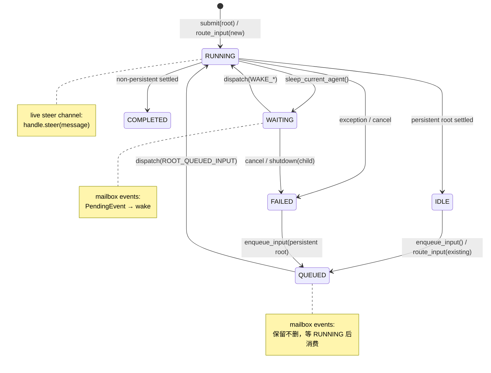

# Scheduler 层重构方案：综合修订版

> 基于 Opus 方案（01-03）和 GPT 方案的交叉审视，取长补短后的最终设计。
> 同时纳入 console/server 对 scheduler 内部语义的越权使用问题。

## 0. 两个方案的核心差异

| 维度 | Opus 方案 | GPT 方案 |
|------|----------|----------|
| **合并力度** | 激进：5 ops → engine 内联 | 适度：替换为 service/runtime/planning/executor |
| **文件数** | 9 个（-44%） | 10 个 |
| **代码缩减** | ~44% | ~15% |
| **DispatchAction** | 无，直接方法调用 | ✅ 显式 enum + frozen dataclass |
| **AgentState 可变性** | 保持可变，减少冗余刷新 | ✅ frozen + copy-on-write |
| **Tick 驱动** | 保持轮询 | ✅ nudge event + periodic sweep |
| **SchedulerControl** | 删除 | 保留（重命名） |
| **Bug 识别** | 结构性痛点 | ✅ 具体 P1/P2 bug |
| **Tool 精简** | ✅ 3→1 result 构造器 | 未涉及 |
| **Console 边界** | 未涉及 | 提及但未展开 |
| **量化度量** | ✅ 依赖边数、行数对比 | 定性描述 |

## 1. 我从 GPT 方案中采纳的改进

### 1.1 DispatchAction 模型 ✅ 采纳

GPT 提出用显式 `DispatchAction` 替代 `AgentRunMode + AgentRunSpec` 的布尔矩阵。这是严格更优的设计。

```python
class DispatchReason(str, Enum):
    ROOT_SUBMIT = "root_submit"
    ROOT_QUEUED_INPUT = "root_queued_input"
    CHILD_PENDING = "child_pending"
    WAKE_CONDITION = "wake_condition"
    WAKE_TIMEOUT = "wake_timeout"
    WAKE_EVENTS = "wake_events"
    SHUTDOWN_SUMMARY = "shutdown_summary"


@dataclass(frozen=True)
class DispatchAction:
    state_id: str
    reason: DispatchReason
    input_override: UserInput | None = None
    event_ids: tuple[str, ...] = ()
    increment_wake_count: bool = False
    clear_wake_condition: bool = False
```

**为什么优于我原方案**：
- 调度原因成为第一等语义，不再编码进 flag 组合
- Planner 输出 `list[DispatchAction]`，executor 逐个执行 — 两者可独立测试
- 新增 dispatch 原因只需加一个枚举值

### 1.2 Frozen AgentState + copy-on-write ✅ 采纳

GPT 指出可变 `AgentState` 是冗余刷新的根本原因。我之前只想"减少刷新次数"，而 GPT 直接从根源解决。

```python
@dataclass(frozen=True, slots=True)
class AgentState:
    id: str
    session_id: str
    status: AgentStateStatus
    task: UserInput
    ...

    def with_running(self, *, task=None, **kw) -> "AgentState":
        return replace(self, status=AgentStateStatus.RUNNING,
                       task=task or self.task,
                       updated_at=datetime.now(timezone.utc), **kw)

    def with_waiting(self, *, wake_condition, **kw) -> "AgentState":
        return replace(self, status=AgentStateStatus.WAITING,
                       wake_condition=wake_condition,
                       updated_at=datetime.now(timezone.utc), **kw)

    def with_idle(self, *, result_summary=None, **kw) -> "AgentState": ...
    def with_queued(self, *, pending_input, **kw) -> "AgentState": ...
    def with_completed(self, *, result_summary, **kw) -> "AgentState": ...
    def with_failed(self, *, result_summary, **kw) -> "AgentState": ...
```

**收益**：
- 彻底消除 `refreshed = await store.get_state(...)` 的 defensive dance
- Memory store 和 SQLite/Mongo store 行为一致（不再有 mutable alias 差异）
- 删除整个 `state_ops.py` — transition 逻辑回归 model 自身

### 1.3 Nudge event + periodic sweep ✅ 采纳

当前纯轮询 tick 导致 `submit()` 后 child 要等最多 `check_interval` 才被拉起。GPT 的 nudge 方案消除了这个延迟。

```python
# engine 内部
self._nudge = asyncio.Event()

async def _loop(self):
    while self._running:
        self._nudge.clear()
        await self.tick()
        # 等 nudge 或超时
        with suppress(asyncio.TimeoutError):
            await asyncio.wait_for(
                self._nudge.wait(), timeout=self._check_interval
            )

def nudge(self) -> None:
    """唤醒 tick loop，消除延迟。"""
    self._nudge.set()
```

在 `submit()`, `enqueue_input()`, `save_event()` 后调用 `self.nudge()`。

**收益**：
- 保持 periodic sweep 作为兜底
- 消除"为什么 submit 后没立刻动"的延迟感
- 统一掉当前散落的 fast path（如 submit 后直接起 task）

### 1.4 Bug 修复纳入 ✅ 采纳

GPT 识别的 P1/P2 bug 必须在重构中修复，不应 bug-for-bug 继承：

| Bug | 修复方向 |
|-----|---------|
| **QUEUED steer 丢消息** | mailbox events 在 `QUEUED` 状态下不删除，等 agent 运行时消费 |
| **shutdown(RUNNING) no-op** | 对 RUNNING root 触发 abort signal + 标记 shutdown pending |
| **spawn_child id 冲突** | save 前检查 id 是否已存在，冲突则拒绝 |
| **mutable alias 差异** | frozen AgentState 彻底消除 |

### 1.5 三条输入通道显式化 ✅ 采纳

| Channel | 作用 | 允许消费状态 |
|---------|------|-------------|
| **next-input slot** | persistent root 下一轮开始输入 | `IDLE/FAILED → QUEUED → RUNNING` |
| **live steer** | 当前正在运行的一轮纠偏 | `RUNNING` |
| **mailbox events** | async 通知 (child result, user hint) | `WAITING`；`QUEUED` 时保留不删 |

## 2. 我保持不变的优势点

### 2.1 激进合并策略

GPT 的 5 文件方案（service/runtime/planning/executor/messages）虽然每个 owner 更强，但**本质上还是把现有 7 个模块换成了 5 个新模块**，依赖网没有根本性简化。

我继续主张：**核心编排只需 3 个模块**（engine + runner + tools）。

但我会吸收 GPT 的 TickPlanner 纯化思路 — 不是把它做成独立文件，而是在 engine 内部保持 plan/execute 的分离：

```python
class SchedulerEngine:
    async def tick(self) -> None:
        # Phase 1: Plan (pure)
        states = await self._store.list_states(...)
        events = await self._store.list_events(...)
        actions = self._plan_tick(states, events, now=datetime.now(timezone.utc))
        # Phase 2: Execute (side effects)
        for action in actions:
            self._dispatch_task(action)

    def _plan_tick(self, states, events, now) -> list[DispatchAction]:
        """Pure function: 给定当前快照，返回应执行的动作列表。"""
        actions = []
        actions.extend(self._plan_signal_propagation(states))
        actions.extend(self._plan_timeouts(states, now))
        actions.extend(self._plan_pending_events(states, events))
        actions.extend(self._plan_pending_starts(states))
        actions.extend(self._plan_queued_starts(states))
        actions.extend(self._plan_wake_waiting(states, now))
        return actions
```

**这比 GPT 的独立 TickPlanner 更好**：
- 保持 plan 逻辑纯粹且可测试（`_plan_tick` 是纯函数）
- 不需要额外文件、额外构造函数、额外依赖注入
- Plan 结果直接在 engine 内消费，不需要跨模块传递

### 2.2 Tool 层精简

GPT 未涉及 tool 样板压缩。我的 `_result(status=...)` 合并方案继续保留：

```python
# 3 个方法 (~60 行) → 1 个方法 (~20 行)
def _result(self, *, parameters, start_time, content,
            status="success", error=None, reason=None,
            output=None, input_args=None,
            termination_reason=None) -> RuntimeToolOutcome: ...
```

### 2.3 量化度量

继续维护精确的文件数/行数/依赖边数对比，这是评估重构效果的基线。

## 3. 新增：Console 边界优化

这是两个方案都未充分展开的问题，也是本次修订的重点补充。

### 3.1 问题诊断

Console 侧有 3 个模块直接依赖 scheduler 内部语义：

#### (A) `agent_executor.py` — 重新实现了 scheduler 的状态路由

```python
# agent_executor.py:80-114
if status in (RUNNING, WAITING, QUEUED):
    → steer (urgent 取决于是否 WAITING)
if status == PENDING:
    → wait_for 然后重试
if is_root and is_persistent and status in (IDLE, FAILED):
    → enqueue_input
else:
    → submit
```

这段逻辑**就是 scheduler 的调度语义**，但它被写在了 console 的 channel 层。如果 scheduler 的状态机发生任何变化（比如新增一个状态），这里也必须同步修改。

#### (B) `routers/scheduler.py` — 直接穿透 store 查询

```python
# scheduler router
storage = scheduler.store          # 直接拿 store
states = await storage.list_states(...)
events = await storage.list_events(...)
```

Router 绕过 scheduler facade 直接操作 store，知道了 store 的查询接口细节。

#### (C) `runtime_agent_pool.py` — 检查 scheduler state status

```python
# runtime_agent_pool.py:59-67
state = await self._scheduler.get_state(session.scheduler_state_id)
if state is not None and state.status == AgentStateStatus.RUNNING:
    # 推迟 agent 刷新
    return existing
```

Pool 需要知道"RUNNING 状态下不能刷新 agent"这个 scheduler 内部约束。

### 3.2 解决方案：Scheduler facade 提供高层 API

#### (A) 新增 `Scheduler.route_input()` — 封装状态路由

```python
class RouteResult:
    action: Literal["submitted", "enqueued", "steered", "rejected"]
    state_id: str | None = None
    stream: AsyncIterator[AgentStreamItem] | None = None
    reason: str | None = None


class Scheduler:
    async def route_input(
        self,
        user_input: UserInput,
        *,
        agent: Agent,
        state_id: str | None = None,
        session_id: str | None = None,
        persistent: bool = True,
        timeout: int | None = None,
    ) -> RouteResult:
        """高层 API：根据当前状态自动选择 submit/enqueue/steer。

        Console 不再需要知道状态机细节。
        """
        if state_id is None:
            # 无已有 state → submit
            ...
            return RouteResult(action="submitted", state_id=..., stream=...)

        state = await self.get_state(state_id)
        if state is None:
            return RouteResult(action="submitted", state_id=..., stream=...)

        if state.status == AgentStateStatus.RUNNING:
            await self.steer(state_id, user_input)
            return RouteResult(action="steered", state_id=state_id)

        if state.status == AgentStateStatus.WAITING:
            await self.steer(state_id, user_input, urgent=True)
            return RouteResult(action="steered", state_id=state_id)

        if state.status == AgentStateStatus.QUEUED:
            await self.steer(state_id, user_input)
            return RouteResult(action="steered", state_id=state_id)

        if state.status == AgentStateStatus.PENDING:
            await self.wait_for(state_id, timeout=timeout)
            # 递归: state 已完成，重新路由
            return await self.route_input(...)

        if state.can_accept_enqueue_input():
            stream = self.stream(user_input, agent=agent, state_id=state_id, timeout=timeout)
            return RouteResult(action="enqueued", state_id=state_id, stream=stream)

        # COMPLETED 或其他终态 → 重新 submit
        stream = self.stream(user_input, agent=agent, session_id=session_id, persistent=persistent, timeout=timeout)
        return RouteResult(action="submitted", state_id=agent.id, stream=stream)
```

**Console 侧的 agent_executor.py 简化为**：

```python
class AgentExecutor:
    async def execute(self, agent, session, user_input) -> DispatchResult:
        result = await self._scheduler.route_input(
            user_input,
            agent=agent,
            state_id=session.scheduler_state_id,
            session_id=session.id,
            persistent=True,
            timeout=self._timeout,
        )
        if result.state_id and result.state_id != session.scheduler_state_id:
            assign_scheduler_state(session, result.state_id)
        await self._touch_session(session)
        return DispatchResult(action=result.action, stream=result.stream)
```

从 ~150 行状态路由逻辑降到 ~15 行纯委托。

#### (B) Scheduler facade 提供查询方法

```python
class Scheduler:
    # 已有
    async def get_state(self, state_id) -> AgentState | None: ...

    # 新增 — Console 不再直接碰 store
    async def list_states(self, *, statuses=None, parent_id=None,
                          session_id=None, limit=100, offset=0) -> list[AgentState]: ...

    async def list_events(self, *, target_agent_id=None,
                          session_id=None) -> list[PendingEvent]: ...

    async def get_stats(self) -> dict[str, int]: ...
```

Router 变为纯委托：

```python
@router.get("/states")
async def list_agent_states(scheduler: SchedulerDep, ...):
    states = await scheduler.list_states(statuses=..., limit=limit, offset=offset)
    # ... 序列化
```

#### (C) Scheduler 提供 `is_agent_refreshable()` 查询

```python
class Scheduler:
    async def is_agent_refreshable(self, state_id: str) -> bool:
        """返回 agent 是否可以安全刷新（非 RUNNING 状态）。"""
        state = await self.get_state(state_id)
        if state is None:
            return True
        return state.status != AgentStateStatus.RUNNING
```

RuntimeAgentPool 不再需要 import `AgentStateStatus`：

```python
if not await self._scheduler.is_agent_refreshable(session.scheduler_state_id):
    return existing
```

### 3.3 Console 侧改动量评估

| 文件 | 改动 | 行数变化 |
|------|------|---------|
| `agent_executor.py` | 状态路由逻辑删除，改为 `route_input()` 调用 | -100 行 |
| `runtime_agent_pool.py` | 删除 `AgentStateStatus` import，改用 `is_agent_refreshable()` | -5 行 |
| `routers/scheduler.py` | `scheduler.store.xxx()` → `scheduler.xxx()` | ~-10 行 |
| `feishu/commands/scheduler.py` | 同上 | ~-5 行 |
| **总计** | | ~-120 行 console 代码 |

### 3.4 依赖方向清理

```mermaid
graph LR
    subgraph "现状"
        Console1["agent_executor.py"] -->|import AgentStateStatus| Models1["scheduler.models"]
        Console1 -->|直接检查 status| Scheduler1["Scheduler"]
        Router1["routers/scheduler.py"] -->|scheduler.store.xxx()| Store1["AgentStateStorage"]
        Pool1["runtime_agent_pool.py"] -->|import AgentStateStatus| Models1
    end

    subgraph "重构后"
        Console2["agent_executor.py"] -->|route_input()| Scheduler2["Scheduler"]
        Router2["routers/scheduler.py"] -->|list_states()| Scheduler2
        Pool2["runtime_agent_pool.py"] -->|is_agent_refreshable()| Scheduler2
    end
```

**重构后 console 侧只依赖 Scheduler facade 的公开方法**，不再 import scheduler 内部模型（`AgentStateStatus`）或直接穿透 `store`。

## 4. 修订后的目标文件结构

```
scheduler/
├── __init__.py          #  25 行  │ 公开导出
├── models.py            # 280 行  │ 领域模型（frozen + with_* transitions）
├── scheduler.py         # 180 行  │ Facade: 生命周期 + 公开 API + route_input + 查询
├── engine.py            # 550 行  │ 状态机 + tick(plan→execute) + 调度协调
├── runner.py            # 350 行  │ 单次执行 + 唤醒消息
├── tools.py             # 420 行  │ 5 个运行时工具（含 DTO）
├── guard.py             #  80 行  │ 限制检查（不变）
├── formatting.py        #  57 行  │ 文本格式化（不变）
├── serialization.py     #  68 行  │ 传输序列化（不变）
└── store/               # 776 行  │ 持久化层（不变）
```

**核心编排 ~2,010 行**（vs 现状 3,434 行 = -41%）

### 与两个原方案对比

| 维度 | Opus 原方案 | GPT 方案 | 修订方案 |
|------|-----------|----------|---------|
| 核心文件数 | 9 | 10 | 9 |
| 核心 LOC | ~1,910 | ~2,900 | ~2,010 |
| DispatchAction | ❌ | ✅ | ✅ |
| Frozen state | ❌ | ✅ | ✅ |
| Nudge tick | ❌ | ✅ | ✅ |
| Tool 精简 | ✅ | ❌ | ✅ |
| Console 边界 | ❌ | ❌ | ✅ |
| Bug 修复 | ❌ | ✅ | ✅ |
| Plan/Execute 分离 | ❌ | ✅ (独立文件) | ✅ (engine 内方法) |

## 5. 修订后的 Engine 内部结构

```python
class SchedulerEngine:
    """状态机 + tick + 调度协调。"""

    # ── 构造 ────────────────────────────────────────
    def __init__(self, *, store, guard, config): ...

    # ── Runtime 内存状态（原 coordinator） ─────────────
    _agents: dict[str, SchedulerAgentPort]
    _execution_handles: dict[str, AgentExecutionHandlePort]
    _abort_signals: dict[str, AbortSignal]
    _state_events: dict[str, asyncio.Event]
    _dispatched: set[str]
    _active_tasks: set[asyncio.Task]
    _stream_channels: dict[str, StreamChannelState]
    _nudge: asyncio.Event  # 新增

    # ── Public API ──────────────────────────────────
    async def submit(...) -> str: ...
    async def enqueue_input(...) -> None: ...
    async def route_input(...) -> RouteResult: ...  # 新增
    async def stream(...) -> AsyncIterator: ...
    async def wait_for(...) -> RunOutput: ...
    async def cancel(...) -> bool: ...
    async def steer(...) -> bool: ...
    async def shutdown(...) -> bool: ...

    # ── 查询 API（供 facade 委托） ──────────────────
    async def list_states(...) -> list[AgentState]: ...
    async def list_events(...) -> list[PendingEvent]: ...
    async def get_stats(...) -> dict[str, int]: ...
    async def is_agent_refreshable(state_id) -> bool: ...

    # ── Tool-facing control ─────────────────────────
    async def spawn_child(request) -> AgentState: ...
    async def sleep_current_agent(request) -> SleepResult: ...
    async def cancel_child(request) -> CancelChildResult: ...
    async def get_child_state(target_id) -> AgentState | None: ...
    async def list_child_states(**kw) -> list[AgentState]: ...

    # ── Tick: plan + execute ────────────────────────
    async def tick(self) -> None:
        states = await self._store.list_states(...)
        events = await self._store.list_events(...)
        # 先做 signal propagation（有 store 写入副作用）
        await self._propagate_signals(states)
        # 再做 pure planning
        actions = self._plan_tick(states, events, now)
        # 最后 dispatch
        for action in actions:
            self._dispatch_action(action)

    def _plan_tick(self, states, events, now) -> list[DispatchAction]:
        """纯函数：给定快照，返回动作列表。"""
        ...

    # ── State transitions (via frozen model) ───────
    async def _save_running(self, state, **kw) -> AgentState:
        new = state.with_running(**kw)
        await self._store.save_state(new)
        self._notify_state_change(state.id)
        return new

    async def _save_waiting(self, state, **kw) -> AgentState: ...
    async def _save_idle(self, state, **kw) -> AgentState: ...
    async def _save_queued(self, state, **kw) -> AgentState: ...
    async def _save_completed(self, state, **kw) -> AgentState: ...
    async def _save_failed(self, state, **kw) -> AgentState: ...

    # ── Tree ops ────────────────────────────────────
    async def _cancel_subtree(self, state_id, reason) -> None: ...
    async def _shutdown_subtree(self, state_id) -> None: ...

    # ── Dispatch helpers ────────────────────────────
    def _dispatch_action(self, action: DispatchAction) -> bool: ...
    def _track_task(self, task) -> None: ...
    def nudge(self) -> None: ...
```

### 关键改进相比原方案

1. **`_plan_tick()` 是纯函数** — 输入 states/events/now，输出 `list[DispatchAction]`，可独立单测
2. **`_save_*()` 替代 `_mark_*()`** — 命名更准确，语义是"生成新 state snapshot 并持久化"
3. **State transitions 在 model 上** — `state.with_running()` 返回新 frozen 实例，`_save_*` 只负责持久化+通知
4. **`nudge` event** — submit/enqueue/save_event 后调用，消除 tick 延迟
5. **`route_input()` + 查询 API** — console 不再穿透 store 或重写状态路由

## 6. 修订后的状态机

保持枚举不变，但明确三条输入通道的消费规则：



## 7. 修订后的迁移策略

### Phase 1: Model 层（最低风险）

1. `AgentState` 改为 `frozen=True` + `with_*()` transition 方法
2. 添加 `DispatchAction` + `DispatchReason` 到 `models.py`
3. 删除 `ChildAgentConfigOverrides` dataclass
4. 删除 `normalize_statuses()` 全局函数（内联到 store）

**验证**: 所有现有测试通过（store 实现需要适配 frozen state）。

### Phase 2: Engine 内聚化

1. 将 coordinator/state_ops/tick_ops/tree_ops/selectors 内联到 engine
2. 实现 `_plan_tick()` 纯函数 + `_dispatch_action()` 执行
3. 添加 `nudge` event
4. 实现 `_save_*()` 方法替代 `_mark_*()` + 冗余刷新
5. 删除 5 个被吸收的文件

**验证**: 所有测试通过。

### Phase 3: Runner 内聚化

1. wake_messages 内联到 runner
2. Runner 构造函数改为持有 engine 引用
3. Runner 的 dispatch mode 改为接收 `DispatchAction`

**验证**: 所有测试通过。

### Phase 4: Tools 精简 + Console 边界

1. control.py DTOs 移入 tools.py
2. 删除 SchedulerControl protocol
3. 精简基类 result 构造器
4. Scheduler facade 新增 `route_input()`, `list_states()`, `list_events()`, `get_stats()`, `is_agent_refreshable()`
5. Console 侧适配：agent_executor 简化、router 改用 facade 方法、pool 改用查询 API

**验证**: 所有 SDK + Console 测试通过。

### Phase 5: Bug 修复

1. QUEUED steer 不再丢消息
2. shutdown(RUNNING) 正确触发 abort
3. spawn_child id 冲突检查

**验证**: 新增对应边界测试。

### Phase 6: 清理

1. 更新 `__init__.py` 导出
2. 旧文件 mv 到 trash/
3. 更新 README.md / DESIGN_QA.md

## 8. 最终收益矩阵

| 维度 | 现状 | 修订方案 | 改善 |
|------|------|---------|------|
| SDK 源文件数（不含 store） | 16 | 9 | -44% |
| SDK 代码行数（不含 store） | 3,434 | ~2,010 | -41% |
| 内部依赖边数 | 43 | ~18 | -58% |
| Console 对 scheduler 内部 import | 3 个文件直接穿透 | 0（全部走 facade） | -100% |
| Console agent_executor 状态路由代码 | ~150 行 | ~15 行 | -90% |
| State transition 冗余刷新 | 4 次/分支 | 0（frozen copy-on-write） | -100% |
| Tick 延迟 | 最多 check_interval | nudge 后立刻触发 | ~0ms |
| 已知 P1 bug | 3 个 | 0 | 全修 |

## 9. 这次不做的事（边界声明）

与两个原方案一致，以下功能超出本次重构范围：

1. 分布式调度 / lease
2. 真正的 inbox 多消息队列
3. 通用 workflow DSL
4. 多租户 stream hub
5. WakeCondition 组合表达式
6. 自动 retry policy
