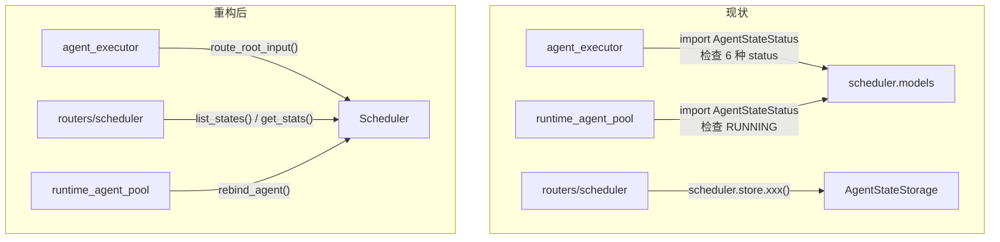
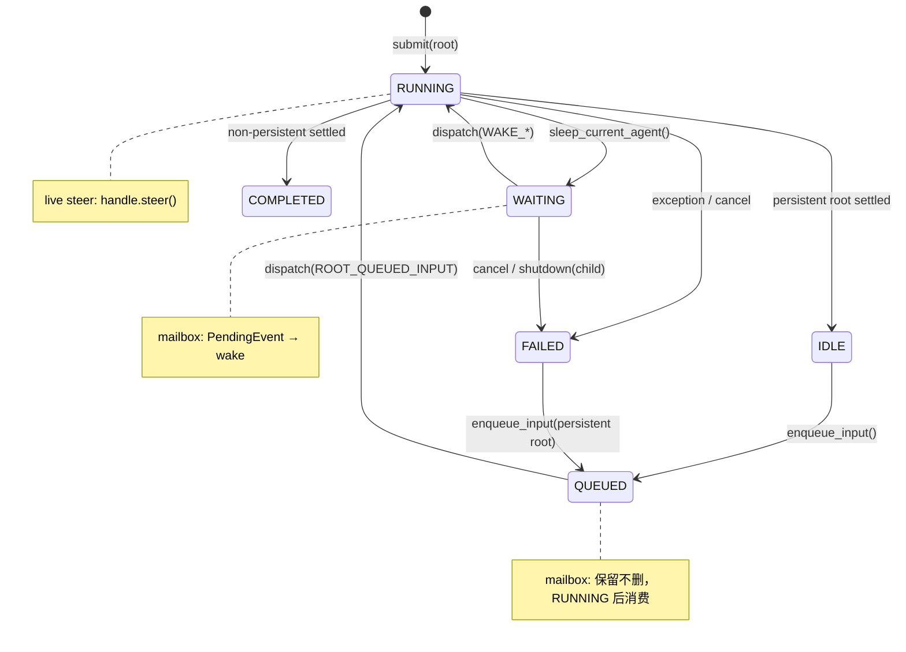
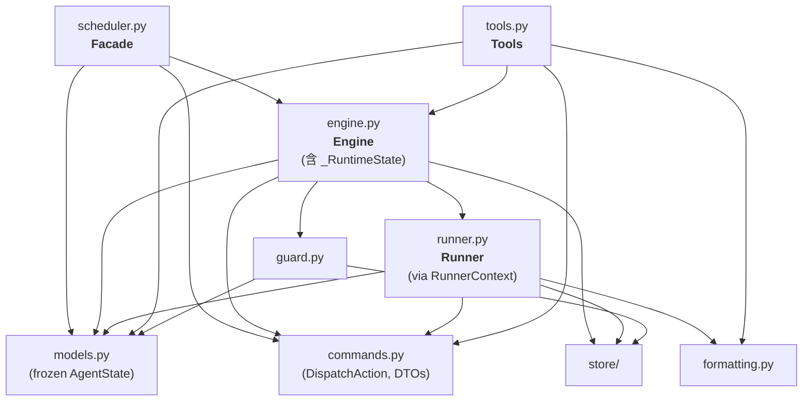

# Scheduler 层重构方案：综合修订版 v2

> 基于 Opus 方案（01-03）、GPT 方案、以及 GPT 对 v1 综合版的 8 点评价，取长补短后的最终设计。
> 纳入 console/server 对 scheduler 内部语义的越权使用问题。

## 0. 设计主轴

这次重构只有 3 根主轴，所有设计决策都应能追溯到其中之一：

1. **`DispatchAction` + frozen `AgentState` + tick 三段式** — 让调度语义显式化、状态迁移不可变化
2. **让每个模块只承载一个变化原因** — 不为压文件数而制造新的超级 owner
3. **把 Console 和 scheduler 的边界收硬** — 移除 `scheduler.store` 直读路径

文件数和代码行数是结果度量，不是设计牵引目标。

## 1. 两方案对比与采纳决策

| 维度 | Opus 方案 | GPT 方案 | 本方案采纳 |
|------|----------|----------|-----------|
| **DispatchAction** | 无 | ✅ | ✅ GPT |
| **Frozen AgentState** | 保持可变 | ✅ | ✅ GPT |
| **Nudge tick** | 保持轮询 | ✅ | ✅ GPT |
| **Bug 识别** | 结构性痛点 | ✅ 具体 P1/P2 | ✅ GPT |
| **三输入通道** | 未涉及 | ✅ | ✅ GPT |
| **合并力度** | 激进 | 适度 | 折中（见下文） |
| **Tool 精简** | ✅ | 未涉及 | ✅ Opus |
| **Console 边界** | 未涉及 | 提及未展开 | ✅ 新增 |

### 1.1 DispatchAction 模型

替代 `AgentRunMode + AgentRunSpec` 布尔矩阵。调度原因提升为第一等语义。

```python
class DispatchReason(str, Enum):
    ROOT_SUBMIT = "root_submit"
    ROOT_QUEUED_INPUT = "root_queued_input"
    CHILD_PENDING = "child_pending"
    WAKE_CONDITION = "wake_condition"
    WAKE_TIMEOUT = "wake_timeout"
    WAKE_EVENTS = "wake_events"
    SHUTDOWN_SUMMARY = "shutdown_summary"

@dataclass(frozen=True)
class DispatchAction:
    state_id: str
    reason: DispatchReason
    input_override: UserInput | None = None
    event_ids: tuple[str, ...] = ()
    increment_wake_count: bool = False
    clear_wake_condition: bool = False
```

### 1.2 Frozen AgentState + copy-on-write

从根源消灭 runner.py 中 4 次/分支的 `refreshed = await store.get_state(...)` 防御式刷新。

```python
@dataclass(frozen=True, slots=True)
class AgentState:
    id: str
    session_id: str
    status: AgentStateStatus
    task: UserInput
    ...

    def with_running(self, *, task=None, **kw) -> "AgentState":
        return replace(self, status=AgentStateStatus.RUNNING,
                       task=task or self.task,
                       updated_at=datetime.now(timezone.utc), **kw)

    def with_waiting(self, *, wake_condition, **kw) -> "AgentState": ...
    def with_idle(self, *, result_summary=None, **kw) -> "AgentState": ...
    def with_queued(self, *, pending_input, **kw) -> "AgentState": ...
    def with_completed(self, *, result_summary, **kw) -> "AgentState": ...
    def with_failed(self, *, result_summary, **kw) -> "AgentState": ...
```

### 1.3 Nudge event + periodic sweep

```python
self._nudge = asyncio.Event()

async def _loop(self):
    while self._running:
        self._nudge.clear()
        await self.tick()
        with suppress(asyncio.TimeoutError):
            await asyncio.wait_for(self._nudge.wait(), timeout=self._check_interval)

def nudge(self) -> None:
    self._nudge.set()
```

在 `submit()`, `enqueue_input()`, `save_event()` 后调用 `nudge()`。

### 1.4 Bug 修复（不做 bug-for-bug 继承）

| Bug | 修复方向 |
|-----|---------|
| QUEUED steer 丢消息 | mailbox events 在 `QUEUED` 状态下保留不删，等 RUNNING 后消费 |
| shutdown(RUNNING) no-op | 对 RUNNING root 触发 abort signal + 标记 shutdown pending |
| spawn_child id 冲突 | save 前检查 id 是否已存在，冲突则拒绝 |
| mutable alias 差异 | frozen AgentState 彻底消除 |

### 1.5 三条输入通道显式化

| Channel | 作用 | 允许消费状态 |
|---------|------|-------------|
| **next-input slot** | persistent root 下一轮输入 | `IDLE/FAILED → QUEUED → RUNNING` |
| **live steer** | 当前正在运行的一轮纠偏 | `RUNNING` |
| **mailbox events** | async 通知 (child result, user hint) | `WAITING`；`QUEUED` 时保留不删 |

## 2. 目标文件结构

```text
scheduler/
├── __init__.py          # 公开导出
├── models.py            # frozen AgentState + with_*() + 枚举 + WakeCondition
├── commands.py          # 领域命令: DispatchAction, SpawnChildRequest, SleepRequest, RouteResult ...
├── scheduler.py         # Facade: 生命周期 + 公开 API + route_root_input + 查询
├── engine.py            # 状态机 + tick(normalize→plan→dispatch) + _RuntimeState
├── runner.py            # 单次执行 + 唤醒消息（通过 RunnerContext 访问 engine）
├── tools.py             # 5 个运行时工具（精简基类）
├── guard.py             # 限制检查
├── formatting.py        # 文本格式化
├── serialization.py     # 传输序列化
└── store/               # 持久化层（不变）
```

### 为什么是 10 个文件而不是 9 个

v1 综合版把所有 DTO（DispatchAction、SpawnChildRequest、SleepRequest、RouteResult ...）都塞进 `tools.py`。
GPT 的评价正确指出：**这些是 scheduler 的领域命令，不是 tool 实现细节**。

多一个小 `commands.py`（~80 行 frozen dataclass）换来的是：
- `tools.py` 只含工具实现，不混杂领域语义
- `engine.py` 和 `tools.py` 共享 commands 而不是互相依赖
- 新增命令类型时不需要改 tools.py

## 3. Engine 内部设计

### 3.1 `_RuntimeState` 容器

v1 综合版让 engine 顶层直接挂 7 个 dict/set 字段。GPT 正确指出这接近"第二个 God Object"。

解决方案：**将运行时内存状态聚成私有 `_RuntimeState` 容器**。不是独立文件，而是 engine 的内部 dataclass：

```python
@dataclass
class _RuntimeState:
    """进程内 live state — 不碰持久化，不碰调度决策。"""
    agents: dict[str, SchedulerAgentPort] = field(default_factory=dict)
    execution_handles: dict[str, AgentExecutionHandlePort] = field(default_factory=dict)
    abort_signals: dict[str, AbortSignal] = field(default_factory=dict)
    state_events: dict[str, asyncio.Event] = field(default_factory=dict)
    dispatched: set[str] = field(default_factory=set)
    active_tasks: set[asyncio.Task] = field(default_factory=set)
    stream_channels: dict[str, StreamChannelState] = field(default_factory=dict)
    nudge: asyncio.Event = field(default_factory=asyncio.Event)
```

Engine 持有 `self._rt = _RuntimeState()`，通过 `self._rt.agents` 等访问。

**收益**：
- Engine 顶层字段从 ~14 个降到 ~5 个（`_store`, `_guard`, `_config`, `_runner`, `_rt`）
- 运行时状态有明确的分组边界
- `_RuntimeState` 可以整体 reset（测试友好）

### 3.2 Engine 的职责分区

```python
class SchedulerEngine:
    """状态机 + tick + 调度协调。"""

    def __init__(self, *, store, guard, config): ...
        self._store = store
        self._guard = guard
        self._config = config
        self._rt = _RuntimeState()
        self._runner = SchedulerRunner(RunnerContext.from_engine(self))

    # ── Public API（供 facade 委托） ────────────────
    async def submit(...) -> str: ...
    async def enqueue_input(...) -> None: ...
    async def route_root_input(...) -> RouteResult: ...
    async def stream(...) -> AsyncIterator: ...
    async def wait_for(...) -> RunOutput: ...
    async def cancel(...) -> bool: ...
    async def steer(...) -> bool: ...
    async def shutdown(...) -> bool: ...

    # ── 查询 API ────────────────────────────────────
    async def list_states(...) -> list[AgentState]: ...
    async def list_events(...) -> list[PendingEvent]: ...
    async def get_stats(...) -> dict[str, int]: ...
    async def rebind_agent(state_id, agent) -> bool: ...

    # ── Tool-facing control ─────────────────────────
    async def spawn_child(request) -> AgentState: ...
    async def sleep_current_agent(request) -> SleepResult: ...
    async def cancel_child(request) -> CancelChildResult: ...
    async def get_child_state(target_id) -> AgentState | None: ...
    async def list_child_states(**kw) -> list[AgentState]: ...

    # ── Tick: normalize → plan → dispatch ───────────
    async def tick(self) -> None:
        # 1. Normalize: propagate signals (has side effects)
        await self._propagate_signals()
        # 2. Plan: pure function → list[DispatchAction]
        states = await self._store.list_states(...)
        events = await self._store.list_events(...)
        actions = self._plan_tick(states, events, now=datetime.now(timezone.utc))
        # 3. Dispatch: schedule execution tasks
        for action in actions:
            self._dispatch_action(action)

    def _plan_tick(self, states, events, now) -> list[DispatchAction]:
        """纯函数：给定快照，返回动作列表。可独立单测。"""
        ...

    # ── State persistence (via frozen model) ────────
    async def _save_state(self, state: AgentState) -> None:
        await self._store.save_state(state)
        self._notify_state_change(state.id)

    # ── Tree ops ────────────────────────────────────
    async def _cancel_subtree(...) -> None: ...
    async def _shutdown_subtree(...) -> None: ...
```

### 3.3 为什么 Engine 不是 God Object

v1 综合版的 engine 同时持有 7 个平铺 dict + 全部 API + tick + tree ops + state persistence，确实有膨胀风险。

修订后的分权：

| 关注点 | 实际 owner |
|--------|-----------|
| 运行时内存状态 | `_RuntimeState` 容器（engine 内部） |
| 状态迁移规则 | `AgentState.with_*()` 方法（models） |
| 领域命令定义 | `commands.py` |
| 执行周期 | `SchedulerRunner`（通过窄 context） |
| 限制检查 | `TaskGuard` |
| 工具实现 | `tools.py` |

Engine 做的是**编排协调**：接收请求 → 查状态 → 做决策 → 委托执行 → 持久化。它不再直接持有内存 dict 或转换规则。

## 4. Runner 的窄依赖面：`RunnerContext`

### 4.1 问题

v1 综合版让 runner 持有完整 engine 引用。GPT 正确指出：如果 runner 能看到整个 engine，边界很快会塌陷。

### 4.2 Runner 的实际依赖面

审计 `runner.py` 当前 584 行代码，runner 对外部的调用可以穷举为：

**Store 操作（3 种）**:
- `store.get_state(id)` — 6 处（frozen state 后大部分可消除）
- `store.save_state(state)` — 间接通过 state_ops
- `store.save_event(event)` — 1 处

**Runtime 状态操作（11 种）**:
- `get/set/pop_abort_signal`
- `set/pop_execution_handle`
- `get/register/unregister_agent`
- `get/finish_stream_channel`
- `release_state_dispatch`

**State 迁移（5 种）**:
- `mark_running/waiting/idle/completed/failed`

### 4.3 `RunnerContext` 设计

不用 Protocol（过重），用一个明确的 dataclass 束口：

```python
@dataclass
class RunnerContext:
    """Runner 的全部外部依赖面 — 不多一个方法。"""

    # ── 持久化 ────────────────────────────────
    store: AgentStateStorage

    # ── 运行时状态 ────────────────────────────
    rt: _RuntimeState

    # ── 通知 ──────────────────────────────────
    notify_state_change: Callable[[str], None]
    nudge: Callable[[], None]

    # ── 信号量 ────────────────────────────────
    semaphore: asyncio.Semaphore
```

Runner 通过 `self._ctx.store.save_state(...)`, `self._ctx.rt.agents.get(...)` 等访问。

**Runner 看不到什么**：
- Engine 的公开 API（submit, cancel, steer, enqueue_input ...）
- Tool-facing control（spawn_child, sleep_current_agent ...）
- Tick / plan 方法
- Guard

这保证了 runner 只做"执行一次 agent cycle 并翻译结果"，不会反向调用编排 API。

### 4.4 Frozen state 消除冗余刷新

With frozen state + `DispatchAction` 携带 `input_override`，runner 中 6 处 `store.get_state()` 刷新变化如下：

| 现有调用位置 | 原因 | 改造后 |
|-------------|------|--------|
| `_prepare_state_for_run` (L410) | 拿最新 wake_count | frozen → DispatchAction 携带 |
| `_load_pending_input` (L433) | 拿 pending_input | DispatchAction.input_override 携带 |
| `_handle_agent_output` (L471, L486, L503, L513) | 防 mutable alias | frozen → 消除 |
| `_emit_event_to_parent` (L536) | 检查 parent 存在 | 保留（合理的存在性检查） |
| `_maybe_cleanup_agent` (L568) | 检查最终状态 | 保留（合理的最终态检查） |

6 处 → 2 处，且剩余 2 处是合理的业务查询而非 defensive dance。

## 5. Console 边界优化

### 5.1 问题诊断

Console 侧 3 个模块直接依赖 scheduler 内部语义：

**(A) `agent_executor.py`** — 重写了 ~150 行状态路由逻辑（检查 RUNNING/WAITING/QUEUED/IDLE/FAILED 决定 submit/enqueue/steer）

**(B) `routers/scheduler.py`** — `scheduler.store.list_states()` 直接穿透到 store

**(C) `runtime_agent_pool.py`** — import `AgentStateStatus` 检查 RUNNING 状态

### 5.2 `route_root_input()` — 封装状态路由

命名采用 GPT 建议：用**中性的 scheduler 语义**，不用聊天会话语义。明确处理的是"root agent 输入路由"。

```python
@dataclass(frozen=True)
class RouteResult:
    action: Literal["submitted", "enqueued", "steered"]
    state_id: str
    stream: AsyncIterator[AgentStreamItem] | None = None


class Scheduler:
    async def route_root_input(
        self,
        user_input: UserInput,
        *,
        agent: Agent,
        state_id: str | None = None,
        session_id: str | None = None,
        persistent: bool = True,
        timeout: int | None = None,
    ) -> RouteResult:
        """根据 state_id 对应的当前状态，自动选择 submit/enqueue/steer。

        这是 root agent 输入的统一入口。Console 和其他集成方不再需要
        自己实现状态路由。
        """
        ...
```

**关键改进**：`stream()` 内部复用 `route_root_input()`，而不是两处各自保留一套 submit/enqueue/steer 分流。

Console 侧简化：

```python
class AgentExecutor:
    async def execute(self, agent, session, user_input) -> DispatchResult:
        result = await self._scheduler.route_root_input(
            user_input,
            agent=agent,
            state_id=session.scheduler_state_id,
            session_id=session.id,
            persistent=True,
            timeout=self._timeout,
        )
        if result.state_id != session.scheduler_state_id:
            assign_scheduler_state(session, result.state_id)
        await self._touch_session(session)
        return DispatchResult(action=result.action, stream=result.stream)
```

从 ~150 行状态路由逻辑降到 ~15 行纯委托。

### 5.3 查询 facade — 替代 `scheduler.store` 直读

```python
class Scheduler:
    async def list_states(self, *, statuses=None, parent_id=None,
                          session_id=None, limit=100, offset=0) -> list[AgentState]: ...
    async def list_events(self, *, target_agent_id=None,
                          session_id=None) -> list[PendingEvent]: ...
    async def get_stats(self) -> dict[str, int]: ...
```

Router 变为纯委托，不再 import `AgentStateStorage`。

### 5.4 `rebind_agent()` — 替代 `is_agent_refreshable()` 布尔查询

GPT 正确指出：`is_agent_refreshable()` 只判断 "不是 RUNNING 就能刷新" 太弱。`WAITING/QUEUED` 状态下 scheduler 仍然依赖已注册的 live agent。

更稳的方案是把**决策 + 替换**都交给 scheduler：

```python
class Scheduler:
    async def rebind_agent(self, state_id: str, agent: Agent) -> bool:
        """尝试替换已注册的 runtime agent。

        只有 IDLE / COMPLETED / FAILED / 不存在 时允许替换。
        Active 状态（RUNNING / WAITING / QUEUED / PENDING）一律拒绝。

        返回 True 表示替换成功，False 表示被拒绝。
        """
        state = await self.get_state(state_id)
        if state is not None and state.is_active():
            return False
        self._engine._rt.agents[state_id] = adapt_scheduler_agent(agent)
        return True
```

RuntimeAgentPool 不再需要 import 任何 scheduler 内部类型：

```python
# runtime_agent_pool.py — 改造后
rebound = await self._scheduler.rebind_agent(session.scheduler_state_id, agent)
if not rebound:
    logger.info("runtime_agent_refresh_deferred", reason="state_active")
    return existing
```

### 5.5 移除 `scheduler.store` public escape hatch

现有 `Scheduler.store` property 直接暴露底层 `AgentStateStorage`。即使补了 facade 查询 API，只要这个出口在，console 以后还是会穿透回来。

```python
# 移除
@property
def store(self) -> AgentStateStorage: ...

# 改为 internal（下划线前缀）
# 仅 scheduler 自身测试或 console tests 通过 _store 访问
```

所有 console 的合法 store 访问已经被 facade 方法覆盖（list_states, list_events, get_stats, get_state）。

### 5.6 依赖方向对比



## 6. 修订后的状态机

保持枚举不变，明确三条输入通道的消费规则：



## 7. 迁移策略

### Phase 1: 主轴落地

**只做 3 件事**：frozen state、dispatch model、tick 三段式。

1. `AgentState` 改为 `frozen=True` + `with_*()` transition 方法
2. 新建 `commands.py`，包含 `DispatchAction` + `DispatchReason` + 从 control.py 迁入的 DTOs
3. 添加 `_RuntimeState` 容器到 engine
4. 实现 `_plan_tick()` 纯函数 + tick 三段式
5. 添加 nudge event

**不做**：删文件、改名、顺手清理。

**验证**：所有现有测试通过。

### Phase 2: Engine 内聚化 + Runner 窄化

1. 将 coordinator/state_ops/tick_ops/tree_ops/selectors 内联到 engine（进入 `_RuntimeState` 或成为 engine 方法）
2. 实现 `RunnerContext` 窄接口
3. Runner 改为接收 `DispatchAction` 而非 `AgentRunMode`
4. wake_messages 内联到 runner
5. 删除被吸收的文件（mv to trash/）

**验证**：所有测试通过。

### Phase 3: Console 边界 + Tools 精简

1. Scheduler facade 新增 `route_root_input()`, `list_states()`, `list_events()`, `get_stats()`, `rebind_agent()`
2. 移除 `scheduler.store` public property
3. Console 侧适配：agent_executor 简化、router 改用 facade、pool 改用 `rebind_agent()`
4. 删除 `SchedulerControl` protocol
5. 精简 tools 基类 result 构造器

**验证**：所有 SDK + Console 测试通过。

### Phase 4: Bug 修复 + 清理

1. QUEUED steer 不再丢消息
2. shutdown(RUNNING) 正确触发 abort
3. spawn_child id 冲突检查
4. 删除 `ChildAgentConfigOverrides` dataclass
5. 更新 `__init__.py` 导出、README.md

**验证**：新增对应边界测试。

## 8. 架构依赖图



**关键特征**：
- Runner 通过 `RunnerContext` 访问 engine，不直接依赖 engine 类型
- Tools 依赖 engine 的 tool-facing 方法，不碰 public API
- `commands.py` 被 engine/runner/tools 共享，是领域命令的唯一定义点
- Store 只被 engine、runner、guard 直接依赖（runner 通过 context 拿到 store 引用）

## 9. 这次不做的事

1. 分布式调度 / lease
2. 真正的 inbox 多消息队列
3. 通用 workflow DSL
4. 多租户 stream hub
5. WakeCondition 组合表达式
6. 自动 retry policy
7. 把 scheduler 改成 actor framework
8. ~~为了压文件数把所有东西塞回一个 God Object~~
